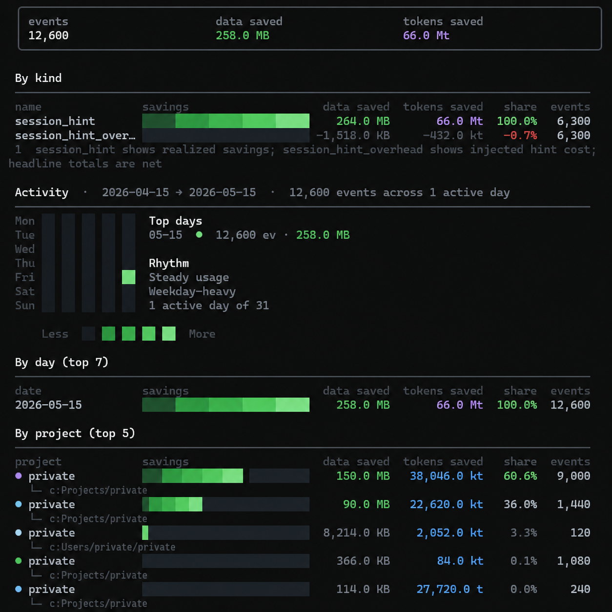

<p align="center">
  
</p>

<p align="center">
  Cuts the tokens Claude Code and Codex CLI burn. Windows, Linux, WSL, and macOS. Install once, then forget it.
</p>

<p align="center">
  <a href="https://pypi.org/project/token-goat/"></a>
  <a href="https://github.com/DFKHelper/token-goat/actions/workflows/ci.yml"></a>
  <a href="https://pypi.org/project/token-goat/"></a>
  <a href="LICENSE"></a>
</p>

<p align="center">
  
  
  
  
</p>

---

<p align="center">
  <b>97.4%</b> image compression &nbsp;·&nbsp; <b>85%</b> smaller reads via surgical CLI &nbsp;·&nbsp; <b>zero</b> ongoing maintenance
</p>

---

## The problem

Long sessions accumulate waste three ways. Screenshots cross the model at full resolution. A single PNG can land at 3.3 MB. The agent re-reads files it already parsed earlier in the same conversation. And when a session compacts, the summary LLM doesn't know which files were edited or which symbols mattered, so it preserves the wrong things.

Each one is preventable. Token-Goat intercepts all three, automatically.

## What changes

| Without Token-Goat | With Token-Goat |
|--------------------|-----------------|
| 3.3 MB screenshot lands in model context | 84 KB compressed copy — 97.4% smaller |
| Agent re-reads files from earlier in the session | "Already read this" reminder with narrow slice suggestion |
| Compaction forgets which files were edited | Structured session manifest injected before compact |
| Full file read for one function or section | `token-goat read file::symbol` — about 85% smaller |

> Four hours of use on the author's machine: **59.7 MB** of data that never hit the model, with an estimated **11.5 million tokens** avoided.

<p align="center">
  
</p>

## Install

**Windows requirements:** Windows 10 or 11 · Python 3.11, 3.12, or 3.13 · [uv](https://docs.astral.sh/uv/) (`winget install astral-sh.uv`)

**Linux / WSL requirements:** Python 3.11, 3.12, or 3.13 · [uv](https://docs.astral.sh/uv/) (`curl -LsSf https://astral.sh/uv/install.sh | sh`)

**macOS requirements (untested):** Python 3.11, 3.12, or 3.13 · [uv](https://docs.astral.sh/uv/) (`curl -LsSf https://astral.sh/uv/install.sh | sh`)

```
uv tool install token-goat
token-goat install
```

Two commands. Done. Hooks register, a background worker starts at logon and stays out of the way. No terminal popups, no tray icon, no service to babysit.

On Linux and WSL, the worker registers as a systemd user service when systemd is available. On WSL without systemd, and on macOS, the SessionStart hook ensures the worker is running at the start of every Claude Code session.

### Codex CLI users

```
token-goat install --codex
```

The `--codex` flag patches both Claude Code and Codex CLI in one pass.

## CLI

| Command | What it does |
|---------|-------------|
| `token-goat symbol <name>` | Jump to a symbol definition |
| `token-goat read "file::symbol"` | Pull one function or class, not the whole file |
| `token-goat section "doc.md::Heading"` | Pull one Markdown section by heading |
| `token-goat semantic "<query>"` | Find code by meaning, not by filename |
| `token-goat map` | Get a compact orientation of the repo |
| `token-goat stats` | See how many tokens you have saved |
| `token-goat compact-hint --session-id <id>` | Inspect the compaction manifest for a session |
| `token-goat doctor` | Confirm everything is wired correctly |

First `token-goat semantic` call downloads a small embedding model, about 130 MB, into the token-goat data directory. One-time. Offline after that.

## What gets installed?

`token-goat install` writes the following on your machine — nothing else, anywhere. Every entry is reversed by `token-goat uninstall`. Run `token-goat doctor` at any time to see which of these are currently present.

**Claude Code integration** (`~/.claude/`)

| Path | What |
|------|------|
| `~/.claude/settings.json` | Hook entries for `SessionStart`, `PreToolUse` (Read, Drive/WebFetch), `PostToolUse` (Edit/Write/MultiEdit, Read/Grep/Glob), and `PreCompact`. Plus a `Bash(token-goat:*)` permission allowlist entry. Existing hooks are preserved; a timestamped `.bak` is written before any change. |
| `~/.claude/CLAUDE.md` | A delimited block (`<!-- token-goat-begin -->` … `<!-- token-goat-end -->`) telling the agent to prefer `token-goat read` / `symbol` / `section` over `Read` / `Grep`. Any existing content is preserved. |
| `~/.claude/skills/token-goat/SKILL.md` | The token-goat skill — the same routing guidance in skill form. |

**Worker autostart** (one of the following, picked by platform)

| Platform | Entry |
|---------|------|
| Windows | `HKCU\Software\Microsoft\Windows\CurrentVersion\Run\token-goat-worker`. No admin rights required. |
| Linux (with `systemd --user`) | `~/.config/systemd/user/token-goat-worker.service`, enabled. |
| Linux (no systemd, incl. WSL) | `~/.config/autostart/token-goat-worker.desktop`. On WSL without systemd, the SessionStart hook also starts the worker on every Claude Code session. |
| macOS (untested) | `~/Library/LaunchAgents/com.dfkhelper.token-goat-worker.plist`, loaded via `launchctl`. |

The autostart command is `pythonw -m token_goat.cli worker --daemon` from Token-Goat's `uv tool` venv. No PyInstaller-style launcher `.exe` is dropped; AV/EDR products do not behavior-flag this invocation pattern.

**Weekly auto-update** (Sunday 03:00 local time, runs `uv tool upgrade token-goat`)

| Platform | Entry |
|---------|------|
| Windows | Scheduled task `token-goat-update` (`schtasks`). |
| Linux / macOS | A `crontab` line tagged with `# token-goat-autoupdate`. |

**Data directory** (created on first run)

| Platform | Path |
|---------|------|
| Windows | `%LOCALAPPDATA%\dfk-helper\token-goat\` |
| Linux / WSL | `~/.local/share/token-goat/` |
| macOS | `~/Library/Application Support/dfk-helper/token-goat/` |

Contains the symbol index (`global.db`, per-project `.db` files), session cache, shrunken-image cache, embedding model (~130 MB, downloaded on the first `semantic` call), logs, locks, and the dirty-file queue. Nothing outside this directory and `~/.claude/` is written.

**With `--codex`** (Codex CLI integration)

| Path | What |
|------|------|
| `~/.codex/config.toml` | Hooks block with Codex-specific matchers (`view_image|Bash`, `apply_patch`, `web_search`). Existing hooks preserved. |
| `~/.codex/AGENTS.md` | A delimited block (`<!-- token-goat-codex-begin -->` … `<!-- token-goat-codex-end -->`) with the same routing guidance, adapted for Codex tool names. |

## Zero maintenance

After install, there is nothing to start, stop, or restart. The worker runs at logon on Windows, Linux, and macOS; on WSL without systemd, the SessionStart hook covers it. Survives reboots on every platform. `token-goat uninstall` reverses every change, including the startup entry.

## Verify

```
token-goat doctor
token-goat stats
```

`doctor` confirms the install is healthy. `stats` shows cumulative savings.

## Security, privacy, and uninstall

**No telemetry. No analytics. No background reporting or silent outbound connections.**

Outbound network is reserved to three explicit cases:

- First `token-goat semantic` call downloads the embedding model (~130 MB) into the data directory. Offline after that.
- Google Drive API calls, only if you already authorized Drive in Claude Code. Token-goat never prompts for its own auth.
- Explicit, user-triggered URL fetches via `token-goat fetch-image <url>`.

**Security reports.** See [SECURITY.md](SECURITY.md). Email `token-goat@dfkhelper.com`; do not file as a GitHub issue. Reports are acknowledged within 7 days; coordinated disclosure with a 90-day default window.

**Windows Defender (optional, Windows only).** Real-time scanning slows indexing. To exclude the data folder, open PowerShell as administrator:

```powershell
Add-MpPreference -ExclusionPath "$env:LOCALAPPDATA\dfk-helper\token-goat"
```

`0x800106ba` means the prompt is not elevated; reopen as administrator. On enterprise-managed Windows (domain-joined / Intune), Defender exclusions may be locked by Group Policy. The command will fail; that is expected and harmless.

**Uninstall.**

```
token-goat uninstall
```

Reverses everything in [What gets installed?](#what-gets-installed): the scheduled task or systemd unit, the registry value or `.desktop` or `.plist`, the hook entries in `settings.json`, the `CLAUDE.md` block, the skill directory. Add `--codex` to also strip the Codex integration. Add `--purge` to also delete the data directory (cache, index, models, logs). Nothing else on the system depends on it.

## About

I built this because long Claude Code and Codex sessions on my machine kept burning context in the same ways: screenshots landing at 2-3 MB, the agent re-reading a file it parsed hours earlier in the same conversation, compactions that forgot which functions were edited. Each felt preventable.

This is a solo project. I use it daily on Windows 11. Tests run across Python 3.11, 3.12, and 3.13.

## Available for work

Senior or staff engineering. Developer tools, AI infrastructure, or context management.

I've spent months inside Claude Code's hook system, session management, and compaction pipeline. Not reading the docs. Instrumenting them to see what was actually happening. The work is in this repo.

I build systems that run without babysitting, measure their own impact, and fail quietly. If you're building tooling for developers who work with AI, reach out.

[token-goat@dfkhelper.com](mailto:token-goat@dfkhelper.com)

## Disclaimer

Token-Goat runs on your machine and touches your files. The software is provided as-is, without warranty of any kind. DFK Helper LLC is not liable for any damages arising from use. Full terms, including the No Liability clause, are in the LICENSE file.

## License

Token-Goat is licensed under the PolyForm Noncommercial License 1.0.0. See the LICENSE file for the full terms.

Individual developers may install and use Token-Goat on their own machines for personal productivity without a commercial license, provided the use does not involve providing Token-Goat as a service to others, incorporating it into a commercial product or platform, or deploying it as shared infrastructure across a team or organization. Employment at a for-profit company does not by itself make use commercial — but if your employer is the primary beneficiary of the deployment, a commercial license applies. When in doubt, email token-goat@dfkhelper.com.

Commercial use is reserved. That means copying or incorporating this codebase into a product, charging for access to it, or running it as shared infrastructure across a team at a for-profit company. Commercial licensing: token-goat@dfkhelper.com.

Copyright (c) 2026 DFK Helper LLC.

Patent Pending.
