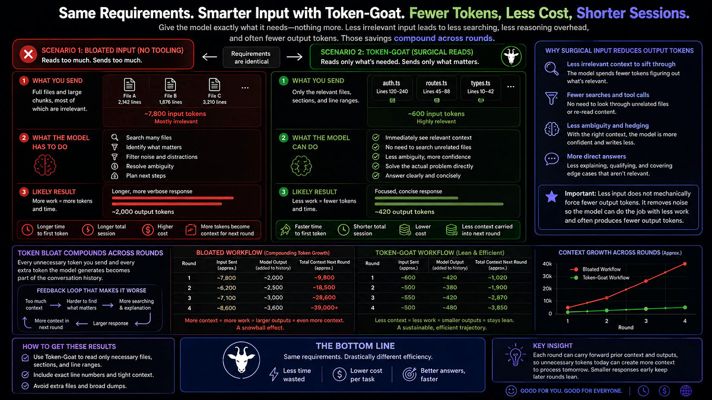

# Token-Goat


***Give the model what it needs, not everything you have.***

**85%** smaller reads · **97.4%** image compression · **180+** filter & interception rules · **94–99%** skill overhead cut · compaction memory · **prompt injection** guard · **3.7 GB** never reached the model · **1.1 Gt** tokens saved

**Reduces AI token use/costs by 40–90%, and improves its focus. Fully automated, always online.**

**Also defends against prompt injection. Every fetched page, tool result, and extracted document is wrapped in an untrusted-content fence before hitting the model, whether or not it matched an attack pattern, and the scan only decides what the label says. One config line to disable.**

**Your AI re-reads the same file three times. Every compaction causes amnesia. Every build log buries the one line that matters. You pay for all of it. Token-Goat fixes all of it — automatically.**

Token-Goat sits silently between your AI and your tools. Re-read a file? It gets a one-line hint and a narrow-slice suggestion instead of the full file again. Grab a screenshot? A 100 KB copy reaches the model instead of 10 MB. Run `pytest`, `npm install`, `docker build`, or `cargo`? The thousands of progress bars and passing-test names are stripped to the failures before the output even reaches the context window. Open a PDF, a large Markdown doc, or a CSV? The hook intercepts it — heading tree, page count, or column preview — so the model never pays for the full file. Run `gh run watch` or `next dev` a second time? Prior output is recalled rather than re-run. Compact a long session? It gets a clean structured manifest of edited files and key symbols so nothing important is forgotten. Sessions drop 40–90%+ in cost. You change nothing about how you work.

Works with **Claude Code**, **Gemini CLI**, **Qwen Code**, **Codex CLI**, **Aider**, **Cursor**, **Cline**, **Windsurf**, **Copilot CLI**, **Kimi Code**, **Grok CLI** (xAI Grok Build), and OpenCode, plus **pi** ([pi-coding-agent](https://github.com/earendil-works/pi-mono)).

**Ask your AI to install it fully (give it this GitHub link), or install in one command:**

```
npm install -g token-goat && token-goat install
```

Restart your AI sessions. Run `token-goat stats` a couple of minutes after your next session to see the massive savings. It also doubles as a great tracker of your work. Welcome to token efficiency.

[](https://www.npmjs.com/package/token-goat) [](https://github.com/DFKHelper/token-goat/actions/workflows/ci.yml) [](LICENSE)

   

> **Built and continually improved, free, by one person. If it saves you tokens, drop a ⭐️ at the top of this page. One click. Makes my day. Also, if you'd like anything added, [drop me a line](mailto:token-goat@dfkhelper.com).**

[Install](docs/install.md) · [CLI](docs/cli.md) · [What gets installed?](docs/install.md#what-gets-installed) · [Stats](#stats-display) · [Security & uninstall](docs/security.md)

---

<p align="center">
  
  <br>
  <sub>Same requirements, smarter input: fewer input tokens, shorter answers, and context that stops compounding across rounds</sub>
</p>

<p align="center">
  
  <br>
  <sub>Stats display — gradient bars, sparklines, and a calendar heatmap in 24-bit color</sub>
</p>

## The problem

AIs read `auth.py`. Then reads it again. And again. Then a third time after compaction wipes the session. Then it can't find what it wanted and searches other lines and files. You pay for every token and most of it is waste.

Long sessions accumulate waste five ways. Screenshots cross the model at full resolution. A single PNG can land at 10+ MB. The agent re-reads files it already parsed earlier in the same conversation. When a session compacts, the summary LLM doesn't know which files were edited or which symbols mattered, so it preserves the wrong things. And every `pytest`, `npm install`, `docker build`, or `git log` dumps thousands of lines of progress bars, deprecation warnings, and passing-test names that bury the one line that actually matters.

The fifth waste is skills. A single large skill injects 10k–65k tokens every time. Run a five-iteration `/improve` loop and you've paid for five full copies of the same rules. Token-Goat now blocks repeat skill loads before they happen: a PreToolUse hook intercepts the second invocation, serves the cached compact (~400 tokens) instead, and only allows a reload when compaction may have evicted the skill from context. It also intercepts direct reads of skill files and ensures the compaction manifest carries the full skill index — so nothing is forgotten and the full body never re-enters context unnecessarily.

The fastest way to reduce AI token costs is fixing these five, not writing shorter prompts. Each one is preventable. Token-Goat intercepts all five, automatically.

## What changes

| Without Token-Goat | With Token-Goat |
|--------------------|------------------|
| 3.3 MB screenshot lands in model context | 84 KB compressed copy, 97.4% smaller |
| Agent re-reads files from earlier in the session | "Already read this" reminder with narrow slice suggestion |
| Read tool asks for lines the session was already given | Answered with a pointer at the copy already delivered instead of the file, when the text this read would return matches the text already served for it whole line for whole line. Proof rather than a read count, so it also covers a file inside the recent-read protection window; a changed file, a wider range, and `reread_deny = false` all pass through |
| Same unchanged file read again through the shell (`cat`, `head`, `tail`, `sed -n '1,40p'`) | Byte-identical repeat replaced with a one-line pointer instead of the whole body — 4,031 bytes to 189 on this project. Only fires when the two runs match exactly, so a changed file is untouched; full text stays available via `token-goat bash-output <id>` |
| Part of a file re-read under a different command (`head -40 F` then `sed -n '1,30p' F`) | Repeat replaced with a pointer when every line coming back was already served for that same file this session. Matched on the text, on whole-line boundaries, so a read that adds any new lines is left whole; the record is dropped when the file is edited or the conversation is compacted. A file read with the Read tool counts as served too, limited to the lines that read actually handed over, and a read that came back truncated counts for nothing |
| Read tool asks for a range that overlaps one already delivered | Only the overlapping stretch is withheld, replaced by one line naming the line numbers and the recall command; the new lines come through with their own numbers and spacing, byte for byte. A stretch is kept whenever dropping it would save less than the line replacing it costs, and a result carrying anything the redactor would strip, a truncated result, or a file changed on disk all pass through whole. Set `elide_served_lines = false` to disable |
| Shell command run with colour on (`git`, `npm`, `npx`, `token-goat`) | Terminal escape sequences removed, leaving byte-for-byte the same output with colour off: 13.2% smaller on a real `git diff` here, and about a quarter of the bytes on the calls it fires for. Nothing is summarized or withheld, so there is no recall pointer; it runs on failed commands too, and only when the escapes are worth a rewrite |
| Agent re-reads a file edited mid-session | Unified diff injected as a hint — full Read avoided when the diff covers the change. Docs and source/style/data files (`.md`/`.ts`/`.css`/`.json`/…) by default; set `serve_diff_on_reread = false` to disable source diffs |
| Compaction forgets which files were edited | Structured session manifest injected before compact |
| Same files re-read from scratch after `/compact` | Recovery hint at SessionStart lists cached snapshot + bash + WebFetch IDs |
| Loaded skill body summarized away by compaction | `### Active Skills` manifest section + `**Skills**:` recovery block list every loaded skill; full body recoverable via `token-goat skill-body <name>` without re-invoking |
| Large skill bodies re-injected each turn (6 active skills = 65k+ tokens) | `<!-- COMPACT_END -->` marker: everything above the marker is the compact form; token-goat detects it on load, caches the compact slice, and injects only that — typically ~400 tokens vs. 10k+ |
| Model reads a skill SKILL.md file directly mid-session (burning the full 10k–65k tokens again) | Pre-Read hook intercepts `*/.claude/skills/<name>/SKILL.md` paths; if the skill is already cached this session it emits a `token-goat skill-body <name>` hint instead |
| Same large skill invoked twice in a session | PreToolUse hook blocks the reload; serves cached compact (~400 tokens) via `additionalContext` instead of the full 40–65k body. Allows the reload if compaction fired since the last load |
| Skill invoked with `first_load_compact=true` and `<!-- COMPACT_END -->` present | First load also blocked; only the curated compact section is served. Full body available via `token-goat skill-body <name>` on demand |
| Same docs URL fetched twice in a session with the same question | Re-fetch blocked at any context pressure; cached body available via `token-goat web-output <id>`. Keyed on the URL and the prompt together, since a WebFetch answer is specific to the question asked, so the same page fetched with a different question is left alone |
| `cat src/auth.py` or `Get-Content module.py` run via Bash | Pre-Bash hook detects whole-file reads of indexed source files and suggests `token-goat read "file::Symbol"`, `skeleton`, or `section` — covers `cat`, `bat`, `type`, PowerShell `Get-Content`/`gc` |
| `rg pattern src/` or `grep -rn` run via Bash (first time) | Pre-Bash hook suggests `token-goat symbol <name>` and `token-goat semantic "<query>"` as indexed alternatives to a full directory walk |
| `rg "^def" src/file.py` or `grep "class " module.ts` — structural search on a single source file | Pre-Bash hook redirects to `token-goat skeleton "file"` or `outline "file"` — all symbols with line numbers, no full-file read |
| `rg` or `grep` run twice with the same pattern | Pre-Bash dedup hint fires on repeated `rg`/`grep`/`ag` calls the same way it fires on the native Grep tool; repeat searches return a cached match-count hint instead of re-running |
| Read tool targets `tool-results/<id>.txt` or `tasks/<id>.output` | Pre-Read hook suggests `token-goat bash-output <id> --tail N` / `--grep PATTERN` / `--section H`; the filename stem is the output ID |
| Repeated monitoring command run again (`gh run watch`, `next dev`, `vitest`, `docker logs`) | Pre-bash recall hint: when a prior run is cached and its output exceeds 2 KB, a pointer to `token-goat bash-output <id> --grep PATTERN` is injected instead of re-running the command. Cache is keyed on the *base command*, so re-running with a different trailing pipe (e.g., `| tail -40` then `| grep error`) still hits the same cache entry |
| `pnpm`/`yarn`/`bun` install or build dumps full output | pnpm, yarn, and bun compress filters now strip install noise and build logs the same way npm does; `pnpm run`/`yarn run` route through their own filter |
| Surgical-read command returns a 10k-line symbol or a full section dump | Capped at ~25k tokens; marker names the truncation ratio and narrowing command (`symbol` → `file::Class.method`; `section` → sub-heading; cached → `--grep`/`--tail`) |
| Full file read for one function or section | `token-goat read file::symbol`, about 85% smaller |
| `pytest` dumps 150 PASSED lines + dots + tracebacks | Failures-first view, 80 to 97% smaller |
| `npm install` floods deprecation warnings + spinner | Errors kept; warnings collapsed by package, ~90% smaller |
| `docker build` emits sha256 digests + transfer progress | Step headers + errors kept; noise dropped, ~75% smaller |
| `ruff` / `eslint` / `mypy` repeat the same rule 50 times | Grouped by rule with first 3 examples, ~80% smaller |
| Same `pytest` / `cargo` / `git log` re-run mid-session | Small prior outputs (≤8 KB) served inline on first repeat; larger outputs get a hint pointing at `token-goat bash-output <id>` |
| Same `Grep` pattern re-run with hundreds of matches | Pre-Grep dedup hint quotes the prior match count |
| `Grep` in `content` mode repeats the same file path on every match line | Post-Grep hook folds matches under one path header per file (lossless, path/line survive verbatim) |
| Same docs URL fetched twice with the same prompt | Re-fetch denied (redirects to `token-goat web-output <id>`) once the cached body clears `web_dedup_min_bytes`, at every context pressure. A repeat with a different prompt passes through: the cached answer was written for the earlier question |
| `token-goat section pyproject.toml::tool.ruff` | One TOML table extracted instead of the whole config; same for `.yaml`/`.yml`/`.json`/`.ini`/`.cfg`/`.env`/`Dockerfile` |
| Typoed `token-goat symbol getUserr` | `symbol` matches on exact name; a miss returns `No matches for 'getUserr'` (no fuzzy/auto-redirect) — use `token-goat find getUserr` for a typo-tolerant name lookup, or `token-goat semantic "<what it does>"` when you don't know the name at all |
| `grep`/`rg` returns 50+ match lines | File-level summary: top 20 files by match count; full result cached, ~80% smaller |
| Same "already read" hint fires on every re-read | Suppressed after first injection; SHA-256 fingerprinting prevents the same nag twice per session |
| A file already read in another session is requested unchanged | With `hints.cross_session_read_dedup = true`, a project-scoped SHA-256 evidence record adds a compact advisory instead of replaying content. Changed files are named at startup for a fresh surgical read; cached bodies are never injected |
| `token-goat semantic` finds no indexed source match | It falls back to up to 100 recent, project-scoped, secret-redacted workspace-evidence entries. Vectors are created only for this explicit command and cached locally; results are labeled as cached evidence rather than live source |
| Same bash command runs 3+ times in one session | Escalating warning: "ran 2×" on repeat, "WARNING: ran N×" by the third; output always cached |
| Agent starts cold with no git context in a dirty repo | Branch, change counts, and 5 recent commits injected at startup (~50 tokens) |
| Re-read hint shows only the line range | Hint includes previously-accessed symbol names: `[symbols: login, refresh, …]` |
| Manifest too large or unstructured after compaction | Manifest gains `### MUST_PRESERVE` sealed block, `### What Worked` (last 2 green test runs), inline git diffs, and `### TODOs` from TaskList |
| CSV/JSON/JSONL/log file re-read when only structure changed | Pre-Read hint for structured files (CSV headers, JSON keys, log format), ~70% smaller than full read |
| Index-only files (lockfiles, source maps, bundles) read on every session | Pre-Read suppression for read-only files (package-lock.json, *.map, dist/), skipped unless explicitly edited |
| Large markdown file read in full (README.md, CHANGELOG.md, CLAUDE.md ≥8 KB) | Heading tree intercepted instead — H1–H3 with `#2`/`#3` disambiguation; `token-goat section` shortcuts listed for well-known files; post-edit injects a re-read suggestion rather than the full file |
| Subagent reads a ≥30 KB markdown file whole, on its first look at it | Off by default. Set `subagent_markdown_first_read_deny = true` under `[hints]` to block that read and answer with the heading tree instead. Only fires in a subagent, only on a first, un-ranged read of a `.md`/`.mdx`/`.markdown` file with at least three headings; a read that already asks for a line range, and every main-session read, pass through untouched |
| PDF opened via Read | Full read denied; PDF shows page count and outline (`token-goat pdf-extract` pulls the actual text, optionally paged/sliced, when the outline isn't enough) |
| Excel/PowerPoint/Word file (.xlsx/.pptx/.docx) opened via Read | Full read denied; redirects to the matching narrow-slice command family (`xlsx-sheets`/`xlsx-head`/`xlsx-range`/`xlsx-query`, `pptx-outline`/`pptx-slide`/`pptx-notes`/`pptx-text`, `docx-outline`/`docx-text`) instead of extracting the whole document as text |
| Other Office binary (.odt, .ods, .ott, .odp) opened via Read | Full read denied; redirects to `pandoc` for text extraction (no dedicated reader for these formats yet) |
| Large CSV or TSV file (≥10 KB) read in full | Column headers, row count, and 3 sample rows shown; `token-goat csv-query` projects columns and/or filters rows instead of a full read; `duckdb` query suggestion for very large tabular data |
| WebFetch returns a page's full raw HTML | HTML-to-text extraction strips markup/scripts/styles before the model ever sees it — readable prose instead of a wall of tags |
| Large WebVTT/SRT transcript (≥10 KB) read in full | Duration, cue count, and detected speakers shown; `token-goat transcript-outline` gives a skimmable speaker/time overview and `token-goat transcript` slices by speaker/time range/pattern instead of a full read |
| Large TXT or log file (≥20 KB) read in full | Line count + first/last 5 lines shown; `.log`/`.out` files bias toward `--tail 100 --grep`; general catch-all for any file ≥100 KB |
| Subagent reads a 47–86 KB recon dump (or greps a 73 KB transcript) and overflows its window | `pre_read` denies a full Read at or above `large_read_redirect_bytes` (512 KB base, tightened by context pressure to as low as ~92 KB once the session is nearly full — the case that matters most for an already-strained subagent), and a `content`-mode Grep over one oversized file, redirecting both to surgical reads or a windowed `offset`/`limit` |
| Subagent overflows at "hello" with no idea why | `token-goat baseline` (`--subagent` for the terser variant a fresh subagent gets) prints a project map — file count, languages, top symbols, recent files — as quick orientation instead of an `ls -R`/full-repo read |
| MCP screenshot call lands 10 MB image in context because no file path was passed | `pre_screenshot` denies chrome-devtools and playwright screenshot calls without a `filePath`/`file_path` argument; redirects the model to re-issue with one, so the saved file flows through image-shrink (~39K tokens raw → ~8K compressed) |
| `claude-in-chrome`'s `computer`/`browser_batch` return a raw, full-resolution base64 screenshot in-band, with no destination-file option to redirect through image-shrink | Inline screenshot blocks are shrunk via the same image-shrink pipeline in place, and a repeated `Tab Context:` listing (appended to nearly every call, often unchanged) collapses to a placeholder once seen unchanged this session |
| Agent tool spawns a subagent with no orientation and no reuse hints | A `PreToolUse` handler appends a compact briefing pack to the prompt: a one-line project-map summary, 2-3 recent cached-output IDs, and a surgical-read reminder (~300 tokens) |
| Subagent's own final report runs long and gets discarded once the parent moves on | Agent tool results ≥8000 characters get a recall pointer appended (`token-goat recall`); the original report always reaches the parent untouched |
| Agent tool spawns with no `subagent_type` (or an explicit `general-purpose`), so the lane starts by paying for every tool and MCP schema on the machine | Once per session, a `PostToolUse` advisory names up to three `tools:`-restricted agent definitions found in `~/.claude/agents` and suggests passing one as `subagent_type` on a future spawn that fits. It fires only when at least one restricted definition exists, states outright that the observed spawn already ran and nothing was saved, and records a zero-credit stat |
| Large MCP tool result (≥2 KB) is a homogeneous array of objects, e.g. a list/search result | Deterministic structural compression: table-ified into one header row + tab-delimited rows, with columns constant across every row hoisted into a single `constant:` line instead of repeated per row; only applied when it saves ≥15%. Full original always recoverable via `token-goat bash-output <id>` (labeled `[token-goat: compressed, full via mcp-output <id>]`). Disable with `TOKEN_GOAT_MCP_COMPRESS=0` |
| Large MCP tool result (≥2 KB) doesn't table-ify (an object-rooted config dump, a single-resource response, a nested settings tree) but most of its bytes are `null`/`""`/`[]`/`{}` | Deterministic empty-value pruning: recursively drops those four empty shapes to a fixed point (a container left empty by its own dropped children is dropped too) and renders the remainder as compact JSON with a trailing `dropped N empty value(s) (null, "", [], {})` summary line; `0` and `false` are never dropped; only applied when it saves ≥15%. Same full-recovery-by-id guarantee and `TOKEN_GOAT_MCP_COMPRESS=0` opt-out as the table pass |
| GitHub MCP tool result (`list_pull_requests`, `list_issues`, `search_code`, `get_file_contents`, `pull_request_read`, …) carries dozens of boilerplate fields per object | GitHub compression pack strips `_links`, `node_id`, `gravatar_id`, `site_admin`, and every `*_url` field (`avatar_url`, `html_url`, `events_url`, `gists_url`, `followers_url`, …) except `download_url`/`git_url`/`clone_url`/`ssh_url`, before handing the shrunk JSON to the same table-ifying pass — same `TOKEN_GOAT_MCP_COMPRESS=0` opt-out and full-recovery-by-id guarantee |
| Browser-automation MCP tool result (claude-in-chrome's `read_console_messages`/`read_network_requests`, chrome-devtools-mcp's `list_console_messages`/`list_network_requests`) carries verbose CDP plumbing per entry | Browser compression pack strips console `stackTrace` frames and network `requestHeaders`/`responseHeaders`/`timing`/`initiator`/`securityDetails`/cookie fields, keeping `url`/`method`/`status`/`resourceType`/`mimeType`/`reqid` and the actual log text, before the same table-ifying pass runs — same opt-out and full-recovery-by-id guarantee |
| `curl -v` dumps TLS handshake + all request/response headers | Verbose lines stripped; request line, HTTP status, content-type, and body kept — typically 70–90% smaller |
| `jest --verbose` / `vitest --verbose` emits one `✓` line per passing test | Consecutive passing-test lines collapsed to a count per file; failures kept verbatim, ~95% smaller on passing suites |
| `go test -v` emits `--- PASS: TestName (Ns)` for every passing test | PASS lines collapsed to a count per package; FAIL lines and panic output kept, ~90% smaller on clean runs |
| Python script raises and dumps a 30-frame traceback | Intermediate frame pairs collapsed to a count; outermost frame, exception type, and message kept |
| `tsc --noEmit` emits hundreds of type errors across many files | Errors grouped by file, up to 3 examples per file shown, rest counted; ~70–90% smaller |
| `make`/`cmake`/`ninja` emits hundreds of `[N%] Building …` progress lines | Progress lines collapsed to a count; warnings, errors, and `Built target` lines kept, ~85% smaller on clean builds |
| Command writes JUnit XML and prints the path | XML parsed directly; compact summary (totals + failed test names/messages) injected — raw XML never enters context |
| `grep`/`rg` matches a line in a `.min.js` or `.min.css` file | Matching line truncated to 200 chars; filename and line number preserved |
| Claude Code writes async-task output to a temp file | `pre_read` intercepts the path and redirects to `token-goat bash-output <id>` with `--head`/`--tail`/`--grep` support |
| Re-read hints fire immediately after conversation compaction | Grace period suppresses deny hints for the first few reads after a compact so the model can re-orient |
| Large reference doc (CLAUDE.arch.md, API spec) re-read in full every new session | `token-goat compact-doc <path>` builds a deterministic extractive sidecar (headings + first N lines per section); `pre_read` serves it in place of the full file — 80–95% smaller. Sidecar is automatically marked stale when the source is edited. |
| Re-read denial fires as an advisory hint the model can ignore | When `deny_reread` is on (default), `pre_read` actively denies re-reads of files confirmed in the current context window, not just nudges; the advisory still fires for older reads that may have scrolled out |
| Unchanged files produce duplicate hints across sessions | Hint fingerprint includes file path; unchanged-file short-circuit skips re-read pre-check entirely |
| Bash dedup hints conflict with other compression | `token-goat compress` can be called as dedup-vs-hint filter; one-call access to cached output |
| Large manifest sections with no useful signal | Drop empty sections, strip project name from paths (cleaner relative paths in manifest) |
| Manifest git-history section loses signal on clean main | Inline git diffs + skip git log when on clean main branch; session-awareness improves manifest hygiene |
| Skill body lost after compaction but recovery too verbose | Recovery hint deduped skills by content_sha (same skill loaded twice = one entry); inline skill checklist |
| Recovery hints omit critical paths when space is tight | Skip bash snippet when recall available |
| AVIF format not supported despite better compression | AVIF image-shrink via sharp (when libvips is built with libaom); WebP fallback; codec auto-detection in docker |
| Token-savings invisible until you run `stats` | Token-savings benchmark (slow-marked test suite) locks in measured wins; `token-goat stats` reports net-positive impact |
| Hook crash leaves agent waiting for response | Every way the shim can fail prints `{}` and exits 0, leaving the tool call to proceed untouched: an event name it does not know, stdin it cannot read or parse, an in-process load that throws, a token-goat child that exits non-zero or prints nothing, and a catch around the whole run |
| Concurrent edits lose update counts mid-session | Session CAS + mtime-based retry prevent lost edits in manifest |
| Dirty queue appends corrupt on concurrent writes | Each entry is one `O_APPEND` line, and an append that finds the file not ending in a newline starts with one, so a line torn by an earlier crash cannot merge with the next path into a single garbage entry |
| Worker claim file blocks all re-spawns on crash | Mtime staleness check (>60s) auto-recovers zombie claim files |
| Compaction hook subprocess ~190 ms cold | Lazy imports of heavy modules in `hooks_session` and `compact`; compaction path ~110 ms cold (~42% faster) |
| Pre-compact subprocess runs on every session | Compact-skip sentinel on disk: if session file is <5 min old and no edits logged, subprocess exits in <1 ms |
| Git ops slow manifest build in non-repo dirs | `git diff` / `git log` calls skipped when `cwd` is not inside a git repo (saves 60–100 ms per hook fire) |
| `terraform init` downloads 30+ provider plugins | Provider install lines collapsed to a count note; generic progress lines head/tail compressed (5+5 kept); `Init complete!` preserved |
| `terraform show` dumps a full resource block | Noise attributes (id, arn, timeouts, tags) stripped per resource block; high-signal fields kept with a suppression note |
| `kubectl events` lists raw repetitive events | Events grouped by REASON with a per-group count; field-selector hint added to narrow scope |
| `kubectl describe` floods labels and annotations | Labels/annotations blocks collapsed to line counts; Conditions table kept in full; container resource fields preserved |
| `npm install` verbose output with sill/http/verb/spinner lines | Verbose timing, sill, http, verb lines suppressed; warn lines beyond first 3 collapsed; braille spinner reify lines dropped |
| Fetched web content lands raw in model context | Always wrapped in an untrusted-content fence; scanned for attack patterns, and a matched pattern name is written to the log and into the fence's notice |
| Chatty log repeats the same error or event thousands of times | `token-goat logfold` collapses consecutive duplicates to `[Nx]` counts; same event logged with different timestamps or request IDs folds correctly — ~90–95% smaller on repetitive logs |
| Reading poetry.lock or package-lock.json to find a pinned version | `token-goat lockdeps` returns a name/version table of direct dependencies; optional packages and transitive entries excluded |

On a per-token API plan, 100K wasted tokens per session runs about $0.30. Five sessions a week is ~$450/year. AI coding cost reduction at that scale comes from fixing the waste, not from using the product less. Token-goat is free. And on subscription plans, it can result in limits feeling 10x higher.

## Not just source repos

`token-goat semantic` works on any folder of markdown, not only source code — a notes vault, an agent-memory directory, a docs folder. Project-root resolution falls back to treating any directory as an ad-hoc project when no `.git`/`package.json`/other marker is present, so there's no setup beyond indexing the folder.

```bash
cd ~/notes                  # or any plain folder of .md files, no .git required
token-goat index . --walk   # non-git folders need --walk (git repos: plain `token-goat index .`)
token-goat semantic "how long to steep cold brew"
```

Returns relevance-ranked, distance-scored hits straight from the notes, the same surgical-read path used for code.

## Token savings, measured

Numbers below come from synthetic-fixture benchmarks in the test suite. Each row points at the source file where the measurement is reproduced.

| Source | Improvement | Measured impact | Where |
|--------|-------------|-----------------|-------|
| Image shrink | WebP encoder beats JPEG on screenshot-shaped images | ~39% smaller than the same image at JPEG quality 85 | `src/image_shrink.ts` (codec selection) |
| Repomap output | `--compact` trims the top-symbols list to 10 (vs 30) and drops the recent-files section and per-symbol locations | Denser overview for the same byte budget | `src/baseline.ts` (`buildProjectMap`, `token-goat map --compact`) |
| DB reindex | Batched single transaction + composite indexes on `(file_id, kind)` | 100 files / 10K rows: 84 s → 1 s (~80× faster) | `src/parser.ts`, `src/db.ts` (index migration) |
| Hook cold-start | Lazy import of heavy modules; unknown events short-circuit | 86 ms → 30 ms (~65% faster); unknown-event dispatch <1 ms | `src/hooks_cli.ts` |
| Symbol start_line | TypeScript decorators captured in symbol span | One `token-goat read` returns the decorator + signature + body; no re-read | `src/parser.ts` (TypeScript adapter) |
| Section extraction | Setext headings, h5/h6, anchor IDs, and `__frontmatter__` | `token-goat section` resolves more headings without falling back to a full file read | `src/parser.ts` (Markdown adapter) |
| Image cache | Repeat Read of an unchanged image serves the stored re-encode, keyed on path + size + mtime, instead of running `sharp` again | Skips the re-encode entirely on a hit; the same bytes reach the model, so the reported saving is identical either way | `src/image_shrink.ts` (`findCachedShrink`) |
| Monorepo defaults | Reindex batch 500 → 2000; compact `min_events` 5 → 3 | Fewer worker wakeups; compact manifests fire on shorter sessions | `src/config.ts` defaults |
| Miss suggestions | `read` / `section` print "Did you mean…?" on a miss; `section` also auto-redirects on an unambiguous heading-prefix match | Keeps agents on the surgical-read path instead of falling back to full-file `Read` | `src/read_commands.ts` |

## Token-savings examples

Concrete before/after for the four interception points. Token counts use the ~4-chars-per-token rule of thumb.

### 1. Image — screenshot interception

```
$ ls -lh screenshot.png
-rw-r--r-- 1 user user 1.2M screenshot.png

# Without token-goat: Claude reads the 1.2 MB PNG.
# With token-goat: hook re-encodes as WebP and substitutes the cached copy.

$ token-goat image-shrink screenshot.png
out: ~74 KB WebP   (94% smaller)
```

The same image at JPEG quality 85 lands around 120 KB. WebP wins by another ~39% on screenshot-shaped content (large flat regions, sharp text edges).

### 2. Surgical read — one function, not the whole file

```
# Without token-goat: full file read.
$ wc -l src/auth.py
512 src/auth.py            # ~12,000 tokens

# With token-goat: pull just the function.
$ token-goat read "src/auth.py::login"
out: 38 lines              # ~300 tokens   (97% smaller)
```

Same applies to `token-goat section "README.md::Install"` — one heading instead of the whole document. Anchor IDs and setext headings resolve too, so `section "doc.md::Quick-start"` works when the file uses `Quick start` as an `<h2>` with an explicit `{#quick-start}` anchor.

### 3. Compact manifest — preserve what mattered

```
# Without token-goat: PreCompact fires with no extra context.
# The summarizer LLM picks what to keep, often loses the edit set.

# With token-goat: PreCompact hook injects a structured manifest.
$ token-goat compact-hint --session-id <id>
out: ~280 tokens covering 8 edited files + 12 symbols accessed + 4 key reads
```

The 280-token manifest is one-shot during compaction. The win is downstream: post-compaction, the agent doesn't re-read files it had already edited, saving a full-file Read pass on each one.

### 4. Repomap — orientation without an `ls -R` dump

```
# Without token-goat: recursive ls + a handful of Read calls to figure out the repo.
$ ls -R . | wc -c
51234                       # ~50 KB of raw paths, no signal about importance

# With token-goat: a ranked orientation summary instead of raw paths.
$ token-goat map --compact
out: ~1 KB                  # top-ranked classes/functions, no locations   (98% smaller)
```

`token-goat map` ranks headline symbols by kind (classes/interfaces first) and body size. `--compact` trims that list to the top 10 symbols (name + kind only, no file/line) and drops the recent-files section, for a denser orientation than the full form.

### 5. Bash output compression

```
# Without token-goat: pytest dumps every PASSED line + dots + tracebacks.
$ pytest -v tests/
... (3 KB of output, 150 PASSED lines, 1 FAILED at the bottom)

# With token-goat: the PreToolUse hook rewrites the command to
# `token-goat compress --filter pytest`. The wrapper runs pytest, captures
# stdout+stderr, applies the per-tool filter, and prints failures first.
$ token-goat compress --filter pytest --cmd "pytest -v tests/"
= test session starts =
collected 150 items
FAILED tests/test_x.py::test_one
= 1 failed, 149 passed in 2.3s =

[token-goat: collapsed 149 PASSED lines]
[token-goat: pytest filter compressed 4.8 KiB to 0.1 KiB (97% saved)]
```

Built-in output compression covers 130+ dev tool CLIs: `pytest`, `jest` / `vitest`, `cargo`, `npm` / `pnpm` / `yarn` / `bun`, `docker`, `kubectl` / `helm`, `aws`, `ruff` / `eslint` / `mypy` / `pylint` / `oxlint`, `git`, `make` / `gradle` / `mvn` / `ant` / `bazel`, `go test` / `golangci-lint`, `terraform` / `pulumi` / `cdk`, `pip` / `uv` / `conda`, `python`, `gh`, `ansible`, `pre-commit`, `grep`, `eza` / `ls`, `fd`, `bat`, `jq`, `yq`, `curl` / `wget`, `rsync`, `dotnet`, `cmake` / `ctest`, `swift` / `xcodebuild`, `ruby` / `bundler`, `elixir` / `mix`, `php` / `composer`, `flutter` / `dart`, `rust` / `cargo`, `kotlin` / `ktlint`, `zig`, `crystal`, `haskell` / `cabal`, `nix`, `R`, `c++` (conan / vcpkg / cppcheck / clang-tidy), `wrangler` / `hardhat` / `serverless`, `erlang`, `fly.io`, `forge`, `elm`, `julia`, `tox`, `vault`, `packer`, `nx` / `lerna` / `turbo`, `prettier` / `biome`, `sass`, `wasm-pack`, `deno`, **and AI tool CLIs**: `aider`, `gemini`, `claude`, `gh copilot`, `copilot`, `cursor`, `windsurf` (incl. Cascade), `opencode`, `continue`, `cline`. Each filter strips ANSI escapes, collapses `\r` progress bars, dedupes repeated lines, groups linter issues by rule, keeps every error block verbatim, and caps total output at 1000 lines / 64 KiB. Compound commands (`cmd1 && cmd2`) are wrapped per segment, so `git diff && git log` compresses both halves. Disable globally with `TOKEN_GOAT_BASH_COMPRESS=0`, per-filter via `[bash_compress] disabled_filters = ["docker"]` in config.toml, or preview the output of any command with `token-goat compress --cmd '<your command>'`. To exclude project-specific directories from indexing (temporary venvs, build sandboxes), add `[indexing] skip_dirs = ["my-tmpdir"]` to config.toml. To exclude specific generated files by basename instead (coverage reports, bundler stats), set `[indexing] skip_files = [...]`; it defaults to `["coverage.json", "coverage-final.json"]`, so a project with a legitimately-named `coverage.json` it wants indexed can override the list to drop that entry.

`gh api` responses get an extra pass: boilerplate `*_url` fields (`followers_url`, `gists_url`, `starred_url`, and around a dozen others) are stripped from JSON objects; `html_url`, `avatar_url`, `clone_url`, and `ssh_url` are kept. User and repo objects typically shrink 60–80%. When token-goat sees a GitHub permission error in the output or a non-zero exit on a security endpoint, it injects a system message suggesting `gh auth refresh -s security_events`.

A failing `pytest` / `jest` / `vitest` / `go test` / `cargo test` run (including bare `npm test`/`npm run test`/`yarn test`/`pnpm test`) also gets a one-line advisory naming the exact `token-goat bash-output <id> | token-goat failures` command to run instead of re-reading the raw dump. Silent on a passing run, a non-test command, or output too small to be worth reducing.

### 6. Context pressure

Token-goat tracks how close a session is to the autocompact trigger and tightens its hints as the window fills. Surgical-read suggestions kick in on progressively smaller files as pressure builds (500 lines at cool, down to 50 at critical), so large reads get flagged before they tip the session over. The PreCompact manifest also shrinks: capped at 500 tokens once the window runs hot, 300 once critical, so it stops contributing to the pressure it measures. The denominator is always the fixed 660,000-token autocompact trigger budget, not the model's raw context window, so the same thresholds apply across models. Run `token-goat doctor --context` to see the current footprint.

For recurring scheduler loops, the 25th, 100th, and 250th observed delivery in a session receive a one-time checkpoint/fresh-session reminder; it prevents further accumulation but cannot reclaim input already injected. The count is independent of the scheduler's bracketed identifier, which some hosts repeat for every delivery. Before a direct test command without a focused selector or explicit timeout, the Bash hook either preserves its existing compressor timeout or gives an advisory when compression cannot apply; it never stops the test.

## Install

**Requirements:** Node.js 22.16 or later, on any platform.

```
npm install -g token-goat
token-goat install
token-goat doctor          # confirms hooks and sharp are working; look for "sharp: ok"
```

Three commands. Hooks register and start working immediately: no terminal popups, no tray icon, no service to babysit. That wires up Claude Code; other agent CLIs are added with a flag (`--codex`, `--copilot`, and siblings).

Per-harness setup for Codex, Gemini, Qwen, Kimi, opencode, OpenClaw, pi, Copilot, Grok and Cline/Windsurf/Cursor, the companion CLI tools worth installing alongside it, upgrading, and the full list of what lands on your machine: **[Install guide](docs/install.md)**.

## CLI

You rarely type these yourself. Installation writes a routing guide into the agent's instructions, and the agent picks the command that answers its question: a surgical read (`read`, `symbol`, `section`, `skeleton`), a search (`semantic`, `refs`), orientation in an unfamiliar repo (`map`, `arch`, `affected`), recall of output it already has (`bash-output`, `web-output`, `mcp-output`), or a bounded reader for a PDF, Word file, slide deck, workbook, SQLite database or image.

Every command, with its flags, its output, and the comparison workflows that chain them: **[CLI reference](docs/cli.md)**.

## MCP server

```
token-goat mcp-serve
```

Runs token-goat as an MCP ([Model Context Protocol](https://modelcontextprotocol.io)) stdio server, exposing surgical-read tools (including `brief`, a one-shot symbol orientation call bundling body, callers, and containing doc section, and `index_status`, which reports whether a project's index has ever been populated, current file/symbol counts, dirty-queue depth, worker liveness, and embeddings availability — call it after an unexpectedly empty result from another tool, since an MCP-only client has no hook layer to warn it apart from a genuine "not found") plus `compress_text`, `retrieve_text`, `handoff_create`, and `handoff_resolve`. These local-only tools use bounded, redacted storage; MCP never intercepts a client's built-in file reads.

### Generic compression and handoffs

```text
token-goat compress-text "text to keep locally"
token-goat retrieve tg_<id>
token-goat handoff-create review-notes "text for another agent"
token-goat handoff-resolve review-notes
token-goat handoff-resolve review-notes --full
```

`token-goat compress-text` returns a stable opaque ID, size metadata, an estimated token delta, and a recovery command. The deflate/base64url payload tokenizes far worse per byte than plain text, so for most real inputs inlining it costs more tokens than the original: it is printed only when it genuinely wins, and `--payload` forces it for the self-contained case where you need a blob that decodes on another machine. A negative `tokens_saved` is a cost, not a saving. `token-goat retrieve` restores the locally cached text. Handoffs are created with `token-goat handoff-create` and resolved with `token-goat handoff-resolve`; they are named and project-local, and resolve compactly by default or in full with `--full`. Content is limited to 512 KiB and stored in a bounded local cache with secret redaction. `token-goat stats` includes these outcomes alongside existing savings.

`token-goat retrieve <id>` takes the same output filters as `bash-output`/`web-output`/`mcp-output`: `--head <n>`, `--tail <n>`, `--grep <pattern>`, `--max-matches <n>`, `--section <heading>`, and `--full`. With no filter at all, `retrieve` prints the stored text byte-verbatim -- this is its lossless round-trip contract and it never applies the siblings' default head/tail elision. Pass any filter and it switches to sibling semantics (including elision) for that call, so a large stored blob can be recalled a slice at a time instead of taking all of it.

**VS Code** — add it to `.vscode/mcp.json` under the `"servers"` key (this is the correct root key for VS Code's MCP config; it is not `"mcpServers"`):

```json
{
  "servers": {
    "token-goat": {
      "type": "stdio",
      "command": "token-goat",
      "args": ["mcp-serve"]
    }
  }
}
```

`token-goat install --vscode` creates or idempotently updates VS Code's
user-profile `mcp.json` by default (`%APPDATA%\Code\User\mcp.json` on
Windows, `~/Library/Application Support/Code/User/mcp.json` on macOS,
`~/.config/Code/User/mcp.json` on Linux) — add `-p`/`--project` for the
project-local `.vscode/mcp.json` shown above instead. Either way it also adds
a delimited block to `.github/copilot-instructions.md`, preserving unrelated
JSON and user text. It fails clearly on malformed JSON, and refuses to
install into one scope if the other scope already has a token-goat-managed
entry (registering it twice would duplicate its tool schemas in that
workspace). `token-goat uninstall --vscode` (add `-p`/`--project` for the
project scope) removes only token-goat's server entry and guidance block.

The optional source-controlled extension lives in `vscode-extension/`. Build
and install its VSIX manually; `--vscode` intentionally does not copy or
install extensions:

```text
cd vscode-extension
npm install
npm run compile
npx @vscode/vsce package
code --install-extension token-goat-vscode-0.1.0.vsix
```

Its commands call the local CLI and use `workbench.action.chat.open` to
prefill chat. They never submit chat automatically.

Installing the extension is an alternative to `install --vscode`, not an
addition to it: the extension contributes the MCP decoder itself through VS
Code's `mcpServerDefinitionProviders` contribution point, so VS Code starts
`token-goat mcp-serve` on demand and there is no `mcp.json` to write and no
window to reload. That path needs VS Code 1.101 or newer, which the
extension's `engines` field requires. `install --vscode` remains the way to
configure the decoder without the extension — for Copilot in an editor that
has no extension installed, or for any other MCP client.

If the extension is running somewhere that contribution did not take effect,
it falls back to calling `token-goat mcp-status --vscode` (add
`-p`/`--project` for the workspace scope too) to check whether `mcp.json`
already configures the decoder, and offers to run `install --vscode` if not —
the same path resolver `install`/`uninstall` write against, so the two can
never drift on where `mcp.json` lives or what key name it looks for.

**Copilot CLI** — add it to `~/.copilot/mcp-config.json`:

```json
{
  "mcpServers": {
    "token-goat": {
      "command": "token-goat",
      "args": ["mcp-serve"]
    }
  }
}
```

**Caveat.** Registering the server does not force any harness to prefer it. Unlike the hook-based bridges elsewhere in this project — which intercept a `Read`/`Grep`/`Glob` call before it reaches the model and can redirect or deny it outright — an MCP tool is just one more option in the harness's own tool-selection decision. Copilot (or any other MCP-aware client) decides for itself whether to call token-goat's `read` tool or fall back to its own built-in file-read tool; there is no interception mechanism for MCP the way there is for hooks.

## What gets installed?

`token-goat install` writes hook entries and a delimited guidance block into your agent's config directory, plus an index, cache and models under a data directory. Nothing else, anywhere. Every entry is reversed by `token-goat uninstall`, integrations added with `--codex`, `--copilot` or a sibling flag are named rather than silently removed, and `token-goat doctor` lists what is present right now.

**What the index actually holds, in plain terms.** The point of a surgical read is returning a function body without the file around it, which means the database stores those bodies. `symbols.body` holds the source text of every indexed symbol, `symbols.docstring` its doc comment, `refs.context` the line around each reference, and `chunks.text` the passages that semantic search embeds. There is also a full-text index over the bodies and docstrings. So the database is not a list of names and line numbers: it is a substantial copy of your source, sitting in a plain unencrypted SQLite file outside the repository.

The file-by-file table for each harness, and the path that file sits at: **[What gets installed](docs/install.md#what-gets-installed)**.

## Zero maintenance

Hooks fire automatically on every tool call once installed — nothing to start or restart there. The background worker is a separate, manual step: `token-goat worker start` launches it as a detached process, `token-goat worker status` checks it, `token-goat worker stop` kills it. It restarts itself automatically if it crashes or gets killed while the machine is running — an edit hook checks its liveness and respawns it, rate-limited to about once every 5 minutes. It does not survive a reboot or logout, though; re-run `worker start` after either. `token-goat uninstall` removes the hook entries, `CLAUDE.md` block, and skill directory, but does not touch a running worker — stop it separately with `token-goat worker stop` if you no longer want it running.

## Verify

```
token-goat doctor
token-goat stats
```

`doctor` confirms the install is healthy. `stats` shows cumulative savings.

### Confirming hooks are wired

`doctor` checks the binary, worker, database, and disk. It does not inspect `settings.json` hook wiring. To confirm all three hooks are present, re-run `install`:

```
token-goat install
```

`install` is idempotent: it adds any missing entries and leaves existing hook entries alone. Re-running it is always safe. To inspect the wiring directly:

```bash
# Linux / macOS / WSL
jq '[.hooks | to_entries[] | select(.value[].hooks[]?.command | contains("token-goat hook")) | .key]' ~/.claude/settings.json

# Windows (PowerShell with jq on your PATH)
jq '[.hooks | to_entries[] | select(.value[].hooks[]?.command | contains("token-goat hook")) | .key]' "$env:USERPROFILE\.claude\settings.json"
```

A working install returns `["PreToolUse", "PostToolUse", "PreCompact"]`. Any missing event means a partial install; run `token-goat install` to fill it in.

**AI agents:** after `token-goat install`, run the `jq` check above or re-run `token-goat install` before marking the install complete. `doctor` does not verify hook wiring.

## Image support

Vision models bill by pixel dimensions, not file size. Anthropic charges one token per 28×28-pixel patch of a Claude image (`⌈width/28⌉ × ⌈height/28⌉` visual tokens, per the [Claude vision docs](https://platform.claude.com/docs/en/build-with-claude/vision#evaluate-image-size)), OpenAI's GPT-5.6 models tile in 32×32-pixel patches with a 1.2x multiplier on top, and Gemini charges a flat 258 tokens under 384×384 pixels and roughly 258 tokens per 768×768 tile above that. A heavily compressed screenshot can still decode to a large pixel count, so a small file on disk is no guarantee of a cheap read.

Token-goat shrinks an image before it reaches the model whenever either of two independent checks trips: the file is at or above 512 KB, or its longest edge exceeds 1568 pixels (`src/image_shrink.ts`). The byte check is a cheap pre-filter that skips decoding most images outright. The dimension check exists because the byte check alone misses a case: a flat-color screenshot can compress to a few hundred kilobytes on disk and still decode to a resolution well past 1568 pixels on its long edge, and vision models bill on that decoded resolution, not the compressed file. Either trigger routes the image through the same pipeline: downscale to a 1568px long edge and re-encode as WebP. The pipeline uses [`sharp`](https://sharp.pixelplumbing.com/), a Node.js image processing library that ships prebuilt native binaries for Windows, macOS, Linux, and Alpine.

How much this saves depends on the model, because Claude downscales an oversized image itself before billing and caps the cost rather than charging for every pixel it was sent. By the [published per-tier table](https://platform.claude.com/docs/en/build-with-claude/vision#evaluate-image-size), a 3840x2160 screenshot bills at 4784 visual tokens on Claude 4.7 and later, and 1560 on earlier models. Resizing it to a 1568px long edge first costs 1792 tokens: a 63% cut against the newer models, and nothing against the older ones, whose own cap is already tighter than what this pipeline produces. Other vendors cap differently, so treat 63% as the measured Claude figure rather than a universal rate.

Two cases are not about cost at all. Screenshots returned to the computer-use and browser-use toolsets are rejected outright when they exceed the model's limits, rather than downscaled, so resizing before the call is what lets it succeed. A request carrying more than 20 images also applies a stricter per-image dimension limit to every image in it, which a 1568px long edge already satisfies.

On most platforms, `npm install -g token-goat` installs sharp without additional steps. npm pulls a prebuilt binary keyed to your Node.js major version and OS — no C++ compiler, libvips, or system codec libraries required.

Quick check (any platform):

```
token-goat doctor
```

If the `sharp` line shows `OK`, you're done.

### Image support — troubleshooting

If `token-goat doctor` reports `sharp: FAIL`, the most common cause is a cached binary built against a different Node.js version. A fresh install usually fixes it:

```bash
npm install -g token-goat@latest
token-goat doctor
```

On Alpine Linux, some ARM boards, and air-gapped environments, npm can't fetch a prebuilt binary and falls back to compiling from source. That requires `libvips` and C++ build tools:

```bash
# Debian / Ubuntu / WSL
sudo apt-get install -y libvips-dev build-essential

# Alpine
apk add --no-cache vips-dev build-base python3

# Fedora / RHEL
sudo dnf install -y vips-devel gcc-c++ make
```

After installing the system packages:

```bash
npm install -g token-goat@latest
token-goat doctor
```

For platform-specific build details, see the [sharp installation docs](https://sharp.pixelplumbing.com/install).

## Stats display

`token-goat stats` uses 24-bit ANSI color and Unicode block characters for gradient bars, sparklines, and the activity heatmap. In the right terminal it renders sharply. In the wrong one you get broken characters, flat gray blocks, or a "rich is not installed" error.

When it's working, the output shows rounded box borders (╭─╮), gradient bars with fractional edges (▏▎▍▌▋▊▉█), sparklines (▁▂▃▄▅▆▇█), and a heatmap where cells step from dark to bright green. Question marks, boxes, or solid-color bars mean the terminal or font needs fixing.

---

### Stats display — Windows

The old Windows console host — `cmd.exe`, the legacy "Windows PowerShell" app — does not support 24-bit color. Windows Terminal does.

**Step 1: Install Windows Terminal** (already on Windows 11; skip if you have it)
```powershell
winget install --id Microsoft.WindowsTerminal -e --silent
```

**Step 2: Set it as the default terminal** (Windows 10 only — Windows 11 handles this automatically)

Open Windows Terminal → `Ctrl+,` → **Startup** → **Default terminal application** → **Windows Terminal** → **Save**.

**Step 3: Confirm the font**

Windows Terminal ships with Cascadia Code, which covers every character token-goat uses. No additional install needed. To confirm it's selected: `Ctrl+,` → **Profiles → Defaults → Appearance** → Font face should read `Cascadia Code` or `Cascadia Mono`.

If you prefer a Nerd Font, download any variant from [nerdfonts.com](https://www.nerdfonts.com/font-downloads), install it, and select it in the font preference above.

**If bars still look flat** (solid single-color blocks instead of a gradient), add to your PowerShell profile (`$PROFILE`):
```powershell
$env:COLORTERM = "truecolor"
```

---

### Stats display — macOS

Terminal.app on Catalina and later, iTerm2, and the VS Code integrated terminal all handle truecolor and Unicode without configuration. Most users need nothing here. (macOS is untested — see the badge at the top.)

If sparklines or box borders show as question marks or plain dashes, install a complete font:
```bash
brew install --cask font-jetbrains-mono-nerd-font
```
Set it in your terminal's font preferences and reopen.

If colors look flat, add to `~/.zshrc` or `~/.bash_profile`:
```bash
export COLORTERM=truecolor
```

---

### Stats display — Linux / WSL

**WSL users:** you're running inside Windows Terminal. Follow the Windows steps above — same terminal, same font.

**SSH sessions:** the remote shell doesn't inherit truecolor from the local terminal. Add to `~/.bashrc` on the remote machine:
```bash
export COLORTERM=truecolor
export TERM=xterm-256color
```

**Missing Unicode characters:** any Nerd Font covers everything token-goat uses.
```bash
# Ubuntu / Debian
sudo apt install fonts-jetbrains-mono

# Arch
sudo pacman -S ttf-jetbrains-mono-nerd
```

---

### Stats display — AI automated setup

Scripts for non-interactive setup. No prompts.

#### Windows (PowerShell)
```powershell
# 1. Install Windows Terminal if absent
if (-not (Get-Command wt.exe -ErrorAction SilentlyContinue)) {
    winget install --id Microsoft.WindowsTerminal -e --silent
}

# 2. Set Windows Terminal as the default console host
#    UI equivalent: Windows Terminal -> Ctrl+, -> Startup -> Default terminal application -> Windows Terminal
#    GUIDs are for Windows Terminal stable release
reg add "HKCU\Console" /v DelegationConsole /t REG_SZ /d "{E12CFF52-A866-4C77-9A90-F570A7AA2C6B}" /f
reg add "HKCU\Console" /v DelegationTerminal /t REG_SZ /d "{E12CFF52-A866-4C77-9A90-F570A7AA2C6B}" /f

# 3. Enable truecolor for the current session and persistently for the user account
[System.Environment]::SetEnvironmentVariable("COLORTERM", "truecolor", "User")
$env:COLORTERM = "truecolor"

# 4. Verify
token-goat stats
```

#### macOS / Linux / WSL (bash)
```bash
OS="$(uname -s)"

# Install a complete font
if [[ "$OS" == "Darwin" ]]; then
    command -v brew &>/dev/null && brew install --cask font-jetbrains-mono-nerd-font
elif [[ "$OS" == "Linux" ]]; then
    command -v apt-get &>/dev/null && sudo apt-get install -y fonts-jetbrains-mono
    command -v pacman  &>/dev/null && sudo pacman -S --noconfirm ttf-jetbrains-mono-nerd
fi

# Enable truecolor — appends only if not already present
RCFILE="${HOME}/.zshrc"
[[ -f "${HOME}/.bashrc" ]] && RCFILE="${HOME}/.bashrc"
grep -q "COLORTERM=truecolor" "$RCFILE" || echo 'export COLORTERM=truecolor' >> "$RCFILE"
grep -q "TERM=xterm-256color" "$RCFILE" || echo 'export TERM=xterm-256color' >> "$RCFILE"
# shellcheck disable=SC1090
source "$RCFILE"

# Verify
token-goat stats
```

#### Truecolor check (any platform)

Run this if the stats output still looks wrong. A smooth green gradient from left to right means truecolor is active. Solid single-shade green means it isn't.

```bash
node -e "for(let r=0;r<256;r+=32)process.stdout.write('\x1b[48;2;0;'+r+';0m  ');process.stdout.write('\x1b[0m\n')"
```

## Security, privacy, and uninstall

**No telemetry. No analytics. No background reporting or silent outbound connections.** Outbound network is reserved to calls your agent initiates: Google Drive, only if you already authorized Drive in Claude Code, and image fetches from URLs the agent asked for. Pages that come back from the web are fenced against prompt injection and scanned for secrets before the model sees them.

Dependencies carry one high advisory, reachable only from a package's own install script. The full accounting, including the override that clears it, is under [Dependency advisories](SECURITY.md#dependency-advisories).

Rather than take that on trust, ask the copy you installed:

```
token-goat capabilities          # what this build can do, and whether it is on
token-goat capabilities --json   # the same, for asserting on in your own pipeline
```

Every entry names the setting that controls it and the code that enforces it, so a reviewer can open the check instead of believing the description. Setting `network.offline = true` turns off every outbound path at once, and a test in the suite fails the build if a module that can open a network connection does not consult it.

Credentials are removed before anything is written to disk or handed back to the model. Nineteen built-in patterns cover the shapes with a recognisable format; `redaction.custom_patterns` takes your own expressions for an in-house token prefix or an account number, and `redaction.strict` additionally redacts long random-looking strings that match nothing known. A pattern that would not work is refused and named by `token-goat doctor` rather than quietly matching nothing.

A checked-in `.token-goat.toml` cannot weaken any of this. An environment variable still can, and a repository has ways to set one, so `token-goat doctor` prints a `Security config overrides` line naming every locked setting the environment is currently deciding and the variable to unset.

To remove everything, index and caches included:

```
token-goat worker stop
token-goat uninstall --purge
```

The complete outbound list, the trust boundaries, what is stored locally, and what each storage root holds: **[Security, privacy, and uninstall](docs/security.md)**.

## About

I built this because long Claude Code and Codex sessions on my machine kept burning context in the same ways: screenshots landing at 2-3 MB, the agent re-reading a file it parsed hours earlier in the same conversation, compactions that forgot which functions were edited. Each felt preventable.

This is a solo project. I use it daily on Windows 11. The full test suite runs on Node.js 22 across Windows, macOS, and Linux, and all three must pass before anything merges.

## Sister project: token-goat-mem

[Token-Goat Mem](https://github.com/DFKHelper/token-goat-mem) (`token-goat-mem`) is a companion project: durable, local-first memory for AI coding agents, with trust levels and anchor-based staleness detection, so a decision like "we use pnpm, not npm" survives a compaction instead of getting re-explained every session. Token-Goat controls what gets read into context; Mem controls what gets remembered across sessions. The two are independent — neither requires the other — but Mem has an optional one-way seam that feeds its facts into Token-Goat's compaction manifest.

## Requests and issues

Want token-goat to support something it doesn't yet? Open a GitHub issue. Feature requests: a new agent CLI integration (Cline, Copilot Workspace, or any tool not yet covered), a new language adapter, or an image or document format the shrink path doesn't compress yet. Issues are public and searchable. That's where I work out what to build next. A short repro plus what you'd want the command to do is enough.

Bug reports go to the same place. The most useful ones include:
- Your OS, shell, and token-goat version (`token-goat --version`)
- The matching log line from `%LOCALAPPDATA%\dfk-helper\token-goat\logs\` on Windows or `~/.local/share/token-goat/logs/` on Linux/WSL
- What you expected and what actually happened

For private questions, commercial licensing, or anything you'd rather not post publicly, contact me at token-goat@dfkhelper.com.

## Disclaimer

Token-Goat runs on your machine and touches your files. The software is provided as-is, without warranty of any kind. DFK Helper LLC is not liable for any damages arising from use. Full terms, including the No Liability clause, are in the LICENSE file.

## License

Token-Goat is licensed under the PolyForm Noncommercial License 1.0.0. See the LICENSE file for the full terms.

Individual developers may install and use Token-Goat on their own machines for personal productivity without a commercial license, provided the use does not involve providing Token-Goat as a service to others, incorporating it into a commercial product or platform, or deploying it as shared infrastructure across a team or organization. Employment at a for-profit company does not by itself make use commercial — but if your employer is the primary beneficiary of the deployment, a commercial license applies. When in doubt, email token-goat@dfkhelper.com.

Commercial use is reserved. That means copying or incorporating this codebase into a product, charging for access to it, or running it as shared infrastructure across a team at a for-profit company. Commercial licensing: token-goat@dfkhelper.com.

Copyright (c) 2026 DFK Helper LLC.

Patent Pending.
