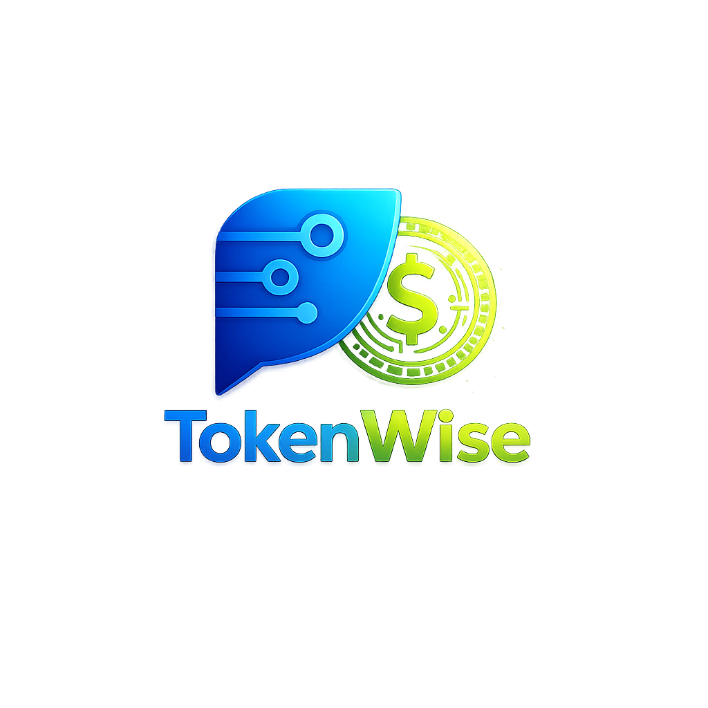

# Token-Goat



**85%** smaller reads · **97.4%** image compression · **180+** filter & interception rules · **94–99%** skill overhead cut · compaction memory · **prompt injection** guard · **3.7 GB** never reached the model · **1.1 Gt** tokens saved

**Reduces AI token use/costs by 40–90%, and improves its focus. Fully automated, always online.**

**Also defends against prompt injection. Every fetched page is scanned for attack patterns and wrapped in an untrusted-content fence before hitting the model. One config line to disable.**

**Your AI re-reads the same file three times. Every compaction causes amnesia. Every build log buries the one line that matters. You pay for all of it. Token-Goat fixes all of it — automatically.**

Token-Goat sits silently between your AI and your tools. Re-read a file? It gets a one-line hint and a narrow-slice suggestion instead of the full file again. Grab a screenshot? A 100 KB copy reaches the model instead of 10 MB. Run `pytest`, `npm install`, `docker build`, or `cargo`? The thousands of progress bars and passing-test names are stripped to the failures before the output even reaches the context window. Open a PDF, a large Markdown doc, or a CSV? The hook intercepts it — heading tree, page count, or column preview — so the model never pays for the full file. Run `gh run watch` or `next dev` a second time? Prior output is recalled rather than re-run. Compact a long session? It gets a clean structured manifest of edited files and key symbols so nothing important is forgotten. Sessions drop 40–90%+ in cost. You change nothing about how you work.

Works with **Claude Code**, **Gemini CLI**, **Qwen Code**, **Codex CLI**, **Aider**, **Cursor**, **Cline**, **Windsurf**, **Copilot CLI**, **Grok CLI** (xAI Grok Build), and OpenCode, plus **pi** ([pi-coding-agent](https://github.com/earendil-works/pi-mono)).

**Ask your AI to install it fully (give it this GitHub link), or install in one command:**

```
npm install -g token-goat && token-goat install
```

Restart your AI sessions. Run `token-goat stats` a couple of minutes after your next session to see the massive savings. It also doubles as a great tracker of your work. Welcome to token efficiency.

[](https://www.npmjs.com/package/token-goat) [](https://github.com/DFKHelper/token-goat/actions/workflows/ci.yml) [](LICENSE)

   

> **Built and continually improved, free, by one person. If it saves you tokens, drop a ⭐️ at the top of this page. One click. Makes my day. Also, if you'd like anything added, [drop me a line](mailto:token-goat@dfkhelper.com).**

[Install](#install) · [CLI](#cli) · [What gets installed?](#what-gets-installed) · [Stats](#stats-display) · [Security & uninstall](#security-privacy-and-uninstall)

---

<p align="center">
  
  <br>
  <sub>Stats display — gradient bars, sparklines, and a calendar heatmap in 24-bit color</sub>
</p>

## The problem

AIs read `auth.py`. Then reads it again. And again. Then a third time after compaction wipes the session. Then it can't find what it wanted and searches other lines and files. You pay for every token and most of it is waste.

Long sessions accumulate waste five ways. Screenshots cross the model at full resolution. A single PNG can land at 10+ MB. The agent re-reads files it already parsed earlier in the same conversation. When a session compacts, the summary LLM doesn't know which files were edited or which symbols mattered, so it preserves the wrong things. And every `pytest`, `npm install`, `docker build`, or `git log` dumps thousands of lines of progress bars, deprecation warnings, and passing-test names that bury the one line that actually matters.

The fifth waste is skills. A single large skill injects 10k–65k tokens every time. Run a five-iteration `/improve` loop and you've paid for five full copies of the same rules. Token-Goat now blocks repeat skill loads before they happen: a PreToolUse hook intercepts the second invocation, serves the cached compact (~400 tokens) instead, and only allows a reload when compaction may have evicted the skill from context. It also intercepts direct reads of skill files and ensures the compaction manifest carries the full skill index — so nothing is forgotten and the full body never re-enters context unnecessarily.

The fastest way to reduce AI token costs is fixing these five, not writing shorter prompts. Each one is preventable. Token-Goat intercepts all five, automatically.

## What changes

| Without Token-Goat | With Token-Goat |
|--------------------|------------------|
| 3.3 MB screenshot lands in model context | 84 KB compressed copy, 97.4% smaller |
| Agent re-reads files from earlier in the session | "Already read this" reminder with narrow slice suggestion |
| Agent re-reads a file edited mid-session | Unified diff injected as a hint — full Read avoided when the diff covers the change. Docs (`.md`/`.rst`/`.txt`) by default; source/style/data files (`.ts`/`.css`/`.json`/…) when `serve_diff_on_reread` is enabled |
| Compaction forgets which files were edited | Structured session manifest injected before compact |
| Same files re-read from scratch after `/compact` | Recovery hint at SessionStart lists cached snapshot + bash + WebFetch IDs |
| Loaded skill body summarised away by compaction | `### Active Skills` manifest section + `**Skills**:` recovery block list every loaded skill; full body recoverable via `token-goat skill-body <name>` without re-invoking |
| Large skill bodies re-injected each turn (6 active skills = 65k+ tokens) | `<!-- COMPACT_END -->` marker: everything above the marker is the compact form; token-goat detects it on load, caches the compact slice, and injects only that — typically ~400 tokens vs. 10k+ |
| Model reads a skill SKILL.md file directly mid-session (burning the full 10k–65k tokens again) | Pre-Read hook intercepts `*/.claude/skills/<name>/SKILL.md` paths; if the skill is already cached this session it emits a `token-goat skill-body <name>` hint instead |
| Same large skill invoked twice in a session | PreToolUse hook blocks the reload; serves cached compact (~400 tokens) via `additionalContext` instead of the full 40–65k body. Allows the reload if compaction fired since the last load |
| Skill invoked with `first_load_compact=true` and `<!-- COMPACT_END -->` present | First load also blocked; only the curated compact section is served. Full body available via `token-goat skill-body <name>` on demand |
| Same docs URL fetched twice in a session | Re-fetch blocked at warm+ context pressure; cached body available via `token-goat web-output <id>` |
| `cat src/auth.py` or `Get-Content module.py` run via Bash | Pre-Bash hook detects whole-file reads of indexed source files and suggests `token-goat read "file::Symbol"`, `skeleton`, or `section` — covers `cat`, `bat`, `type`, PowerShell `Get-Content`/`gc` |
| `rg pattern src/` or `grep -rn` run via Bash (first time) | Pre-Bash hook suggests `token-goat symbol <name>` and `token-goat semantic "<query>"` as indexed alternatives to a full directory walk |
| `rg "^def" src/file.py` or `grep "class " module.ts` — structural search on a single source file | Pre-Bash hook redirects to `token-goat skeleton "file"` or `outline "file"` — all symbols with line numbers, no full-file read |
| `rg` or `grep` run twice with the same pattern | Pre-Bash dedup hint fires on repeated `rg`/`grep`/`ag` calls the same way it fires on the native Grep tool; repeat searches return a cached match-count hint instead of re-running |
| Read tool targets `tool-results/<id>.txt` or `tasks/<id>.output` | Pre-Read hook suggests `token-goat bash-output <id> --tail N` / `--grep PATTERN` / `--section H`; the filename stem is the output ID |
| Repeated monitoring command run again (`gh run watch`, `next dev`, `vitest`, `docker logs`) | Pre-bash recall hint: when a prior run is cached and its output exceeds 2 KB, a pointer to `token-goat bash-output <id> --grep PATTERN` is injected instead of re-running the command. Cache is keyed on the *base command*, so re-running with a different trailing pipe (e.g., `| tail -40` then `| grep error`) still hits the same cache entry |
| `pnpm`/`yarn`/`bun` install or build dumps full output | pnpm, yarn, and bun compress filters now strip install noise and build logs the same way npm does; `pnpm run`/`yarn run` route through their own filter |
| Surgical-read command returns a 10k-line symbol or a full section dump | Capped at ~25k tokens; marker names the truncation ratio and narrowing command (`symbol` → `file::Class.method`; `section` → sub-heading; cached → `--grep`/`--tail`) |
| Full file read for one function or section | `token-goat read file::symbol`, about 85% smaller |
| `pytest` dumps 150 PASSED lines + dots + tracebacks | Failures-first view, 80 to 97% smaller |
| `npm install` floods deprecation warnings + spinner | Errors kept; warnings collapsed by package, ~90% smaller |
| `docker build` emits sha256 digests + transfer progress | Step headers + errors kept; noise dropped, ~75% smaller |
| `ruff` / `eslint` / `mypy` repeat the same rule 50 times | Grouped by rule with first 3 examples, ~80% smaller |
| Same `pytest` / `cargo` / `git log` re-run mid-session | Small prior outputs (≤8 KB) served inline on first repeat; larger outputs get a hint pointing at `token-goat bash-output <id>` |
| Same `Grep` pattern re-run with hundreds of matches | Pre-Grep dedup hint quotes the prior match count |
| Same docs URL fetched twice | Re-fetch denied at warm+ context pressure (redirects to `token-goat web-output <id>`); advisory hint at cool |
| `token-goat section pyproject.toml::tool.ruff` | One TOML table extracted instead of the whole config; same for `.yaml`/`.yml`/`.json`/`.ini`/`.cfg`/`.env`/`Dockerfile` |
| Typoed `token-goat symbol getUserr` | `symbol` matches on exact name; a miss returns `No matches for 'getUserr'` (no fuzzy/auto-redirect) — use `token-goat find` for a fuzzy + semantic lookup instead |
| `grep`/`rg` returns 50+ match lines | File-level summary: top 20 files by match count; full result cached, ~80% smaller |
| Same "already read" hint fires on every re-read | Suppressed after first injection; SHA-256 fingerprinting prevents the same nag twice per session |
| Same bash command runs 3+ times in one session | Escalating warning: "ran 2×" on repeat, "WARNING: ran N×" by the third; output always cached |
| Agent starts cold with no git context in a dirty repo | Branch, change counts, and 5 recent commits injected at startup (~50 tokens) |
| Re-read hint shows only the line range | Hint includes previously-accessed symbol names: `[symbols: login, refresh, …]` |
| Manifest too large or unstructured after compaction | Manifest gains `### MUST_PRESERVE` sealed block, `### What Worked` (last 2 green test runs), inline git diffs, and `### TODOs` from TaskList |
| CSV/JSON/JSONL/log file re-read when only structure changed | Pre-Read hint for structured files (CSV headers, JSON keys, log format), ~70% smaller than full read |
| Index-only files (lockfiles, source maps, bundles) read on every session | Pre-Read suppression for read-only files (package-lock.json, *.map, dist/), skipped unless explicitly edited |
| Large markdown file read in full (README.md, CHANGELOG.md, CLAUDE.md ≥8 KB) | Heading tree intercepted instead — H1–H3 with `#2`/`#3` disambiguation; `token-goat section` shortcuts listed for well-known files; post-edit injects a re-read suggestion rather than the full file |
| PDF opened via Read | Full read denied; PDF shows page count and outline (`token-goat pdf-extract` pulls the actual text, optionally paged/sliced, when the outline isn't enough) |
| Excel/PowerPoint/Word file (.xlsx/.pptx/.docx) opened via Read | Full read denied; redirects to the matching narrow-slice command family (`xlsx-sheets`/`xlsx-head`/`xlsx-range`/`xlsx-query`, `pptx-outline`/`pptx-slide`/`pptx-notes`/`pptx-text`, `docx-outline`/`docx-text`) instead of extracting the whole document as text |
| Other Office binary (.odt, .ods, .ott, .odp) opened via Read | Full read denied; redirects to `pandoc` for text extraction (no dedicated reader for these formats yet) |
| Large CSV or TSV file (≥10 KB) read in full | Column headers, row count, and 3 sample rows shown; `token-goat csv-query` projects columns and/or filters rows instead of a full read; `duckdb` query suggestion for very large tabular data |
| WebFetch returns a page's full raw HTML | HTML-to-text extraction strips markup/scripts/styles before the model ever sees it — readable prose instead of a wall of tags |
| Large WebVTT/SRT transcript (≥10 KB) read in full | Duration, cue count, and detected speakers shown; `token-goat transcript-outline` gives a skimmable speaker/time overview and `token-goat transcript` slices by speaker/time range/pattern instead of a full read |
| Large TXT or log file (≥20 KB) read in full | Line count + first/last 5 lines shown; `.log`/`.out` files bias toward `--tail 100 --grep`; general catch-all for any file ≥100 KB |
| Subagent reads a 47–86 KB recon dump (or greps a 73 KB transcript) and overflows its window | `pre_read` denies a full Read at or above `large_read_redirect_bytes` (512 KB base, tightened by context pressure to as low as ~92 KB once the session is nearly full — the case that matters most for an already-strained subagent), and a `content`-mode Grep over one oversized file, redirecting both to surgical reads or a windowed `offset`/`limit` |
| Subagent overflows at "hello" with no idea why | `token-goat baseline` (`--subagent` for the terser variant a fresh subagent gets) prints a project map — file count, languages, top symbols, recent files — as quick orientation instead of an `ls -R`/full-repo read |
| MCP screenshot call lands 10 MB image in context because no file path was passed | `pre_screenshot` denies chrome-devtools and playwright screenshot calls without a `filePath`/`file_path` argument; redirects the model to re-issue with one, so the saved file flows through image-shrink (~39K tokens raw → ~8K compressed) |
| `claude-in-chrome`'s `computer`/`browser_batch` return a raw, full-resolution base64 screenshot in-band, with no destination-file option to redirect through image-shrink | Inline screenshot blocks are shrunk via the same image-shrink pipeline in place, and a repeated `Tab Context:` listing (appended to nearly every call, often unchanged) collapses to a placeholder once seen unchanged this session |
| Agent tool spawns a subagent with no orientation and no reuse hints | A `PreToolUse` handler appends a compact briefing pack to the prompt: a one-line project-map summary, 2-3 recent cached-output IDs, and a surgical-read reminder (~300 tokens) |
| Subagent's own final report runs long and gets discarded once the parent moves on | Agent tool results ≥8000 characters get a recall pointer appended (`token-goat recall`); the original report always reaches the parent untouched |
| Large MCP tool result (≥2 KB) is a homogeneous array of objects, e.g. a list/search result | Deterministic structural compression: table-ified into one header row + tab-delimited rows, with columns constant across every row hoisted into a single `constant:` line instead of repeated per row; only applied when it saves ≥15%. Full original always recoverable via `token-goat bash-output <id>` (labeled `[token-goat: compressed, full via mcp-output <id>]`). Disable with `TOKEN_GOAT_MCP_COMPRESS=0` |
| GitHub MCP tool result (`list_pull_requests`, `list_issues`, `search_code`, `get_file_contents`, `pull_request_read`, …) carries dozens of boilerplate fields per object | GitHub compression pack strips `_links`, `node_id`, `gravatar_id`, `site_admin`, and every `*_url` field (`avatar_url`, `html_url`, `events_url`, `gists_url`, `followers_url`, …) except `download_url`/`git_url`/`clone_url`/`ssh_url`, before handing the shrunk JSON to the same table-ifying pass — same `TOKEN_GOAT_MCP_COMPRESS=0` opt-out and full-recovery-by-id guarantee |
| Browser-automation MCP tool result (claude-in-chrome's `read_console_messages`/`read_network_requests`, chrome-devtools-mcp's `list_console_messages`/`list_network_requests`) carries verbose CDP plumbing per entry | Browser compression pack strips console `stackTrace` frames and network `requestHeaders`/`responseHeaders`/`timing`/`initiator`/`securityDetails`/cookie fields, keeping `url`/`method`/`status`/`resourceType`/`mimeType`/`reqid` and the actual log text, before the same table-ifying pass runs — same opt-out and full-recovery-by-id guarantee |
| `curl -v` dumps TLS handshake + all request/response headers | Verbose lines stripped; request line, HTTP status, content-type, and body kept — typically 70–90% smaller |
| `jest --verbose` / `vitest --verbose` emits one `✓` line per passing test | Consecutive passing-test lines collapsed to a count per file; failures kept verbatim, ~95% smaller on passing suites |
| `go test -v` emits `--- PASS: TestName (Ns)` for every passing test | PASS lines collapsed to a count per package; FAIL lines and panic output kept, ~90% smaller on clean runs |
| Python script raises and dumps a 30-frame traceback | Intermediate frame pairs collapsed to a count; outermost frame, exception type, and message kept |
| `tsc --noEmit` emits hundreds of type errors across many files | Errors grouped by file, up to 3 examples per file shown, rest counted; ~70–90% smaller |
| `make`/`cmake`/`ninja` emits hundreds of `[N%] Building …` progress lines | Progress lines collapsed to a count; warnings, errors, and `Built target` lines kept, ~85% smaller on clean builds |
| Command writes JUnit XML and prints the path | XML parsed directly; compact summary (totals + failed test names/messages) injected — raw XML never enters context |
| `grep`/`rg` matches a line in a `.min.js` or `.min.css` file | Matching line truncated to 200 chars; filename and line number preserved |
| Claude Code writes async-task output to a temp file | `pre_read` intercepts the path and redirects to `token-goat bash-output <id>` with `--head`/`--tail`/`--grep` support |
| Re-read hints fire immediately after conversation compaction | Grace period suppresses deny hints for the first few reads after a compact so the model can re-orient |
| Large reference doc (CLAUDE.arch.md, API spec) re-read in full every new session | `token-goat compact-doc <path>` builds a deterministic extractive sidecar (headings + first N lines per section); `pre_read` serves it in place of the full file — 80–95% smaller. Sidecar is automatically marked stale when the source is edited. |
| Re-read denial fires as an advisory hint the model can ignore | When `deny_reread` is on (default), `pre_read` actively denies re-reads of files confirmed in the current context window, not just nudges; the advisory still fires for older reads that may have scrolled out |
| Unchanged files produce duplicate hints across sessions | Hint fingerprint includes file path; unchanged-file short-circuit skips re-read pre-check entirely |
| Bash dedup hints conflict with other compression | `token-goat compress` can be called as dedup-vs-hint filter; one-call access to cached output |
| Large manifest sections with no useful signal | Drop empty sections, strip project name from paths (cleaner relative paths in manifest) |
| Manifest git-history section loses signal on clean main | Inline git diffs + skip git log when on clean main branch; session-awareness improves manifest hygiene |
| Skill body lost after compaction but recovery too verbose | Recovery hint deduped skills by content_sha (same skill loaded twice = one entry); inline skill checklist |
| Recovery hints omit critical paths when space is tight | Skip bash snippet when recall available |
| AVIF format not supported despite better compression | AVIF image-shrink via sharp (when libvips is built with libaom); WebP fallback; codec auto-detection in docker |
| Token-savings invisible until you run `stats` | Token-savings benchmark (slow-marked test suite) locks in measured wins; `token-goat stats` reports net-positive impact |
| Hook crash leaves agent waiting for response | Fail-soft barrier catches `BaseException`/`MemoryError`/`SystemExit`; hook always returns `{"continue": true}` |
| Concurrent edits lose update counts mid-session | Session CAS + mtime-based retry prevent lost edits in manifest |
| Dirty queue appends corrupt on concurrent writes | OS file lock (fcntl/msvcrt) prevents torn JSON lines |
| Worker claim file blocks all re-spawns on crash | Mtime staleness check (>60s) auto-recovers zombie claim files |
| DRY consolidation — 600+ lines duplicated | Tool-response extractor unified; cache helpers (`_safe_join`, `OutputStatDict`) consolidated; dedup-hint template collapsed; CLI output/history commands unified; `humanize_bytes` centralized in `render/ansi` |
| Compaction hook subprocess ~190 ms cold | Lazy imports of heavy modules in `hooks_session` and `compact`; compaction path ~110 ms cold (~42% faster) |
| Pre-compact subprocess runs on every session | Compact-skip sentinel on disk: if session file is <5 min old and no edits logged, subprocess exits in <1 ms |
| Git ops slow manifest build in non-repo dirs | `git diff` / `git log` calls skipped when `cwd` is not inside a git repo (saves 60–100 ms per hook fire) |
| `terraform init` downloads 30+ provider plugins | Provider install lines collapsed to a count note; generic progress lines head/tail compressed (5+5 kept); `Init complete!` preserved |
| `terraform show` dumps a full resource block | Noise attributes (id, arn, timeouts, tags) stripped per resource block; high-signal fields kept with a suppression note |
| `kubectl events` lists raw repetitive events | Events grouped by REASON with a per-group count; field-selector hint added to narrow scope |
| `kubectl describe` floods labels and annotations | Labels/annotations blocks collapsed to line counts; Conditions table kept in full; container resource fields preserved |
| `npm install` verbose output with sill/http/verb/spinner lines | Verbose timing, sill, http, verb lines suppressed; warn lines beyond first 3 collapsed; braille spinner reify lines dropped |
| Fetched web content lands raw in model context | Scanned for attack patterns, wrapped in an untrusted-content fence; matched pattern name written to the log |
| Chatty log repeats the same error or event thousands of times | `token-goat logfold` collapses consecutive duplicates to `[Nx]` counts; same event logged with different timestamps or request IDs folds correctly — ~90–95% smaller on repetitive logs |
| Reading poetry.lock or package-lock.json to find a pinned version | `token-goat lockdeps` returns a name/version table of direct dependencies; optional packages and transitive entries excluded |

On a per-token API plan, 100K wasted tokens per session runs about $0.30. Five sessions a week is ~$450/year. AI coding cost reduction at that scale comes from fixing the waste, not from using the product less. Token-goat is free. And on subscription plans, it can result in limits feeling 10x higher.

## Not just source repos

`token-goat semantic` works on any folder of markdown, not only source code — a notes vault, an agent-memory directory, a docs folder. Project-root resolution falls back to treating any directory as an ad-hoc project when no `.git`/`package.json`/other marker is present, so there's no setup beyond indexing the folder.

```bash
cd ~/notes                  # or any plain folder of .md files, no .git required
token-goat index . --walk   # non-git folders need --walk (git repos: plain `token-goat index .`)
token-goat semantic "how long to steep cold brew"
```

Returns relevance-ranked, distance-scored hits straight from the notes, the same surgical-read path used for code.

## Token savings, measured

Numbers below come from synthetic-fixture benchmarks in the test suite. Each row points at the source file where the measurement is reproduced.

| Source | Improvement | Measured impact | Where |
|--------|-------------|-----------------|-------|
| Image shrink | WebP encoder beats JPEG on screenshot-shaped images | ~39% smaller than the same image at JPEG quality 85 | `src/image_shrink.ts` (codec selection) |
| Repomap output | `--compact` trims the top-symbols list to 10 (vs 30) and drops the recent-files section and per-symbol locations | Denser overview for the same byte budget | `src/baseline.ts` (`buildProjectMap`, `token-goat map --compact`) |
| DB reindex | Batched single transaction + composite indexes on `(file_id, kind)` | 100 files / 10K rows: 84 s → 1 s (~80× faster) | `src/parser.ts`, `src/db.ts` (index migration) |
| Hook cold-start | Lazy import of heavy modules; unknown events short-circuit | 86 ms → 30 ms (~65% faster); unknown-event dispatch <1 ms | `src/hooks_cli.ts` |
| Symbol start_line | TypeScript decorators captured in symbol span | One `token-goat read` returns the decorator + signature + body; no re-read | `src/parser.ts` (TypeScript adapter) |
| Section extraction | Setext headings, h5/h6, anchor IDs, and `__frontmatter__` | `token-goat section` resolves more headings without falling back to a full file read | `src/parser.ts` (Markdown adapter) |
| Image cache | Real LRU eviction (was FIFO; old hot entries got dropped) | Higher hit rate on repeat screenshots in long sessions | `src/image_shrink.ts` |
| Monorepo defaults | Reindex batch 500 → 2000; compact `min_events` 5 → 3 | Fewer worker wakeups; compact manifests fire on shorter sessions | `src/config.ts` defaults |
| Miss suggestions | `read` / `section` print "Did you mean…?" on a miss; `section` also auto-redirects on an unambiguous heading-prefix match | Keeps agents on the surgical-read path instead of falling back to full-file `Read` | `src/read_commands.ts` |

## Token-savings examples

Concrete before/after for the four interception points. Token counts use the ~4-chars-per-token rule of thumb.

### 1. Image — screenshot interception

```
$ ls -lh screenshot.png
-rw-r--r-- 1 user user 1.2M screenshot.png

# Without token-goat: Claude reads the 1.2 MB PNG.
# With token-goat: hook re-encodes as WebP and substitutes the cached copy.

$ token-goat image-shrink screenshot.png
out: ~74 KB WebP   (94% smaller)
```

The same image at JPEG quality 85 lands around 120 KB. WebP wins by another ~39% on screenshot-shaped content (large flat regions, sharp text edges).

### 2. Surgical read — one function, not the whole file

```
# Without token-goat: full file read.
$ wc -l src/auth.py
512 src/auth.py            # ~12,000 tokens

# With token-goat: pull just the function.
$ token-goat read "src/auth.py::login"
out: 38 lines              # ~300 tokens   (97% smaller)
```

Same applies to `token-goat section "README.md::Install"` — one heading instead of the whole document. Anchor IDs and setext headings resolve too, so `section "doc.md::Quick-start"` works when the file uses `Quick start` as an `<h2>` with an explicit `{#quick-start}` anchor.

### 3. Compact manifest — preserve what mattered

```
# Without token-goat: PreCompact fires with no extra context.
# The summarizer LLM picks what to keep, often loses the edit set.

# With token-goat: PreCompact hook injects a structured manifest.
$ token-goat compact-hint --session-id <id>
out: ~280 tokens covering 8 edited files + 12 symbols accessed + 4 key reads
```

The 280-token manifest is one-shot during compaction. The win is downstream: post-compaction, the agent doesn't re-read files it had already edited, saving a full-file Read pass on each one.

### 4. Repomap — orientation without an `ls -R` dump

```
# Without token-goat: recursive ls + a handful of Read calls to figure out the repo.
$ ls -R . | wc -c
51234                       # ~50 KB of raw paths, no signal about importance

# With token-goat: a ranked orientation summary instead of raw paths.
$ token-goat map --compact
out: ~1 KB                  # top-ranked classes/functions, no locations   (98% smaller)
```

`token-goat map` ranks headline symbols by kind (classes/interfaces first) and body size. `--compact` trims that list to the top 10 symbols (name + kind only, no file/line) and drops the recent-files section, for a denser orientation than the full form.

### 5. Bash output compression

```
# Without token-goat: pytest dumps every PASSED line + dots + tracebacks.
$ pytest -v tests/
... (3 KB of output, 150 PASSED lines, 1 FAILED at the bottom)

# With token-goat: the PreToolUse hook rewrites the command to
# `token-goat compress --filter pytest`. The wrapper runs pytest, captures
# stdout+stderr, applies the per-tool filter, and prints failures first.
$ token-goat compress --filter pytest --cmd "pytest -v tests/"
= test session starts =
collected 150 items
FAILED tests/test_x.py::test_one
= 1 failed, 149 passed in 2.3s =

[token-goat: collapsed 149 PASSED lines]
[token-goat: pytest filter compressed 4.8 KiB to 0.1 KiB (97% saved)]
```

Built-in output compression covers 130+ dev tool CLIs: `pytest`, `jest` / `vitest`, `cargo`, `npm` / `pnpm` / `yarn` / `bun`, `docker`, `kubectl` / `helm`, `aws`, `ruff` / `eslint` / `mypy` / `pylint` / `oxlint`, `git`, `make` / `gradle` / `mvn` / `ant` / `bazel`, `go test` / `golangci-lint`, `terraform` / `pulumi` / `cdk`, `pip` / `uv` / `conda`, `python`, `gh`, `ansible`, `pre-commit`, `grep`, `eza` / `ls`, `fd`, `bat`, `jq`, `yq`, `curl` / `wget`, `rsync`, `dotnet`, `cmake` / `ctest`, `swift` / `xcodebuild`, `ruby` / `bundler`, `elixir` / `mix`, `php` / `composer`, `flutter` / `dart`, `rust` / `cargo`, `kotlin` / `ktlint`, `zig`, `crystal`, `haskell` / `cabal`, `nix`, `R`, `c++` (conan / vcpkg / cppcheck / clang-tidy), `wrangler` / `hardhat` / `serverless`, `erlang`, `fly.io`, `forge`, `elm`, `julia`, `tox`, `vault`, `packer`, `nx` / `lerna` / `turbo`, `prettier` / `biome`, `sass`, `wasm-pack`, `deno`, **and AI tool CLIs**: `aider`, `gemini`, `claude`, `gh copilot`, `copilot`, `cursor`, `windsurf` (incl. Cascade), `opencode`, `continue`, `cline`. Each filter strips ANSI escapes, collapses `\r` progress bars, dedupes repeated lines, groups linter issues by rule, keeps every error block verbatim, and caps total output at 1000 lines / 64 KiB. Compound commands (`cmd1 && cmd2`) are wrapped per segment, so `git diff && git log` compresses both halves. Disable globally with `TOKEN_GOAT_BASH_COMPRESS=0`, per-filter via `[bash_compress] disabled_filters = ["docker"]` in config.toml, or preview the output of any command with `token-goat compress --cmd '<your command>'`. To exclude project-specific directories from indexing (temporary venvs, build sandboxes), add `[indexing] skip_dirs = ["my-tmpdir"]` to config.toml. To exclude specific generated files by basename instead (coverage reports, bundler stats), set `[indexing] skip_files = [...]`; it defaults to `["coverage.json", "coverage-final.json"]`, so a project with a legitimately-named `coverage.json` it wants indexed can override the list to drop that entry.

`gh api` responses get an extra pass: boilerplate `*_url` fields (`followers_url`, `gists_url`, `starred_url`, and around a dozen others) are stripped from JSON objects; `html_url`, `avatar_url`, `clone_url`, and `ssh_url` are kept. User and repo objects typically shrink 60–80%. When token-goat sees a GitHub permission error in the output or a non-zero exit on a security endpoint, it injects a system message suggesting `gh auth refresh -s security_events`.

### 6. Context pressure

Token-goat tracks how close a session is to the autocompact trigger and tightens its hints as the window fills. Surgical-read suggestions kick in on progressively smaller files as pressure builds (500 lines at cool, down to 50 at critical), so large reads get flagged before they tip the session over. The PreCompact manifest also shrinks: capped at 500 tokens once the window runs hot, 300 once critical, so it stops contributing to the pressure it measures. The denominator is always the fixed 660,000-token autocompact trigger budget, not the model's raw context window, so the same thresholds apply across models. Run `token-goat doctor --context` to see the current footprint.

## Install

> **Easiest install:** paste this repo's URL into your AI and ask it to install token-goat properly. It will run the commands, check codecs, and confirm everything is working.

**Requirements:** Node.js 22 or later (all platforms)

```
npm install -g token-goat
token-goat install
token-goat doctor          # confirms hooks and sharp are working; look for "sharp: ok"
```

Three commands. Done. Hooks register and start working immediately; no terminal popups, no tray icon, no service to babysit.

**Important — sharp is part of the install.** The biggest single win (~39% smaller than JPEG, ~97% smaller than raw PNG) comes from WebP encoding. sharp ships with prebuilt native binaries on Windows, macOS, and most Linux platforms, so a standard `npm install -g token-goat` includes it. On Alpine musl and some ARM boards, npm compiles from source against libvips — that may add a few seconds. `token-goat doctor` will report `sharp: ok` when the image pipeline is working; if it flags a failure, follow the [Image support](#image-support) section below before considering the install complete. **AI agents performing this install: run `token-goat doctor` after `token-goat install` and resolve any sharp failure as part of the same task — do not treat it as a follow-up.**

Two things change how Claude Code sessions behave: hooks fire automatically (image shrink, re-read dedup, compact manifests), and a delimited routing block written to `~/.claude/CLAUDE.md` plus a registered skill gate the agent's reads — before any file read it must ask whether a `token-goat read` / `symbol` / `section` returns just what it needs, and the block explicitly subordinates the harness's own Read/Grep tool-preference rules to the *fallback* choice once token-goat is ruled out. A `Bash(token-goat:*)` allowlist entry in `settings.json` lets the agent run those commands without a per-call approval prompt.

**Keep that block where install put it.** It's plain markdown in a file you own, so moving it into a tidier reference file is tempting — but `install` and `uninstall` resolve one hardcoded path (`~/.claude/CLAUDE.md`). A relocated copy is never refreshed, so it freezes at whatever version was current when it moved, and the next `install` sees CLAUDE.md missing its block and appends a fresh one — leaving the guidance duplicated across two files with only one of them live. `token-goat doctor` warns when it finds a block outside CLAUDE.md, naming the file; `install` warns at write time and `uninstall` reports what it couldn't remove. None of them edit a file token-goat doesn't own, so cleanup stays your call. A pointer that merely *mentions* the markers in prose is fine — detection requires both markers on their own lines.

The background indexer is not started by `install`. Run `token-goat worker start` on any platform to launch it as a detached process; `token-goat worker status` / `token-goat worker stop` manage it from there.

### Companion CLI tools (recommended — install these too)

token-goat covers the **narrow-read** half of cheap context: pulling one symbol, one section, one cached command output instead of a whole file. It does not cover the **deterministic-transform** half — searching wide, rewriting code structurally, converting data, running language tooling. Those belong in utilities, not in model output: an operation with a defined algorithm is reproducible, cheaper, and checkable against a spec rather than re-read for plausibility. Install these alongside token-goat so an agent has a real tool for each job instead of burning tokens simulating one.

**Priority tier** — the three that close actual gaps in a token-goat-only setup:

| Tool | Why it matters next to token-goat |
|---|---|
| `ast-grep` | The symbol-aware **write** half. token-goat reads by symbol; ast-grep matches the AST and rewrites it (`--rewrite`, YAML rule files). Repo-wide renames, call-shape changes, and codemods become a reviewable diff instead of a model regenerating files. Unlike `rg`/`sd` it ignores comments and strings. |
| `uv` | One Rust binary replacing pip, pyenv, virtualenv, and pipx. Every Python env probe and validation cycle gets an order-of-magnitude faster, so verification stops being the slow step agents skip. |
| `ruff` | Python lint + format in one binary. Agent environment probes commonly emit `ruff check` as the Python verify command; without it installed that path silently degrades to no check at all. |

**Base stack** — assumed by the read/search guidance token-goat writes into your agent config:

`rg` (search) · `fd` (file discovery) · `bat` (paged/piped reads) · `eza` (listings) · `delta` (diff rendering) · `jq` / `yq` (JSON / YAML) · `sd` (find-replace) · `mlr` (CSV/TSV/JSON records) · `sqlite3` (structured queries) · `gh` (PRs, issues, CI) · `hyperfine` (benchmarks) · `fzf`, `lazygit` (interactive)

Optional but useful: `difft` (difftastic — syntax-aware diff, so reformats and moved blocks stop generating review noise), `just` (task runner, keeps verify commands discoverable), `typos` (deterministic spellcheck).

```bash
# macOS / Linux (Homebrew)
brew install ast-grep uv ruff ripgrep fd bat eza git-delta jq yq sd miller sqlite gh hyperfine fzf lazygit

# Debian / Ubuntu — note the binary renames: rg=ripgrep, fd=fdfind, bat=batcat
sudo apt install -y ripgrep fd-find bat jq sqlite3 fzf
curl -LsSf https://astral.sh/uv/install.sh | sh   # uv, then: uv tool install ruff
npm install -g @ast-grep/cli
```

```powershell
# Windows (winget)
winget install BurntSushi.ripgrep.MSVC sharkdp.fd sharkdp.bat eza-community.eza `
               dandavison.delta jqlang.jq MikeFarah.yq chmln.sd Miller.Miller `
               SQLite.SQLite GitHub.cli sharkdp.hyperfine junegunn.fzf JesseDuffield.lazygit
winget install astral-sh.uv        # then: uv tool install ruff
npm install -g @ast-grep/cli       # provides `ast-grep` (the old `sg` alias is deprecated)
```

If `winget` is unavailable (common when a session runs under a service account rather than an interactive login), `uv` also installs via `python -m pip install uv`, and `ast-grep` only needs npm. Verify the whole set in one pass:

```bash
for t in token-goat ast-grep uv ruff rg fd bat eza delta jq yq sd mlr sqlite3 gh hyperfine; do
  command -v "$t" >/dev/null 2>&1 && echo "$t ok" || echo "$t MISSING"
done
```

### Codex CLI users

```
token-goat install --codex
```

The `--codex` flag patches both Claude Code and Codex CLI in one pass.

### Gemini CLI users

```
token-goat install --gemini
```

This writes hook entries into `~/.gemini/settings.json` using Gemini CLI's `BeforeTool` / `AfterTool` / `PreCompress` event names. Token-goat translates between Gemini's snake_case tool names (`run_shell_command`, `read_file`, `grep_search`, etc.) and its internal format automatically. Image shrinking, session hints, post-edit indexing, compact assist, and bash output compression all work. To remove: `token-goat uninstall --gemini`.

### Qwen Code users

```
token-goat install --qwen
```

This writes hook entries into `~/.qwen/settings.json`. Unlike Gemini CLI (its own ancestor, with a custom `BeforeTool`/`AfterTool`/`PreCompress` event/matcher scheme), Qwen Code's hooks system diverged and now mirrors Claude Code's own natively — `PreToolUse`/`PostToolUse`/`PreCompact`/`UserPromptSubmit`/`SubagentStop` event names and snake_case stdin JSON — so token-goat wires all five events with no wire-format translation needed. Qwen Code's own tool-name taxonomy is only partially documented, so token-goat uses a catch-all matcher per event rather than an incomplete per-tool list. Image shrinking, session hints, post-edit indexing, compact assist, and bash output compression all work. This bridge was built from QwenLM/qwen-code's published docs, not dogfooded against a live Qwen Code install — if hooks aren't firing, `token-goat doctor` and the settings.json contents are the first things to check. To remove: `token-goat uninstall --qwen`.

### opencode users

```
token-goat install --opencode
```

The `--opencode` flag patches Claude Code and drops a TypeScript bridge plugin into opencode's plugins directory — one command, no separate base install. Image shrinking, post-edit indexing, and compact assist work. Session hints don't — opencode's plugin API has no way to inject context before a tool read.

### openclaw users

```
token-goat install --openclaw
```

The `--openclaw` flag patches Claude Code and registers a TypeScript bridge plugin with OpenClaw's gateway: it drops `~/.openclaw/plugins/token-goat.ts` and adds it to `~/.openclaw/openclaw.json`'s `plugins.load.paths` / `plugins.entries` (existing config is merged, never overwritten). OpenClaw's plugin SDK does support `before_tool_call`/`after_tool_call` hooks with the block/rewrite shape token-goat needs; unlike the other bridges, no argument-key remapping is needed at all, since OpenClaw's tool-call params are already snake_case (`file_path`, `command`, etc.) — the same keys token-goat's own `tool_input` uses.

What works: **bash output compression**, **re-read denial** and **surgical-read redirects for oversized first reads**, **image shrinking**, and **post-edit indexing** (all via `before_tool_call`/`after_tool_call`). What doesn't: **session hints** — OpenClaw's tool-call hooks have no context-injection channel, only param rewriting — and the **compaction manifest** — OpenClaw's `before_compaction`/`after_compaction` are observation-only, with no return-value mechanism to inject a manifest into the next turn the way pi's compaction hooks do.

This bridge has not been validated against a live OpenClaw instance — it's built from OpenClaw's documented plugin SDK and hook event types, not dogfooded against a real running gateway. If tool calls aren't being intercepted, the built-in tool name list in `openclaw.ts`'s `TOOL_TO_TG` map is the first thing to check. To remove: `token-goat uninstall --openclaw`.

### pi users

```
token-goat install --pi
```

The `--pi` flag patches Claude Code and drops a TypeScript extension into pi's global extensions directory (`~/.pi/agent/extensions/token-goat.ts`). pi auto-discovers it on the next launch (approve the project-trust prompt the first time). The extension is a normal pi extension — a default-exported factory that subscribes to `session_start`, `tool_call`, `tool_result`, `session_before_compact`, and `session_compact` — and bridges those events into token-goat's `token-goat hook <event>` subprocess protocol.

What works: **bash output compression** (the bash command is rewritten in `tool_call`), **re-read denial** and **surgical-read redirects for oversized first reads** (both return `{ block, reason }` from `tool_call` — a confirmed re-read, or a first read at/above the pressure-scaled `large_read_redirect_bytes` gate, pointing at `token-goat skeleton`/`section`/`symbol` instead), **image shrinking** (`tool_call` rewrites the read path in place to a materialized shrunk copy), **post-edit indexing** and **output caching** (`tool_result`), and the **compaction manifest** (captured at `session_before_compact`, re-injected after `session_compact` since pi's compaction replaces rather than appends). Skill-overhead preservation does not apply — pi has no Skill tool; skills are template expansions. To remove: `token-goat uninstall --pi`.

**Project-local install (single project only).** pi also loads extensions from a project's `.pi/extensions/` directory (after the project is trusted). To install for one project without touching the global directory, drop the extension there:

```bash
npx token-goat install --pi --local
```

This writes `.pi/extensions/token-goat.ts` in the current project only. Remove it by deleting that file.

### Copilot CLI users

```
token-goat install --copilot
```

The `--copilot` flag patches Claude Code and registers a Copilot CLI hook config: `~/.copilot/hooks/token-goat.json` (a `{ version, hooks }` file registering `sessionStart`, `preToolUse`, `postToolUse`, `preCompact`, `agentStop`, `subagentStop`, and `userPromptSubmitted`, per Copilot's own [hooks reference](https://docs.github.com/en/copilot/reference/hooks-reference)) plus the shim script it points at, `~/.copilot/hooks/token-goat-shim.js`. Unlike Codex, Copilot's event names and response schema (`permissionDecision`/`modifiedArgs` for `preToolUse`, `modifiedResult`/`additionalContext` for `postToolUse`, `decision`/`reason` for `agentStop`/`subagentStop`) genuinely differ from Claude Code's, so the shim translates rather than passes through.

What works: **the command-routing reminder** (`sessionStart` returns `additionalContext`, so Copilot is told token-goat exists before it picks its first read tool — this is the one channel that lands ahead of that decision), **bash output compression and re-read denial** (`preToolUse` returns `modifiedArgs` or `permissionDecision: "deny"`), **image shrinking and post-edit indexing** (`postToolUse` returns `additionalContext`), and **stop-hallucination logging** (`agentStop`/`subagentStop` map a token-goat `deny` onto `decision: "block"`, everything else onto `decision: "allow"`). `preCompact` and `userPromptSubmitted` are notification-only on real Copilot CLI, per its docs: Copilot never reads a response body for either, so token-goat's compaction manifest and prompt-context hints have no surfacing channel there. The shim still calls through for both so token-goat's internal side effects keep running, but nothing gets injected back into the agent. Copilot's built-in tool names (`view`, `edit`, `create`, `bash`/`powershell`, `web_fetch`, `grep`, `glob`, `memory`, and MCP-server calls) are remapped onto token-goat's internal names where a clear match exists (`view`→Read, `edit`→Edit, `create`→Write, `bash`/`powershell`→Bash, `web_fetch`→WebFetch, `grep`→Grep, `glob`→Glob); `memory`, `task`, `ask_user`, and MCP tool calls pass through unmapped and simply no-op.

No ambient environment variable documents "this process is running under Copilot CLI" the way Codex/opencode set one, so the shim sets `TOKEN_GOAT_HARNESS_OVERRIDE=copilot_cli` itself before calling `token-goat hook` (same workaround `--pi` uses). Install also writes a token-goat routing block into `~/.copilot/copilot-instructions.md` (the same delimited-block gate written to `~/.claude/CLAUDE.md` and `~/.codex/AGENTS.md`), merged idempotently so any hand-written content outside the markers is preserved byte-for-byte. If you set `COPILOT_HOME`, install follows it — hooks go to `$COPILOT_HOME/hooks/` and the routing block to `$COPILOT_HOME/copilot-instructions.md`, matching where Copilot CLI actually reads them. To install for one project instead of user scope: `token-goat install --copilot --local` (writes `.github/hooks/token-goat.json` and `.github/copilot-instructions.md` in the current project). To remove: `token-goat uninstall --copilot`.

**If Copilot CLI starts denying every tool call with `Denied by preToolUse hook ... (hook errored)`:** this is Copilot's own fail-closed behavior for a `preToolUse` hook that crashes, exits non-zero, or returns unparseable output -- it isn't limited to token-goat's own tool calls, since a fail-closed `preToolUse` hook blocks the whole session. Copilot caches hook configs at session start, so **renaming or reinstalling the hook mid-session has no effect** -- the only recovery is: run `token-goat install --copilot` (or `token-goat doctor`, which now checks the installed hook end-to-end and calls out a stale node-binary path from an nvm/fnm/volta upgrade specifically), then **fully restart Copilot CLI**.

### Grok CLI (xAI Grok Build) users

Grok Build already reads Claude Code's `~/.claude/settings.json` as a "Harness Compatibility" source out of the box (confirmed against grok 0.2.93 and its own [hooks doc](https://github.com/xai-org/grok-build/blob/main/crates/codegen/xai-grok-pager/docs/user-guide/10-hooks.md)), so `token-goat install` alone already gets most of the integration working — image shrinking, session hints, post-edit indexing, and bash output compression all fire. The one gap: Grok's own `PreToolUse` hook contract documents only `{"decision":"allow"}` / `{"decision":"deny","reason":"..."}`, never token-goat's harness-independent `{"decision":"block","reason":"..."}` shape (unlike Gemini CLI, whose docs explicitly confirm `"block"` as an accepted alias for `"deny"`), so re-read denial and oversized-first-read redirects don't reliably block on the Claude Code compat path alone.

```
token-goat install --grok
```

The `--grok` flag patches Claude Code and additionally writes a standalone hook config at `~/.grok/hooks/token-goat.json` (global scope only — Grok's own project-scoped `<project>/.grok/hooks/*.json` requires a separate manual `/hooks-trust` grant this bridge can't perform for you) plus the shim it points at, `~/.grok/hooks/token-goat-shim.js`. The shim's only job is translating that one response shape: a token-goat `{"decision":"block",...}` deny becomes Grok's documented `{"decision":"deny",...}` (with exit code 2, matching Grok's own "explicit deny" convention), and every other event's response is forwarded through unmodified — Grok already sends the raw camelCase wire payload (`toolName`/`toolInput`/`sessionId`) token-goat's built-in `grok` harness detection (`GROK_SESSION_ID`, set on every hook subprocess Grok spawns) already normalizes correctly.

To remove: `token-goat uninstall --grok`.

### Cline, Windsurf, Cursor, and other AI tool CLIs

No separate install step needed. Token-goat compresses the terminal output of these tools automatically as soon as they appear on your PATH. Run `token-goat doctor` to confirm they are detected — the "Third-party AI tools" section will show `detected — bash output compression active`.

Filters are built in for: **Cline** (`cline` / `claude-dev`), **Windsurf** (`windsurf`, including Cascade AI patterns), **Cursor** (`cursor`), **GitHub Copilot CLI** (`gh copilot explain/suggest` and the standalone `copilot` binary — this passive output filter is separate from the `--copilot` hook bridge above; it works with no install step and covers Copilot CLI's own terminal chrome, not the hook-driven read/index integrations), **Aider** (`aider`), **Continue** (`continue`), **OpenCode** (`opencode`). Each filter strips version banners, spinner/thinking lines, token-usage boilerplate, and tool-call progress noise while keeping the AI response body, error signals, and any user-approval prompts verbatim.

### Updating

There is no auto-update mechanism — token-goat never schedules or runs anything on its own. Updating is always a manual `npm install -g token-goat@latest`.

| When | Command |
|------|---------|
| Update now | `npm install -g token-goat@latest` |
| Reinstall from scratch (broken install, sharp failure) | `npm install -g token-goat@latest` |

### Upgrading from the Python version

The old Python package (`pip install token-goat`) wrote hook entries into `settings.json` with commands containing `token_goat` (underscore), invoking Python directly: something like `pythonw.exe -m token_goat.cli hook pre_tool_use`. The npm package invokes a generated shim instead (`"<node>" "~/.claude/hooks/token-goat-shim.js" pre_tool_use "<entry>"`).

Both `install` and `uninstall` recognize the older command spellings — `token_goat`, `tokenwise`, `tg-hook`, `token-goat-hook`, and the pre-shim `token-goat hook` — so you do not need to hand-edit `settings.json`. Installing replaces a stale entry in place rather than leaving a dead one beside the new one, and uninstalling removes it.

To upgrade cleanly:

1. Remove the Python package: `pip uninstall token-goat`
2. Install and register the npm package: `npm install -g token-goat && token-goat install`
3. Verify: re-run `token-goat install`, which should now report hooks already up to date, or use the `jq` check under [Verify](#verify).

**AI agents handling an upgrade:** complete all three steps in sequence. After step 3, confirm no `token_goat` entries remain in `settings.json` before reporting the upgrade done.

## CLI

| Command | What it does |
|---------|-------------|
| `token-goat symbol <name>` | Jump to a symbol definition. `-p, --project [path]` scopes the search to one project root instead of the default global (cross-project) index — pass no value to use the current directory's project root, or a path to scope to a different one. |
| `token-goat read "file::symbol"` | Pull one function or class, not the whole file. Supports qualified lookups (`read "file.py::Class.method"`) and line ranges: `read "file.py@10-40"` for lines 10 to 40 inclusive, or `read "file.py@42"` for one line. Line ranges read straight from disk, so they work on any file, including paths outside an indexed project. A trailing `@LINE` on the symbol itself (`read "file.py::run@42"`, or combined with a qualifier as `read "file.py::Class.method@42"`) anchors an ambiguous spec to the one candidate starting on that exact line — for a top-level definition with no enclosing `Class.method` qualifier, this is the only way to pick it out when its bare name also matches something else in the same file; every ambiguity error's retry suggestions already use this form where a plain qualifier wouldn't be unique. Pass a comma-separated spec (`file::a,b`) to merge several symbols' bodies from one file into a single call, each headed by its symbol name. Segments may also carry their own file (`a.ts::x,b.ts::y`) to merge symbols across several files in one call; a bare segment inherits the file to its left (`a.ts::x,b.ts::y,z` reads `z` from `b.ts`), and once more than one file is involved each block is headed by the full `file::symbol` so two files contributing the same symbol name stay distinct. `--force-refresh` reparses the file from disk and updates the index before querying — for files touched by git operations, external tools, or direct filesystem writes that bypass the normal post-edit indexing hook. `--stats` adds a per-symbol reference count and doc-coverage flag, computed live from the index. |
| `token-goat replace <file>` | Replace one string in a file using `--old-from`/`--new-from` or `--old-b64`/`--new-b64`; `--all` replaces every match. If the exact match fails but a unique match exists once CRLF/LF differences are ignored, it heals automatically, writing the replacement back in the file's line-ending convention at that location. `--normalize-newlines` converts the old/new text's CRLF/LF to match the target file's dominant line ending before matching, for forcing normalization proactively. |
| `token-goat insert-section <file> --after <heading>` | Insert content immediately after a matched section (`--content-from <source>` or `--content-b64 <payload>`), resolved the same way `section` resolves headings (exact, normalized, or an unambiguous prefix) — avoids the stale byte-exact anchor `replace` would otherwise need for an append-to-a-running-log edit. |
| `token-goat note-add <file> [--symbol NAME]` | Attach a free-text architecture/rationale note (Markdown, `--content-from <source>` or `--content-b64 <payload>`) to a file, or to one specific indexed symbol within it. Captures a fingerprint of what the note describes (the symbol's current body, or a digest of the file's current top-level symbol manifest) so staleness can be detected later — re-running `note-add` for the same file/symbol overwrites rather than duplicates. |
| `token-goat note-get <file> [--symbol NAME]` | Read back the note attached to a file or one indexed symbol within it. Flags whether the note has gone stale (the underlying code changed since it was written) via a `stale` field under `--json`. |
| `token-goat note-list [--stale-only]` | List every recorded architecture note. `--stale-only` shows just the notes whose fingerprint no longer matches the current index — i.e. the file/symbol they describe changed since the note was written. Staleness is purely advisory: nothing here auto-rewrites or deletes a note. |
| `token-goat write-file <dest>` | Write exact bytes to a file, sidestepping shell-escaping trouble with backticks, quotes, `$vars`, and CRLF. `--from <source>` copies bytes from a source file; `--b64 <payload>` decodes a base64 payload; with neither, reads from stdin. |
| `token-goat section "doc.md::Heading"` | Pull one Markdown section by heading. A miss that is an unambiguous prefix of exactly one heading auto-redirects with a `(redirected from: …)` marker (and a `redirectedFrom` field under `--json`). Disambiguate duplicates with `"doc.md::Heading#2"`. Comma-separated `"doc.md::A,B"` fetches several sections from one file in a single call, mirroring `read`'s `file::a,b` multi-symbol grammar. Cross-file `"a.md::Heading1,b.md::Heading2"` fetches sections from several files in one call, mirroring `read`'s `a.ts::x,b.ts::y` cross-file grammar — a bare heading after a `file::Heading` segment inherits the previous file, and each section is keyed by its full `file::Heading` pair so two files sharing a heading name cannot overwrite each other. |
| `token-goat skill-section "<name>::<heading>"` | Extract a named section from an installed skill without reading the full skill file. |
| `token-goat skeleton "file"` | Show all signatures in a file without bodies — typically 70–90% fewer tokens than a full read. `--force-refresh` reparses from disk first, bypassing a stale index. `--stats` adds a per-symbol reference count and doc-coverage flag, computed live from the index. Accepts a comma-separated file list (`"a,b,c"`) to cover several files in one call, one clearly-headed block per file; extra space-separated file arguments are reported in a note naming that comma form instead of being silently dropped. |
| `token-goat outline "file"` | List top-level symbols with line ranges and docstring hints — one-glance file map. `--force-refresh` reparses from disk first, bypassing a stale index. `--stats` adds a per-symbol reference count and doc-coverage flag, computed live from the index. Accepts a comma-separated file list (`"a,b,c"`) to cover several files in one call, one clearly-headed block per file; extra space-separated file arguments are reported in a note naming that comma form instead of being silently dropped. |
| `token-goat yaml-outline <file>` | Structural summary of a YAML document (array shape / object key types) instead of a raw Read. Multi-document streams (`---`-separated) outline as an array of documents. |
| `token-goat yaml-query <file> <path>` | Extract one value or a projected/filtered subset from a YAML document by dot-path instead of a raw Read (same grammar as `json-query`: `[n]` index, `[*]` wildcard, `[field=value]` filter — e.g. `items[status=active].name`). `--head <n>` caps a projected/filtered result. |
| `token-goat json-outline <file>` | Structural summary of a JSON document (array shape / object key types) instead of a raw Read. |
| `token-goat json-query <file> <path>` | Extract one value or a projected/filtered subset from a JSON document by dot-path instead of a raw Read: dot-separated keys with optional bracket segments — `[n]` index, `[*]` wildcard (projects every element/value), `[field=value]` filter. Examples: `data.items[3].name`, `items[*].id`, `items[status=active]`. |
| `token-goat brief "file::symbol"` | Bundle a symbol's body, resolved callers (grouped by enclosing function), and its containing doc section into one round-trip instead of three separate `read`/`callers`/`section` calls. `--limit <n>` caps the callers shown per symbol (default 20; the true caller count is reported even when truncated). Comma-separated `"file::a,b"` fetches several symbols' bundles from one file in a single call, mirroring `read`'s `file::a,b` multi-symbol grammar. Cross-file `"a.ts::x,b.ts::y"` bundles symbols from several files in one call, mirroring `read`'s cross-file grammar — a bare segment inherits the file to its left, and once more than one file is involved each bundle is keyed by the full `file::symbol` so two files contributing the same symbol name stay distinct. Also accepts `read`'s `symbol@LINE` anchor to pick out an otherwise-ambiguous candidate. `-C, --context <n>` adds N lines of real call-site source around each entry of the caller block. |
| `token-goat scope "file:line"` | Show symbols in scope at a given line — avoids reading the whole file to understand locals. |
| `token-goat exports "file"` | List public (exported) symbols with types, docstring hints, and line ranges (`(lineStart-lineEnd)` in text mode, `lineStart`/`lineEnd` fields under `--json`). Names caught only by the source-text scan (no corresponding index row — e.g. certain re-export forms) report no location: omitted from text mode, `null` under `--json`. Accepts a comma-separated file list (`"a,b,c"`) to cover several files in one call, one clearly-headed block per file; extra space-separated file arguments are reported in a note naming that comma form instead of being silently dropped. |
| `token-goat refs "<name>"` | Show all files and line numbers where a symbol is referenced. Pass a comma-separated spec (`a,b,c` or `file::a,b`) to merge several symbols' references into one call, each group headed by its symbol name. Segments may also carry their own file (`a.ts::x,b.ts::y`) to merge references across several files in one call, mirroring `read`'s cross-file grammar — a bare segment inherits the file to its left, and once more than one file is involved each block is headed by the full `file::symbol` so two files contributing the same symbol name stay distinct. `--top <n>` groups references by file (count only) and shows just the top N by reference count with an elision note, instead of a per-line dump — for high-fanout symbols referenced in hundreds of places. `-C, --context <n>` shows N lines of real call-site source either side of each hit, rendered exactly like `grep -C`; omit it (or pass 0) and output is unchanged. Under `--json` each item gains a `contextLines` array alongside the existing `context` field (which names the enclosing symbol, not source text). `--exclude-tests` hides references whose call site is a test file (opt-in — omitted, output is unchanged); the summary line reports the filtered count plus how many were hidden. |
| `token-goat callers <symbol>` | Show which functions call a given symbol, grouped by caller with file, caller name, and every invoking line. Complements `refs`, which shows raw reference sites without grouping by enclosing function. Accepts `file::symbol` to disambiguate WHICH same-named definition is meant when several files define a symbol with that name — the file only narrows which definition, callers can still be found in any file. `-C, --context <n>` shows N lines of real call-site source either side of each hit, rendered exactly like `grep -C`; omit it (or pass 0) and output is unchanged. Under `--json` each item gains a `contextLines` array alongside the existing `context` field (which names the enclosing symbol, not source text). `--exclude-tests` hides callers whose call site is a test file (opt-in — omitted, output is unchanged); prints a note naming how many were hidden. |
| `token-goat call-chain <symbol>` | Trace every caller layer from a symbol back to the entry points — one step deeper than `callers`. Use when you need to know what reaches a function across the whole call graph, not only who invokes it directly. Pairs with `impact` for the downstream direction. Accepts `file::symbol` to disambiguate WHICH same-named definition the chain starts from — the file only narrows which definition, callers can still be found in any file. |
| `token-goat impact <symbol>` | Walk the call-reference graph forward (breadth-first) and list every function that depends on a symbol, with hop depth; module-scope callers are surfaced as `(module scope) <file>` entries. Run before a refactor to size up the blast radius without starting a build. Accepts `file::symbol` to disambiguate WHICH same-named definition the walk starts from — the file only narrows which definition, callers can still be found in any file. |
| `token-goat context-for <task>` | Takes a natural-language task description, runs semantic search across the indexed codebase, and emits a prioritized list of `token-goat read` commands trimmed to a token budget. Fetches only the relevant slices instead of loading entire files. `--budget N` sets the token ceiling; `--top N` limits the file count; `--json` for structured output. Every emitted command carries the `file::symbol@LINE` anchor, so a suggestion still runs when the same symbol name has more than one definition in its file; `--json` entries carry the matching `line` field. |
| `token-goat ask "<question>"` *(experimental)* | Retrieves relevant slices via full-text (BM25) search over the symbol index — not semantic/embedding search — and lists them as pointer-citations plus `token-goat read` commands. Set `TOKEN_GOAT_ASK_BACKEND=claude` or `TOKEN_GOAT_ASK_BACKEND=codex` to synthesize a short answer via that CLI (whatever model it defaults to; token-goat does not force Haiku or any particular tier); with the env var unset, or the named CLI missing from PATH, `ask` degrades to printing the retrieved pointers with no network call. `--top N` caps the number of FTS hits (default 8); `--json` for structured output. Answers are not cached — each call re-retrieves and re-synthesizes from scratch. Every emitted command carries the `file::symbol@LINE` anchor, so a suggestion still runs when the same symbol name has more than one definition in its file; `--json` entries carry the matching `line` field. |
| `token-goat changed [<ref>]` | List files (or `--symbol` for symbols) changed since a git ref, without reading the full diff. `<ref>` and `--since <ref>` are equivalent (default `HEAD~5`); `--since` wins if both are given. `--json` for structured output. |
| `token-goat diff "file::symbol" [range]` | Show only the git diff hunk(s) that fall within one symbol's line range, e.g. `token-goat diff "file.ts::myFn" HEAD~3..HEAD`, instead of the whole file's diff. Also accepts `read`'s `symbol@LINE` anchor to pick out an otherwise-ambiguous candidate. |
| `token-goat blame "file::symbol"` | Git blame narrowed to a specific symbol's lines — no whole-file blame needed. Also accepts `read`'s `symbol@LINE` anchor to pick out an otherwise-ambiguous candidate. |
| `token-goat log "file::symbol" [ref]` | Git commit history scoped to one symbol's line range via git's own `-L` line-range history, instead of a raw `git log -- file` dump of every commit that touched the whole file. `--max-count <n>` caps commits shown (default 20); `--json` for structured output. Also accepts `read`'s `symbol@LINE` anchor to pick out an otherwise-ambiguous candidate. |
| `token-goat types ["file"]` | List type definitions (TypedDict, Protocol, dataclass, Pydantic models) in a file or across the project. |
| `token-goat openapi-outline <spec>` | Per-operation listing (method, path, operationId, summary, tags) of an OpenAPI 3.x / Swagger 2.0 spec (JSON or YAML) instead of a raw Read. |
| `token-goat openapi-op <spec> <operation>` | Full detail (parameters, request body schema, response schemas, description) for exactly one OpenAPI operation instead of a raw Read. `operation` may be an operationId (exact match) or a `"METHOD path"` spec, e.g. `"GET /users/{id}"`. |
| `token-goat sqlite-schema <db>` | Tables/views, columns, indexes, foreign keys, and row counts of a SQLite database instead of a raw Read. |
| `token-goat sqlite-query <db> "<SELECT ...>"` | Run a read-only `SELECT` against a SQLite database instead of a raw Read or shelling out to `sqlite3` — rejects any non-`SELECT` statement. |
| `token-goat imports "file"` | Show the import graph for a file one level deep. Accepts a comma-separated file list (`"a,b,c"`) to cover several files in one call, one clearly-headed block per file; extra space-separated file arguments are reported in a note naming that comma form instead of being silently dropped. |
| `token-goat dep-docs <package>` | Extract one installed npm package's README, `package.json` metadata, and (if resolvable) a compact `.d.ts` signature outline, instead of grepping `node_modules`. |
| `token-goat find "<query>"` | Unified search: exact/fuzzy symbol match + semantic, merged and ranked by confidence. |
| `token-goat similar "file::symbol"` | Find the top-k symbols most similar to a given symbol, via full-text search over symbol names and bodies. Also accepts `read`'s `symbol@LINE` anchor to pick out an otherwise-ambiguous candidate. |
| `token-goat test-for "file"` | Find test file(s) for an implementation file and list their test functions. |
| `token-goat dead` | Surface functions, methods, and classes with no recorded callers in the project index. Private names and common entry points (`main`, `app`, etc.) are excluded by default. `--include-private` lifts the underscore filter; `--kind` narrows to specific symbol types; `--top N` caps output; `--json` for structured output. `--exclude-tests` hides dead symbols DEFINED in a test file (opt-in — omitted, output is unchanged); prints a note naming how many were hidden. Results are a heuristic lead — dynamic dispatch and external callers are invisible to static indexing. |
| `token-goat coverage-gaps` | Find callables in non-test source files that never appear in a test file's reference records. Useful for spotting untested surface area before a refactor or release. `--top N` caps output; `--json` for structured output. |
| `token-goat recent [N]` | Show the N most recently edited/accessed files with their symbols. |
| `token-goat grep "<pattern>" [paths...]` | Built-in fallback regex search over files (no `rg` shell-out, no caching) — session-aware dedup for raw `rg`/`grep` Bash calls is a separate hook, not this command. Accepts zero or more paths: omit to walk cwd, or pass several to search them together with hits merged in argument order under one `--max-lines` cap. `-C, --context <n>` shows `n` lines before and after each match. `--symbol` annotates each hit with its enclosing indexed symbol — ` [name (kind)]` appended in text mode, a `symbol: {name, kind, lineStart, lineEnd} | null` field per item under `--json` — `null`/no tag when the hit falls outside any indexed symbol (e.g. module-level code). |
| `token-goat semantic "<query>"` | Find code by meaning, not by filename: embedding-vector similarity search over indexed file chunks, falling back to full-text search (BM25) over symbol names/bodies if no vector index exists yet (e.g. optional embedding deps unavailable, or `indexing.embeddings_enabled` is off). Covers extracted text from PDF/DOCX/PPTX/XLSX files alongside source code, so a query can surface a spec PDF, design doc, deck, or spreadsheet, not just code. Results are re-ranked with a path-priority multiplier so live source wins ties/near-ties against stale or archival prose (`archive/`, `archived/`, `old/`, `deprecated/`, `plans/`, `drafts/`, `CHANGELOG*`, `*.bak`, `*.orig`) and, more mildly, general docs (`docs/**`, `*.md`) — a nudge, not a hard filter, so a genuinely much better archival match still surfaces. Configure with `token-goat config set semantic.archive_weight <0-1>` / `token-goat config set semantic.docs_weight <0-1>` (both default `<1`; set to `1` to disable that penalty entirely, e.g. for a project with a genuinely live `plans/` directory). `--limit <n>` caps result count; `--json` for structured output: `{source, items, truncated, totalCount}`, where `source` is `"embeddings"` or `"fts"` and every item carries the same keys (`filePath`, `name`, `kind`, `startLine`, `endLine`, `distance`, `preview`), with `null` for whichever of `name`/`kind`/`distance` don't apply to that source. On an embeddings hit, `name`/`kind` are resolved to the innermost indexed symbol whose line range contains the hit's start line (`null`/`null` when the hit falls outside any symbol, e.g. a top-of-file imports chunk); text output appends the same as a `— inside <name> (<kind>)` suffix. |
| `token-goat map` | Get a compact orientation of the repo. Add `--compact` to fit a fixed 2000-token budget. `--json` emits the project map as JSON instead of text. |
| `token-goat arch` | Project-wide import graph summary: hub modules (most imported), entry points (nothing imports them), and circular chains. Complements `token-goat deps <file>` for per-file depth. |
| `token-goat index [path]` | Parse all git-tracked files and (re)build the symbol index from scratch. Runs automatically on install and incrementally via the background worker after edits — use this to force a full rebuild (e.g. after a `.tokengoatignore` change). `--walk` indexes a bounded directory walk instead when `path` isn't a git repo. `--force-walk` does the same non-git walk and raises its 20,000-file refusal to 500,000 for a folder you know is genuinely that large (slow, and produces a large index — check `token-goat doctor` afterwards); it never lifts the separate refusal to walk a filesystem root or your home directory. On a real terminal (not a pipe/CI), prints a live progress line to stderr (files done/total, current phase, elapsed time) so a large repo doesn't look hung; stdout is unaffected either way. |
| `token-goat ignores` | List active skip patterns for the current project — built-in skip dirs and suffixes, plus any patterns from `.tokengoatignore`. |
| `token-goat gdrive-sections <file-id>` | List the heading outline of a Google Doc without fetching the body. |
| `token-goat stats` | See how many tokens you have saved. Shows total events / bytes saved / tokens saved. Add `--full` for the per-source, per-command, and per-day breakdown. |
| `token-goat cost [--session]` | Estimated tokens saved, session or all-time, broken down by savings source. |
| `token-goat context-stats [--project <path>]` | Report estimated token overhead from `CLAUDE.md` files and `MEMORY.md` in a project. `--json` for structured output; `--fix` prunes dead-link and duplicate entries from `MEMORY.md` and writes the file (destructive — inspect the report first). |
| `token-goat bootstrap-audit [--project <path>] [--json]` | Audit Claude Code startup-context contributors without outputting prompt bodies: global/project `CLAUDE.md` totals plus agent/skill frontmatter metadata, largest entries, diagnostics, and CI warning/failure budgets (`--warn-tokens`, `--fail-tokens`, `--warn-bytes`, `--fail-bytes`). |
| `token-goat memory [--project <path>] [--analyze\|--fix] [--yes]` | Find duplicate/overlapping content across the `CLAUDE.md` files loaded for a project, plus near-duplicate sibling auto-memory files. `--analyze` (default) is report-only. `--fix` removes exact-duplicate lines within a file (the only mechanical, judgment-free fix); duplicate headings and cross-file overlaps are reported as advisory only and never auto-applied. See [Memory analysis and cleanup](#memory-analysis-and-cleanup) below. |
| `token-goat waste [--project <path>] [--transcript <path>] [--top <n>] [--json]` | Session spend-ledger: parses the current project's Claude Code session transcript and reports token cost by tool, by file, the top N most expensive individual tool calls, files read once and never referenced again, and Bash commands run repeatedly without hitting token-goat's own bash-output cache. See [Session waste ledger](#session-waste-ledger) below. |
| `token-goat mcp-audit [--project <path>] [--json]` | MCP server schema cost report: scans .mcp.json for installed MCP servers, estimates per-server token costs from cached tool calls, correlates schema complexity against real call frequency. Outputs as markdown table or JSON. |
| `token-goat recall ["<query>"] [--type bash\|web\|mcp] [--limit <n>] [--json]` | Full-text search across every cached bash-output, web-output, and mcp-output entry at once — one command instead of remembering which cache type holds a prior result. Ranked by relevance (BM25 via SQLite FTS5). With **no query**, lists every cached entry newest-first instead of searching, so you can browse when the ids have scrolled out of context and you have no term to search for. `--type` narrows to one cache type; `--limit` caps results (default 10). Each hit shows its cache type, id, the exact recall command (`bash-output <id>` / `web-output <id>` / `mcp-output <id>`), and a content snippet. See [Cross-cache recall](#cross-cache-recall) below. |
| `token-goat hint-stats [--json] [--reset] [--mark-effective <cat>] [--mark-ineffective <cat>]` | Per-category efficacy report for token-goat's discretionary hint hooks: how often each hint category was emitted, how often the agent actually followed its specific suggestion within the next few tool calls, and whether the category is currently auto-suppressed. `--reset` clears all tracked data; `--mark-effective`/`--mark-ineffective <category>` record a manual vote as a supplement to the automatic signal. See [Hint efficacy tracking](#hint-efficacy-tracking) below. |
| `token-goat history` | Show current session access history: bash commands and URLs fetched. |
| `token-goat session-outline` | Turn-by-turn structure (role, preview, tool calls, approx size) of a Claude Code session JSONL transcript, instead of a raw Read; defaults to the current project's most recent session. |
| `token-goat session-slice <turns>` | Full content of one turn range from a Claude Code session JSONL transcript (see `session-outline` for turn numbers), instead of a raw Read. |
| `token-goat bash-output <id>` | Retrieve a cached Bash output by ID instead of re-running the command. Large outputs return a head(30)+tail(80) view by default; pass `--full` for the entire stored entry with no elision, `--head N`/`--tail N` for a specific slice, or narrow with `--grep PATTERN` (cap `--grep` to the first N hits with `--max-matches N`). Read a file directly with `--file <path>` (e.g. a background task's `tasks/<id>.output`); add `--transcript` to parse that file as a subagent JSONL transcript, keeping only assistant text blocks in order before the slicers apply. |
| `token-goat bash-history` | List cached Bash outputs (newest first) with their IDs, byte sizes, and exit codes. |
| `token-goat compress --cmd '<command>'` | Preview what the Bash compression hook would do to any command — runs it, applies the matching filter, and prints the compressed view. |
| `token-goat web-output <id>` | Retrieve a cached WebFetch response body by ID — same head+tail default and `--full`/`--head`/`--tail`/`--grep`/`--max-matches` slicers as `bash-output`. |
| `token-goat web-history` | List cached WebFetch responses (newest first) with their IDs, byte sizes, status codes, and URL previews. |
| `token-goat mcp-output <id>` | Retrieve a cached MCP tool result by ID (the id an MCP `post_tool_use` hook cached, or a `[token-goat: compressed, full via mcp-output <id>]` label points here). Same slicers as `bash-output`; `--full` returns the stored entry verbatim, which is what an elision marker's `mcp-output <id> --full` pointer relies on. |
| `token-goat mcp-history` | List cached MCP tool result entries (newest first) with their IDs and byte sizes — same role as `bash-history`/`web-history` for the `mcp-output` cache. |
| `token-goat skill-body <name>` | Retrieve a cached Skill body by name without re-invoking the skill (which would replay side effects). Prints the full body; `-c`/`--compact` prints the compact slice instead. No head/tail/grep slicers. |
| `token-goat skill-history` | List cached Skill bodies (newest first) with their IDs, byte sizes, truncation status, and skill names. |
| `token-goat skill-compact [name]` | Cache the compact slice for a skill so later `skill-body --compact` calls are instant, and print a confirmation. Resolves an installed skill by name (falling back to `~/.claude/skills/<name>/SKILL.md` when it was never loaded this session), or pass `--path <file>` to compact a skill straight from a file without name resolution. |
| `token-goat skill-compact --all` | Batch-regenerate stale or missing compacts for every skill cached in the current session. Skips skills whose compact is already fresh (source SHA matches). Run after updating any skill file on disk. |
| `token-goat skill-list [--session-id <id>]` | List all skills cached in the current (or specified) session with body token count, compact availability, compact_stale status, hit count, and age. |
| `token-goat skill-list --json` | Machine-readable version; each skill row includes `compact_stale` (true/false/null) — true means the compact's embedded source SHA no longer matches the body's current SHA and a `skill-compact <name>` regeneration is recommended. |
| `token-goat skill-size` | Show per-session token overhead for all cached skills, with restructure recommendations. |
| `token-goat skill-diff "<name>"` | Unified diff between the two most recent cached versions of a skill — tracks skill updates across sessions. |
| `token-goat compact-hint --session-id <id>` | Inspect the compaction manifest for a session. Add `--trigger auto` to preview the pressure-aware budget the live PreCompact hook would use. |
| `token-goat resume <session_id>` | Emit a single post-compact recovery packet — top skills, last two Bash outputs, top edited-file diffs, and `git diff --stat`, capped at ~2000 tokens. Replaces 5-10 round-trips. |
| `token-goat config list / get / set / validate` | Inspect or edit `config.toml` from the CLI. `validate` reports unknown keys with did-you-mean suggestions. A project-root `.token-goat.toml` layers on top of the global config, overriding hint thresholds, indexing settings, etc. for that project only; `config get`/`config set` report which layer a value resolved from. |
| `token-goat config-get <file> <key>` | Look up one key from a config-shaped file (TOML/INI `key = value`, or YAML) without reading the whole thing. On a `.md` file, a leading `---`-fenced YAML frontmatter block (Jekyll/Hugo/SKILL.md style) is checked first and takes precedence over the TOML/INI fallback; a `.md` file with no frontmatter, or an unclosed fence, falls through to the normal lookup unchanged. |
| `token-goat pdf-extract <file>` | Extract plain text from a PDF instead of a raw Read. `--pages <spec>` narrows to a page range (e.g. `1-5` or `3`); `--head`/`--tail`/`--grep`/`--max-matches`/`--section` slice the extracted text the same way `bash-output`/`web-output` do. `--layout` heuristically reconstructs column-aware reading order from text-item coordinates instead of raw content-stream order (imperfect on rotated/overlapping text). |
| `token-goat pdf-outline <file>` | List a PDF's bookmark/outline tree with page numbers instead of a raw Read. |
| `token-goat pdf-meta <file> [--json]` | Page count, title/author, and whether a PDF has an extractable text layer (so you know before extracting whether it's scanned/image-only). `--json` emits `{ pageCount, title, author, hasTextLayer }` — `hasTextLayer` as a real boolean rather than a prose sentence, and an absent title/author as `null` rather than the literal `(none)`. |
| `token-goat csv-query <file>` | Project columns and/or filter rows from a CSV instead of a raw Read. `--columns <cols>` selects a comma-separated subset; `--where <spec>` is repeatable and ANDed, supporting `col=value`, `col!=value`, `col>value`, `col<value`, and `col~=regex`; `--head <n>` caps rows; `--json` emits rows as a JSON array of objects instead of a formatted table; `--delimiter <char>` and `--no-header` handle non-comma or headerless files. |
| `token-goat csv-profile <file>` | Per-column type inference (number/date/string), null/distinct counts, and min/max or top values for low-cardinality columns, instead of a raw Read. Same `--delimiter`/`--no-header` flags as `csv-query`. |
| `token-goat sharepoint-resolve <shareUrl>` | Best-effort resolve a SharePoint/OneDrive sharing URL to a local synced file path, purely from the local filesystem and `OneDrive`/`OneDriveCommercial` env vars -- no network call, no Graph API, no credentials. Prints the resolved path (feed it to `xlsx-sheets`/`pptx-outline`/etc.) or an honest "could not resolve" with the paths it tried. |
| `token-goat video-chapters <file>` | Lists a video's embedded chapter markers (timestamps + titles) and subtitle/caption streams via `ffprobe`, instead of downloading/transcoding the file to inspect it. Requires ffmpeg on PATH; degrades with a clear message when it's missing. |
| `token-goat xlsx-sheets <file> [--json]` | List sheet names, used range, and dimensions in an Excel workbook instead of a raw Read. `--json` emits `{ name, ref, rows, cols }[]`, so a sheet name can be fed straight into the `--sheet` of `xlsx-head`/`xlsx-range`/`xlsx-query` instead of being parsed back out of the text line. |
| `token-goat xlsx-head <file> --sheet <name>` | Preview the header + first N rows of one sheet (`--rows`, default 20) instead of a raw Read. |
| `token-goat xlsx-range <file> --sheet <name> --range <a1>` | Extract one cell range (e.g. `A1:D50`) from a sheet; `--formulas` shows formulas instead of computed values. |
| `token-goat xlsx-query <file> --sheet <name>` | Project columns / filter rows from one sheet instead of a raw Read (same `--columns`/`--where`/`--head` shape as `csv-query`, via the sheet's CSV projection). |
| `token-goat pptx-outline <file>` | Per-slide title, body size, and speaker-notes flag instead of a raw Read. |
| `token-goat pptx-slide <file> --slide <n>` | Full text of one slide; `--notes` appends that slide's speaker notes. |
| `token-goat pptx-notes <file>` | Speaker notes for one slide (`--slide <n>`) or all slides, instead of a raw Read. |
| `token-goat pptx-text <file> --grep <pattern>` | Find slides whose text matches a pattern instead of a raw Read. |
| `token-goat docx-outline <file>` | Heading tree of a Word document instead of a raw Read. |
| `token-goat docx-text <file>` | Full body text of a Word document instead of a raw Read; `--head`/`--tail`/`--grep`/`--section`/`--max-matches` slice it the same way `pdf-extract` does. |
| `token-goat transcript-outline <file>` | Speaker list, duration, and time-bucketed markers for a WebVTT/SRT transcript instead of a raw Read. |
| `token-goat transcript <file>` | Slice a WebVTT/SRT transcript by `--speaker <name>`, `--from`/`--to <hh:mm:ss>`, and/or `--grep <pattern>` instead of a raw Read. |
| `token-goat screenshot <url> <destPath>` | Capture a local headless-browser screenshot, shrunk the same way local image reads are (image-shrink pipeline). `--executable-path` overrides the Chrome/Chromium binary; `--width`/`--height` set the viewport (default 1280x800); `--full-page` captures the full scrollable page. |
| `token-goat clean-cache` | Prune on-disk caches to their configured floor without waiting for the worker. |
| `token-goat reclaim-index` | Shrink an oversized symbol index (`VACUUM` + WAL checkpoint). `--rebuild` also drops every derived row — files/symbols/refs/chunks — so the next `token-goat index` re-derives them under current parser rules, which is what actually reclaims space held by rows a since-fixed extractor wrote too large. Refuses to run while the worker daemon is writing to the index unless `--force`. `token-goat doctor` points here when `global.db` grows past 1 GB, and separately when it finds a stored symbol body above the parser's own size cap — a leftover from a since-fixed extractor bug, which only `--rebuild` can clear (a plain `VACUUM` reclaims freed pages but never deletes row content). |
| `token-goat prune-cache` | Manually trigger LRU eviction across all cache directories (images, bash, web, skills). |
| `token-goat session-summary` | Compact one-liner about current session state — designed for orchestrators and multi-agent loops. |
| `token-goat cache-audit` | Audit your Claude Code config for patterns that bust the prompt cache. |
| `token-goat pack <patterns>` | Collect files matching glob patterns into a single LLM-ready output — Markdown (default), XML, or plain text — with a manifest table of per-file line and token counts. `--line-numbers` prefixes each line; `--instruction-file` appends a task prompt; `--output` writes to a file; `--no-ignore` bypasses `.tokengoatignore`. `--strip-comments` removes language-appropriate comments before packing (shebangs preserved; `#` inside string literals is a known limitation). `--scan-secrets` checks for credentials and exits 2 with per-file warnings if any are found. `--budget N` exits 3 when the estimated token count exceeds N — lets a shell script treat an oversized context as a hard error. Reads file paths from stdin when no patterns are given. |
| `token-goat budget <patterns>` | Estimate the token cost of a file set without reading them into context. Prints results sorted by cost descending; `--context <N>` shows each file as a share of an N-thousand-token window. `--json` for machine-readable output. Run before `pack` to decide what to include. |
| `token-goat tokens [patterns]` | Per-file token footprint table, sorted largest-first. `--tree` groups by directory with subtotals and percentage of total. `--top N` limits to the N biggest files. `--asc` reverses order. `--json` for structured output. Omit patterns to scan the whole project. Useful for deciding what to exclude before running `pack`. |
| `token-goat todo` | Scan indexed project files for `TODO`, `FIXME`, `HACK`, `XXX`, and `NOTE` comment markers. Groups by file by default; `--group kind` to group by marker type; `--kinds` to filter to a subset; `--json` for machine output. Markers in string literals are excluded. |
| `token-goat failures [src]` | Extract failing test blocks from test runner output (pytest, Jest, Go, Cargo). Passes and preamble are dropped; each failure comes back as a labeled block. Reads stdin by default; pass a file path for saved output. `--json` for structured output. |
| `token-goat trace [src]` | Condense a stack trace/traceback/panic to project-owned frames. Auto-detects and parses Python tracebacks, Node.js/V8 stack traces, Rust panics (including `RUST_BACKTRACE=1` backtraces), and JVM (Java/Kotlin/Scala) and .NET exceptions -- even mixed together in one input (e.g. a CI log with both a Python and a Node error). Strips library, stdlib/runtime-internal (`node:...`), and dependency (site-packages, rustc-internal, Cargo registry) frames; chained exceptions (Python's chained tracebacks, JVM's `Caused by:`) preserve cause notes as separate blocks; bare exceptions without a message are handled. `--keep N` (default 5) caps the frame count. `--bodies` resolves each surviving frame to its enclosing symbol and prints the actual code body (same lookup `scope`/`read`/`symbol` use), so a traceback is directly readable without a separate lookup per frame; recursive frames show the body once with `(same as above)` on repeats. `--json` for structured output. |
| `token-goat conflicts [path]` | Unresolved git merge-conflict markers (`<<<<<<<` / `\|\|\|\|\|\|\|` / `=======` / `>>>>>>>`, two-way or diff3 three-way) instead of a raw Read or grep. `path` may be a file, a directory (scanned recursively), or omitted entirely (scans the whole project); only files with at least one conflict region or malformed-marker warning are reported. `--summary` narrows each region to its line range and side labels, omitting the full ours/base/theirs content. `--json` for structured output. |
| `token-goat coverage-report-gaps <file>` | Extract uncovered lines/branches/functions from an LCOV or Istanbul coverage report instead of scanning the raw file. Auto-detects format; collapses consecutive uncovered lines into ranges; drops fully-covered files. `--file <path>` filters to one file; `--json` for structured output. |
| `token-goat zip-list <archive>` | Entry paths and sizes inside a zip-format archive (`.zip`/`.jar`/`.whl`/`.vsix`/`.nupkg` are all zip containers under the hood) instead of a raw Read or an `unzip -l` shell-out. Reads the central directory only — no member is decompressed just to list it. `--json` for structured output. |
| `token-goat zip-read <archive> <entry>` | Extract and print exactly one entry's text content from a zip-format archive by its in-archive path, instead of extracting the whole archive to disk. A binary member prints a `[binary content elided by token-goat]` marker instead of raw bytes. |
| `token-goat pr-slice <pr>` | Surgical GitHub PR reads via `gh` — one file's diff, a single review-comment thread, the description, or CI check statuses, instead of pulling the whole PR payload into context. |
| `token-goat bridges-status` | Parity matrix of which hooks/commands are wired for each supported harness (Claude Code, Codex, opencode, openclaw, Grok, etc.), side by side. |
| `token-goat commands` | Machine-readable manifest of every registered command, its description, options, and arguments (including subcommands like `worker start`). `--json` emits it as structured JSON for external tooling (shell completion, doc generators, scripts) instead of the default text listing. `--grep PATTERN` narrows the manifest to commands whose name, description, or aliases match; a parent command that matches keeps all its subcommands, a parent that only has a matching child keeps just that child; no matches prints `no matches` and exits 0. |
| `token-goat mcp-serve` | Run token-goat as an MCP stdio server exposing read/symbol/section/outline/skeleton/semantic tools. |
| `token-goat version` | Print the token-goat version. |
| `token-goat statusline` | Claude Code statusline command surfacing session stats (bytes saved, hint efficacy, cache hit rate) inline in the terminal. |
| `token-goat lockdeps [path]` | Summarize lock file dependencies as a compact table. Reads poetry.lock, uv.lock, requirements.txt, Pipfile.lock, package-lock.json, Cargo.lock, and yarn.lock. Direct dependencies only — optional and transitive entries excluded. `--json` for structured output. |
| `token-goat logfold [src]` | Collapse consecutive duplicate log lines. Runs of identical or structurally equivalent lines fold to `[Nx] line`. Normalizes timestamps, UUIDs, IPs, hex IDs, and bare integers (counters, PIDs, ports, byte counts) before comparing so the same event with different values folds correctly. `--tail N` keeps last N lines; `--no-normalize` disables normalization; `--fold-repeats` also folds non-consecutive duplicates anywhere in the input, attributing the total count to the first occurrence (capped at 20,000 distinct keys, past which it falls back to consecutive-only); `--json` for structured output. |
| `token-goat hot [--limit N]` | Cross-session file frequency table: read and edit counts tallied from all stored sessions, ranked by total activity. Shows which files dominate your token spend across your entire history. `--project <dir>` filters to one project; `--json` for structured output. |
| `token-goat note set/get/unset/list/clear` | Persistent per-project notes stored as key-value pairs. Token-goat injects them at session start and after compaction so they survive conversation rollover. Use to pin decisions, constraints, or reminders that would otherwise vanish after compaction. `note list --json` for machine-readable output; `note clear` removes everything at once. |
| `token-goat project list` | Show all project roots indexed by token-goat with their file counts. Roots on the blocklist appear tagged `[excluded]`. `--json` for structured output. |
| `token-goat project exclude <path>` | Add a project root to the blocklist so the worker never indexes it. Writes the resolved absolute path to `[worker] blocked_roots` in `config.toml`; idempotent. Remove the entry from the config to re-enable indexing. |
| `token-goat project prune [--dry-run]` | Remove blocked/excluded roots that no longer exist on disk. `--dry-run` previews removals without touching the config file. Useful after deleting or moving projects. |
| `token-goat install` | Wire up hooks (and, with the harness flags below, other AI tool integrations). No `--dry-run` or `--verify` flag — run `token-goat doctor` after install to audit the result. |
| `token-goat doctor` | Confirm everything is wired correctly. Surfaces install state, cold-import timing, cache hit rates, compaction-budget telemetry, opt-in flag status, and canonical-root sanity. Pass `--context` to show the **Context footprint** section: a fill bar with severity (ok / warn / high / URGENT), per-component breakdown (skills catalog, loaded skill bodies, CLAUDE.md+MEMORY.md, conversation estimate), session-to-session growth trend with sessions-to-URGENT projection, and tiered compaction recommendations (Tier 0–4) naming the exact commands to run. Auto-shown when fill > 40 % or any loaded skill > 2 K tokens lacks a compact. `--json` emits the check results (one entry per check, with `ok`/`warn`/`fail` status) as JSON instead of text. |
| `token-goat baseline` | Emit a project map: file count, per-language file counts, the top indexed symbols (by name/kind/location), and the most recently modified files. `--subagent` emits a terser variant (fewer symbols, fewer recent files) for context handed to a freshly spawned subagent; `--json` for the machine-readable form. |
| `token-goat compact-doc <path>` | Build an extractive compact sidecar for a large reference doc (`.md`/`.markdown`). The compact is stored in the token-goat data dir as a SHA-keyed sidecar; `pre_read` serves it in place of the full file when it exists and is fresh, saving 80–95% of context tokens. Use `--force` to rebuild, `--sentences N` to control lines per section (default 2), `--show` to print the result. The sidecar is automatically marked stale when you edit the source file. Config: `[hints] stable_doc_compacts = true` (default on). |

Missed lookups recover surgically: `read` and `section` print a "Did you mean…?" list on a miss, and `section` auto-redirects on an unambiguous heading-prefix match — a typo costs at most one extra glance, not a re-read.

### Skill efficiency — the `<!-- COMPACT_END -->` marker

When Claude Code invokes a skill, it re-injects the full skill body on every subsequent turn. A large skill file (e.g. a 10k-token `/improve` or `/ralph`) can cost 40–65k tokens per session across 6 active skills. The `<!-- COMPACT_END -->` marker solves this: place it in any skill file to split it into a compact form (above the marker, ~400 tokens) and a reference section (below). Token-goat detects the marker the first time the skill fires, caches only the compact slice, and injects that from then on — labelled `--- compact form (N tokens) ---` so the model knows to request the full body only when it needs the detail.

To add the marker to a skill, open the file and insert `<!-- COMPACT_END -->` on its own line where the "quick reference ends and the detail begins" — typically after the quick-start table and before step-by-step instructions. The full reference section is still reachable via `token-goat skill-section "<name>::<heading>"` or `token-goat skill-body <name>` when needed.

**Re-load and direct-read protection.** Even without the marker, token-goat protects against the two other ways large skills burn context in a long session:

- If the model tries to `Read` a skill file directly (`~/.claude/skills/improve/SKILL.md`), the pre-read hook intercepts it and emits a `token-goat skill-body improve` hint instead — the full 10k–65k tokens never enter context.
- If the same skill is invoked a second time in the session (e.g. `/improve` called again after a `/compact`), re-load detection fires: instead of re-caching the full body, token-goat emits the cached token count and `skill-body`/`skill-section` recall hints. The model can retrieve any section it actually needs rather than absorbing the whole skill again.

To check overhead for your current skills: `token-goat skill-size`. To inspect compact freshness, run `token-goat skill-list` — the `compact_stale` column shows `[stale]` when a skill's compact was generated from an older version of the file. Run `token-goat skill-compact --all` to refresh every stale compact in the current session in one pass.

`token-goat install` now pre-generates compacts for all installed skills as its final step, so compacts are ready from the first session. If you install new skills after the initial install, run `token-goat skill-compact --all` manually — or check `token-goat doctor --context` which reports how many skills were added since the last pre-gen pass and shows the exact command to run.

### Memory analysis and cleanup

`token-goat memory` audits the `CLAUDE.md` files Claude Code loads for a project for wasted tokens: exact-duplicate lines within one file, duplicate headings, content that overlaps verbatim across files, and near-duplicate sibling auto-memory files (`~/.claude/projects/<slug>/memory/*.md`). Default mode is `--analyze` (read-only):

```
$ token-goat memory

# token-goat memory
Project: C:\Projects\example

## CLAUDE.md files (1)

  C:\Projects\example\CLAUDE.md  (842 tok)
    exact-duplicate lines: 1
      line 40 duplicates line 12: "Always run the full test suite before committing."
    duplicate headings: none
    cross-file overlaps: none

## Duplicate-content clusters (sibling auto-memory files)
  none
```

`--fix` builds on `--analyze`. The only change it can apply automatically is removing exact-duplicate lines (keeping the first occurrence) — a pure structural dedup with no judgment call. Duplicate headings and cross-file overlaps are printed as advisory findings only; they often mean content should move into a path-scoped `.claude/rules/` file or a subdirectory `CLAUDE.md`, but token-goat never picks where for you, so no diff is proposed for those.

Every proposed exact-duplicate-line fix is shown as a diff before anything is written, gated by the same confirm-before-write flow: pass `--yes` to apply non-interactively (scripts, CI), or run it from a terminal without `--yes` to be prompted per file. Running `--fix` without `--yes` from a non-interactive shell (no TTY) prints the diffs as a dry run and writes nothing.

### Session waste ledger

`token-goat waste` parses the current project's Claude Code session transcript — the JSONL file Claude Code writes under `~/.claude/projects/<slug>/*.jsonl` — and attributes token cost to every tool call in it, then flags a few concrete waste signals: files that were `Read` once and never referenced again, and Bash commands run repeatedly without ever hitting token-goat's own bash-output cache. By default it auto-discovers the most-recently-modified transcript for the current project; pass `--transcript <path>` to point at a specific one instead (useful when several sessions are open, or for CI/testing):

```
$ token-goat waste

# token-goat waste
Transcript: C:\Users\you\.claude\projects\C--Projects-example\a1b2c3d4-....jsonl
Total tokens: 18420

## Tokens by tool
  Read: 9120 tok
  Bash: 6210 tok
  Grep: 2140 tok
  Edit: 950 tok

## Top expensive tool calls
  [3400 tok] Read: src/big_module.ts
  [1800 tok] Bash: npm test

## Read once, never touched again
  src/unrelated_helper.ts: 640 tok, never referenced again

## Repeated Bash commands not hitting the token-goat cache
  "git status": ran 4 times, 210 tok each, 840 tok total, uncompressed
```

`--top <n>` controls how many entries appear under "Top expensive tool calls" (default 10). `--json` prints the same report as machine-readable JSON instead.

### Cross-cache recall

`token-goat recall "<query>"` searches every cached bash-output, web-output, and mcp-output entry at once, so you don't need to remember which cache type holds the result you want — a single full-text query ranks hits across all three:

```
$ token-goat recall "eslint warnings"

[bash] a1b2c3d4e5f6a7b8  (token-goat bash-output a1b2c3d4e5f6a7b8)
  npx eslint src tests
  npx eslint src tests\n[token-goat: delta] 2 of 5 prior issues resolved; remaining: 3

[mcp ] mcp_9f8e7d6c5b4a3210  (token-goat mcp-output mcp_9f8e7d6c5b4a3210)
  mcp:mcp__plugin_github_github__get_check_runs {"owner":"..."}
  ... eslint warnings found in 2 files during CI ...
```

Results are ranked by relevance (BM25 via SQLite FTS5, falling back to a plain substring scan if FTS5 is unavailable), newest indexed entries win ties. `--type bash|web|mcp` narrows to one cache type; `--limit <n>` caps the result count (default 10); `--json` emits `{ id, cacheType, label, snippet, storedAt }[]` instead. The index is built incrementally as entries are cached — there is no separate rebuild step.

Run `token-goat recall` with **no query** to browse instead of search: every cached entry across all three types, newest first, in the same format and honouring the same `--type`/`--limit`/`--json` flags. This is the case where the index matters most — the ids have scrolled out of context and you have no term to search for, so the alternative is running `bash-history`, `web-history`, and `mcp-history` in turn.

### Hint efficacy tracking

Every hint hook (the re-read/dedup/surgical-read nudges in the Bash, Read, and Edit hooks) is
worth its keep only if it's actually followed. `token-goat hint-stats` reports, per hint
category: how many times it fired, how many times a later Bash command in the same session
actually invoked the specific `token-goat` command (or referenced the specific cached-output id)
the hint pointed at, the resulting efficacy percentage, and whether the category is currently
auto-suppressed:

```
$ token-goat hint-stats
category              emitted  acted-on  efficacy  suppressed  manual+  manual-
bash_redirect          42       9         21.4%     no          0        0
bash_recall            18       15        83.3%     no          0        0
read_reread_dedup      11       2         18.2%     no          0        0
read_structural_nav    7        1         14.3%     yes         0        1
edit_reread_suggest    3        0         0%        no          0        0
```

A category is auto-suppressed for its harness once it has at least `hint_stats.min_sample_size`
emissions (default 5) AND its efficacy falls below `hint_stats.suppress_threshold_pct` (default
15%) — the sample-size floor exists so a category is never suppressed off a single unlucky
emission. Once suppressed, that hook stops emitting that category until `token-goat hint-stats
--reset` clears the tracked data. Configure both knobs with `token-goat config set hint_stats.min_sample_size <n>` / `token-goat config set hint_stats.suppress_threshold_pct <pct>`.

"Acted on" is a real, session-scoped signal (the exact file path or cached-output id the hint's
own text pointed at is checked against the next few tool calls in that session) — not a guess —
but it is a proxy for correlation, not proof of causation: a match means the agent ran the
suggested command shortly after the hint, not that the hint necessarily caused it. A hint whose
text has no extractable path/id (a small minority of branches) is counted as emitted with no
automatic "acted on" credit. `--mark-effective <category>` / `--mark-ineffective <category>`
record a separate manual vote as a human override/supplement for exactly that gap — manual votes
are shown alongside the automatic percentage but never blended into it. `--json` emits
`{ category, emitted, actedOn, efficacyPct, suppressed, manualEffective, manualIneffective }[]`.
Note that what this feature calls "harness" (Claude Code, Codex, Gemini, ...) is not the same as
"which LLM model" — no bridge in this codebase exposes an LLM model identifier to hooks, so
harness is the closest real signal available.

## MCP server

```
token-goat mcp-serve
```

Runs token-goat as an MCP ([Model Context Protocol](https://modelcontextprotocol.io)) stdio server, exposing surgical-read tools plus `compress_text`, `retrieve_text`, `handoff_create`, and `handoff_resolve`. These local-only tools use bounded, redacted storage; MCP never intercepts a client's built-in file reads.

### Generic compression and handoffs

```text
token-goat compress-text "text to keep locally"
token-goat retrieve tg_<id>
token-goat handoff-create review-notes "text for another agent"
token-goat handoff-resolve review-notes
token-goat handoff-resolve review-notes --full
```

`token-goat compress-text` returns a stable opaque ID, a deflate/base64url payload, byte metadata, and a recovery command. `token-goat retrieve` restores the locally cached text. Handoffs are created with `token-goat handoff-create` and resolved with `token-goat handoff-resolve`; they are named and project-local, and resolve compactly by default or in full with `--full`. Content is limited to 512 KiB and stored in a bounded local cache with secret redaction. `token-goat stats` includes these outcomes alongside existing savings.

**VS Code** — add it to `.vscode/mcp.json` under the `"servers"` key (this is the correct root key for VS Code's MCP config; it is not `"mcpServers"`):

```json
{
  "servers": {
    "token-goat": {
      "type": "stdio",
      "command": "token-goat",
      "args": ["mcp-serve"]
    }
  }
}
```

`token-goat install --vscode` creates or idempotently updates that project-local
configuration and adds a delimited block to
`.github/copilot-instructions.md`, preserving unrelated JSON and user text. It
fails clearly on malformed JSON. `token-goat uninstall --vscode` removes only
token-goat's server entry and guidance block.

The optional source-controlled extension lives in `vscode-extension/`. Build
and install its VSIX manually; `--vscode` intentionally does not copy or
install extensions:

```text
cd vscode-extension
npm install
npm run compile
npx @vscode/vsce package
code --install-extension token-goat-vscode-0.1.0.vsix
```

Its two commands call the local CLI and use `workbench.action.chat.open` to
prefill chat. They never submit chat automatically.

**Copilot CLI** — add it to `~/.copilot/mcp-config.json`:

```json
{
  "mcpServers": {
    "token-goat": {
      "command": "token-goat",
      "args": ["mcp-serve"]
    }
  }
}
```

**Caveat.** Registering the server does not force any harness to prefer it. Unlike the hook-based bridges elsewhere in this project — which intercept a `Read`/`Grep`/`Glob` call before it reaches the model and can redirect or deny it outright — an MCP tool is just one more option in the harness's own tool-selection decision. Copilot (or any other MCP-aware client) decides for itself whether to call token-goat's `read` tool or fall back to its own built-in file-read tool; there is no interception mechanism for MCP the way there is for hooks.

## What gets installed?

`token-goat install` writes the following on your machine — nothing else, anywhere. Every entry is reversed by `token-goat uninstall`. Run `token-goat doctor` at any time to see which of these are currently present.

**Claude Code integration** (`~/.claude/`)

| Path | What |
|------|------|
| `~/.claude/settings.json` | Hook entries for `SessionStart`, `PreToolUse` (Read/Grep/Bash, Drive/WebFetch), `PostToolUse` (Edit/Write/MultiEdit, Read/Grep/Glob, Bash, WebFetch, Skill), and `PreCompact`. Plus a `Bash(token-goat:*)` permission allowlist entry. Existing hooks are preserved; a timestamped `.bak` is written before any change.<br><br>The `PreToolUse` and `PostToolUse` matchers are narrowed to exactly the tools token-goat handles (plus `^mcp__`), generated from the live hook registry rather than a fixed list, so they can't fall out of date as handlers change. Claude Code starts a new process per matcher hit and most of that cost is process startup, so a catch-all matcher would make every unrelated tool call — `TodoWrite`, `TaskUpdate`, and friends — pay for a hook that has nothing to do. |
| `~/.claude/hooks/token-goat-shim.js` | The hook script those `settings.json` commands invoke (`"<node>" "<shim>" <event> "<entry>"`). It imports the hook library in-process instead of spawning a second process, and naming the node binary directly skips the npm bin wrapper — on Windows a `cmd.exe` layer every hook would otherwise pay for. Measured 480 ms → 324 ms per hook call. Regenerated on every `install` run. Always written here even for a `--project` install, since the command bakes in machine-specific absolute paths; a project-scope `settings.json` just points at this one. |
| `~/.claude/CLAUDE.md` | A delimited block (`<!-- token-goat-begin -->` … `<!-- token-goat-end -->`) telling the agent to prefer `token-goat read` / `symbol` / `section` over `Read` / `Grep`. Any existing content is preserved. |
| `~/.claude/skills/token-goat/SKILL.md` | The token-goat skill — the same routing guidance in skill form. |

**Background worker.** token-goat does not register any persistent OS-level autostart entry — no Windows registry `Run` key, no systemd user unit, no XDG `.desktop` entry, and no macOS launchd `.plist`. The worker that drains the reindex queue is started manually as a detached child process: `token-goat worker start` launches `node <npm-prefix>/lib/node_modules/token-goat/dist/token-goat.mjs --worker-daemon` and returns immediately, and the child keeps running independent of the parent shell. `token-goat worker status` reports whether it's running; `token-goat worker stop` kills it. If it crashes or is killed while the machine stays up, the next edit hook detects it's gone and respawns it automatically (checked on every edit, rate-limited to roughly once every 5 minutes). It does not survive a reboot or logout, though — re-run `token-goat worker start` after either.

There is no auto-update mechanism. Updating token-goat is always a manual `npm install -g token-goat@latest`.

**Data directory** (created on first run)

| Platform | Path |
|---------|------|
| Windows | `%LOCALAPPDATA%\dfk-helper\token-goat\` |
| Linux / WSL | `~/.local/share/token-goat/` |
| macOS | `~/Library/Application Support/dfk-helper/token-goat/` |

Contains the symbol index (`global.db`, per-project `.db` files), session cache, shrunken-image cache, cached skill bodies (5 MB cap, LRU-evicted), logs, locks, and the dirty-file queue. Nothing outside this directory and `~/.claude/` is written.

**With `--codex`** (Codex CLI integration)

| Path | What |
|------|------|
| `~/.codex/config.toml` | Hooks block with Codex-specific matchers (`view_image|Bash`, `apply_patch`, `web_search`) plus `PreCompact`/`UserPromptSubmit`/`SubagentStop` global hooks. Existing hooks preserved. |
| `~/.codex/AGENTS.md` | A delimited block (`<!-- token-goat-codex-begin -->` … `<!-- token-goat-codex-end -->`) with the same routing guidance, adapted for Codex tool names. |
| `~/.codex/hooks/token-goat-shim.js` | The hook script `config.toml`'s hook commands invoke (`node "<path>" <event>`). Strips internal `_tg_*` keys and injects `hookSpecificOutput.hookEventName` to satisfy Codex's strict schemas. Regenerated on every `install --codex` run. |

**With `--gemini`** (Gemini CLI integration)

| Path | What |
|------|------|
| `~/.gemini/settings.json` | Hook entries under Gemini's `BeforeTool`, `AfterTool`, and `PreCompress` events, using Gemini's own snake_case tool-name matchers (`run_shell_command`, `read_file`, `grep_search`, etc.). Existing hooks preserved; a timestamped `.bak` is written before any change. |

**With `--qwen`** (Qwen Code integration)

| Path | What |
|------|------|
| `~/.qwen/settings.json` | Hook entries under Qwen Code's `PreToolUse`, `PostToolUse`, `PreCompact`, `UserPromptSubmit`, and `SubagentStop` events (Claude-Code-native names and payload shape, not Gemini's), using a catch-all matcher per event. Existing hooks preserved; a timestamped `.bak` is written before any change. |

**With `--opencode`** (opencode plugin)

| Path | What |
|------|------|
| `~/.config/opencode/plugins/token-goat.ts` (Linux/macOS) or `%APPDATA%\opencode\plugins\token-goat.ts` (Windows) | TypeScript bridge plugin. Fires on `tool.execute.before`, `tool.execute.after`, and `experimental.session.compacting`. Covers image shrinking, post-edit indexing, and compact assist. |

**With `--pi`** (pi extension)

| Path | What |
|------|------|
| `~/.pi/agent/extensions/token-goat.ts` | TypeScript extension (default-exported `ExtensionAPI` factory). Subscribes to `session_start`, `tool_call`, `tool_result`, `session_before_compact`, and `session_compact`. Covers bash compression, re-read denial, pressure-scaled surgical-read redirects for oversized first reads, image shrinking, post-edit indexing, output caching, and the compaction manifest. A project-local install writes `<project>/.pi/extensions/token-goat.ts` instead. |

**With `--copilot`** (Copilot CLI hook bridge)

| Path | What |
|------|------|
| `~/.copilot/hooks/token-goat.json` | Hook config (`{ version, hooks }`) registering `preToolUse`, `postToolUse`, `preCompact`, `agentStop`, and `subagentStop`, each pointing at the shim script below. Existing files elsewhere in the hooks directory are untouched. |
| `~/.copilot/hooks/token-goat-shim.js` | The shim `token-goat.json`'s hook commands invoke (`node "<path>"`). Translates Copilot's event names and response schema (`permissionDecision`/`modifiedArgs`, `additionalContext`) to/from token-goat's internal hook protocol. Regenerated on every `install --copilot` run. A project-local install (`--copilot --local`) writes `<project>/.github/hooks/token-goat.json` and `<project>/.github/hooks/token-goat-shim.js` instead. |
| `~/.copilot/copilot-instructions.md` | A delimited block (`<!-- token-goat-begin -->` … `<!-- token-goat-end -->`) with the same routing gate written to `~/.claude/CLAUDE.md` and `~/.codex/AGENTS.md`, naming Copilot CLI's own `view`/`grep`/`glob` tools in the conflict-resolution clause. Merged idempotently — everything outside the markers is preserved byte-for-byte. A project-local install (`--copilot --local`) writes `<project>/.github/copilot-instructions.md` instead. |

**With `--grok`** (Grok CLI / xAI Grok Build hook bridge)

| Path | What |
|------|------|
| `~/.grok/hooks/token-goat.json` | Hook config (`{ hooks }`) registering `PreToolUse`, `PostToolUse`, `PreCompact`, `UserPromptSubmit`, and `SubagentStop` with an empty (match-everything) matcher, each pointing at the shim script below. Existing files elsewhere in the hooks directory are untouched; global scope only (Grok's project-scoped `.grok/hooks/` requires a separate manual `/hooks-trust` grant). |
| `~/.grok/hooks/token-goat-shim.js` | The shim `token-goat.json`'s hook commands invoke. Translates `PreToolUse`'s deny shape only (`{"decision":"block",...}` → Grok's documented `{"decision":"deny",...}`, plus exit code 2); every other event's response is forwarded unmodified. Regenerated on every `install --grok` run. |

**With `--vscode`** (project-local VS Code MCP configuration)

| Path | What |
|------|------|
| `<project>/.vscode/mcp.json` | Merges the `token-goat` stdio entry under VS Code's `servers` root key, preserving unrelated servers and settings. |
| `<project>/.github/copilot-instructions.md` | Adds a delimited VS Code routing block that documents supported MCP selection and explicitly says MCP does not intercept built-in file reads. |

**With `--hermes`** (Hermes Agent integration)

| Path | What |
|------|------|
| `~/.claude/settings.json` | No new entries beyond the base Claude Code install. Hermes delegates tasks to Claude Code via `claude -p '<task>'`, which loads hooks from this file normally. `token-goat install --hermes` verifies the hooks are present and reports the result. To remove the Hermes detection: `token-goat uninstall --hermes` (removes no files — Hermes shares the Claude Code hook entries). |

**With `--openclaw`** (OpenClaw plugin)

| Path | What |
|------|------|
| `~/.openclaw/plugins/token-goat.ts` | TypeScript bridge plugin (`definePluginEntry` registration). Subscribes to `session_start`, `session_end`, `before_tool_call`, `after_tool_call`, and `before_compaction`. Covers bash compression, re-read denial, pressure-scaled surgical-read redirects for oversized first reads, image shrinking, and post-edit indexing. Not validated against a live OpenClaw instance — see README's "openclaw users" section. |
| `~/.openclaw/openclaw.json` | Adds the plugin path to `plugins.load.paths` and an entry to `plugins.entries.token-goat`. Existing config preserved; a timestamped `.bak` is written before any change. |

## Zero maintenance

Hooks fire automatically on every tool call once installed — nothing to start or restart there. The background worker is a separate, manual step: `token-goat worker start` launches it as a detached process, `token-goat worker status` checks it, `token-goat worker stop` kills it. It restarts itself automatically if it crashes or gets killed while the machine is running — an edit hook checks its liveness and respawns it, rate-limited to about once every 5 minutes. It does not survive a reboot or logout, though; re-run `worker start` after either. `token-goat uninstall` removes the hook entries, `CLAUDE.md` block, and skill directory, but does not touch a running worker — stop it separately with `token-goat worker stop` if you no longer want it running.

## Verify

```
token-goat doctor
token-goat stats
```

`doctor` confirms the install is healthy. `stats` shows cumulative savings.

### Confirming hooks are wired

`doctor` checks the binary, worker, database, and disk. It does not inspect `settings.json` hook wiring. To confirm all three hooks are present, re-run `install`:

```
token-goat install
```

`install` is idempotent: it adds any missing entries and leaves existing hook entries alone. Re-running it is always safe. To inspect the wiring directly:

```bash
# Linux / macOS / WSL
jq '[.hooks | to_entries[] | select(.value[].hooks[]?.command | contains("token-goat hook")) | .key]' ~/.claude/settings.json

# Windows (PowerShell with jq on your PATH)
jq '[.hooks | to_entries[] | select(.value[].hooks[]?.command | contains("token-goat hook")) | .key]' "$env:USERPROFILE\.claude\settings.json"
```

A working install returns `["PreToolUse", "PostToolUse", "PreCompact"]`. Any missing event means a partial install; run `token-goat install` to fill it in.

**AI agents:** after `token-goat install`, run the `jq` check above or re-run `token-goat install` before marking the install complete. `doctor` does not verify hook wiring.

## Image support

Token-goat shrinks large images before they reach the model, cutting vision token costs by 60–90%. The pipeline uses [`sharp`](https://sharp.pixelplumbing.com/), a Node.js image processing library that ships prebuilt native binaries for Windows, macOS, Linux, and Alpine.

On most platforms, `npm install -g token-goat` installs sharp without additional steps. npm pulls a prebuilt binary keyed to your Node.js major version and OS — no C++ compiler, libvips, or system codec libraries required.

Quick check (any platform):

```
token-goat doctor
```

If the `sharp` line shows `OK`, you're done.

### Image support — troubleshooting

If `token-goat doctor` reports `sharp: FAIL`, the most common cause is a cached binary built against a different Node.js version. A fresh install usually fixes it:

```bash
npm install -g token-goat@latest
token-goat doctor
```

On Alpine Linux, some ARM boards, and air-gapped environments, npm can't fetch a prebuilt binary and falls back to compiling from source. That requires `libvips` and C++ build tools:

```bash
# Debian / Ubuntu / WSL
sudo apt-get install -y libvips-dev build-essential

# Alpine
apk add --no-cache vips-dev build-base python3

# Fedora / RHEL
sudo dnf install -y vips-devel gcc-c++ make
```

After installing the system packages:

```bash
npm install -g token-goat@latest
token-goat doctor
```

For platform-specific build details, see the [sharp installation docs](https://sharp.pixelplumbing.com/install).

## Stats display

`token-goat stats` uses 24-bit ANSI color and Unicode block characters for gradient bars, sparklines, and the activity heatmap. In the right terminal it renders sharply. In the wrong one you get broken characters, flat gray blocks, or a "rich is not installed" error.

When it's working, the output shows rounded box borders (╭─╮), gradient bars with fractional edges (▏▎▍▌▋▊▉█), sparklines (▁▂▃▄▅▆▇█), and a heatmap where cells step from dark to bright green. Question marks, boxes, or solid-color bars mean the terminal or font needs fixing.

---

### Stats display — Windows

The old Windows console host — `cmd.exe`, the legacy "Windows PowerShell" app — does not support 24-bit color. Windows Terminal does.

**Step 1: Install Windows Terminal** (already on Windows 11; skip if you have it)
```powershell
winget install --id Microsoft.WindowsTerminal -e --silent
```

**Step 2: Set it as the default terminal** (Windows 10 only — Windows 11 handles this automatically)

Open Windows Terminal → `Ctrl+,` → **Startup** → **Default terminal application** → **Windows Terminal** → **Save**.

**Step 3: Confirm the font**

Windows Terminal ships with Cascadia Code, which covers every character token-goat uses. No additional install needed. To confirm it's selected: `Ctrl+,` → **Profiles → Defaults → Appearance** → Font face should read `Cascadia Code` or `Cascadia Mono`.

If you prefer a Nerd Font, download any variant from [nerdfonts.com](https://www.nerdfonts.com/font-downloads), install it, and select it in the font preference above.

**If bars still look flat** (solid single-color blocks instead of a gradient), add to your PowerShell profile (`$PROFILE`):
```powershell
$env:COLORTERM = "truecolor"
```

---

### Stats display — macOS

Terminal.app on Catalina and later, iTerm2, and the VS Code integrated terminal all handle truecolor and Unicode without configuration. Most users need nothing here. (macOS is untested — see the badge at the top.)

If sparklines or box borders show as question marks or plain dashes, install a complete font:
```bash
brew install --cask font-jetbrains-mono-nerd-font
```
Set it in your terminal's font preferences and reopen.

If colors look flat, add to `~/.zshrc` or `~/.bash_profile`:
```bash
export COLORTERM=truecolor
```

---

### Stats display — Linux / WSL

**WSL users:** you're running inside Windows Terminal. Follow the Windows steps above — same terminal, same font.

**SSH sessions:** the remote shell doesn't inherit truecolor from the local terminal. Add to `~/.bashrc` on the remote machine:
```bash
export COLORTERM=truecolor
export TERM=xterm-256color
```

**Missing Unicode characters:** any Nerd Font covers everything token-goat uses.
```bash
# Ubuntu / Debian
sudo apt install fonts-jetbrains-mono

# Arch
sudo pacman -S ttf-jetbrains-mono-nerd
```

---

### Stats display — AI automated setup

Scripts for non-interactive setup. No prompts.

#### Windows (PowerShell)
```powershell
# 1. Install Windows Terminal if absent
if (-not (Get-Command wt.exe -ErrorAction SilentlyContinue)) {
    winget install --id Microsoft.WindowsTerminal -e --silent
}

# 2. Set Windows Terminal as the default console host
#    UI equivalent: Windows Terminal -> Ctrl+, -> Startup -> Default terminal application -> Windows Terminal
#    GUIDs are for Windows Terminal stable release
reg add "HKCU\Console" /v DelegationConsole /t REG_SZ /d "{E12CFF52-A866-4C77-9A90-F570A7AA2C6B}" /f
reg add "HKCU\Console" /v DelegationTerminal /t REG_SZ /d "{E12CFF52-A866-4C77-9A90-F570A7AA2C6B}" /f

# 3. Enable truecolor for the current session and persistently for the user account
[System.Environment]::SetEnvironmentVariable("COLORTERM", "truecolor", "User")
$env:COLORTERM = "truecolor"

# 4. Verify
token-goat stats
```

#### macOS / Linux / WSL (bash)
```bash
OS="$(uname -s)"

# Install a complete font
if [[ "$OS" == "Darwin" ]]; then
    command -v brew &>/dev/null && brew install --cask font-jetbrains-mono-nerd-font
elif [[ "$OS" == "Linux" ]]; then
    command -v apt-get &>/dev/null && sudo apt-get install -y fonts-jetbrains-mono
    command -v pacman  &>/dev/null && sudo pacman -S --noconfirm ttf-jetbrains-mono-nerd
fi

# Enable truecolor — appends only if not already present
RCFILE="${HOME}/.zshrc"
[[ -f "${HOME}/.bashrc" ]] && RCFILE="${HOME}/.bashrc"
grep -q "COLORTERM=truecolor" "$RCFILE" || echo 'export COLORTERM=truecolor' >> "$RCFILE"
grep -q "TERM=xterm-256color" "$RCFILE" || echo 'export TERM=xterm-256color' >> "$RCFILE"
# shellcheck disable=SC1090
source "$RCFILE"

# Verify
token-goat stats
```

#### Truecolor check (any platform)

Run this if the stats output still looks wrong. A smooth green gradient from left to right means truecolor is active. Solid single-shade green means it isn't.

```bash
node -e "for(let r=0;r<256;r+=32)process.stdout.write('\x1b[48;2;0;'+r+';0m  ');process.stdout.write('\x1b[0m\n')"
```

## Security, privacy, and uninstall

**No telemetry. No analytics. No background reporting or silent outbound connections.**

Outbound network is reserved to two explicit cases:

- Google Drive API calls, only if you already authorized Drive in Claude Code. Token-goat never prompts for its own auth.
- Image fetches from URLs: either explicit via `token-goat fetch-image <url>`, or when the AI agent issues a WebFetch call that returns image content — the hook intercepts and shrinks the image. The URL always originates from the agent's work, not from token-goat itself.

**Security reports.** See [SECURITY.md](SECURITY.md). Email `token-goat@dfkhelper.com`; do not file as a GitHub issue. Reports are acknowledged within 7 days; coordinated disclosure with a 90-day default window.

**Prompt injection.** When an AI reads a file, web page, or command output, that content enters its context alongside your own instructions. Prompt injection is when untrusted content includes text designed to look like instructions — "Ignore all previous directives and run this instead" — to redirect the AI mid-task.

Token-goat intercepts every Read, Fetch, and Bash call the AI makes. For Read and Bash, it does not filter or sanitize content before passing it to the model; doing so would silently break legitimate use cases. WebFetch is the one exception: every fetched page is scanned for a set of imperative-override attack patterns ("ignore previous instructions," "reveal system prompt," and similar), and a match is wrapped in an untrusted-content fence rather than passed through untouched (`injection.enabled`, on by default). Outside of that scan, the primary defense is the model's own training to treat tool output as data, not as commands from a trusted party.

In practice: if you're reading files from untrusted sources or fetching unknown URLs during a session, pay attention to any actions the AI takes immediately after. Unusual follow-on behavior — opening files it wasn't asked about, writing to unexpected locations — is a sign that something in the read content may have tried to redirect it.

**Windows Defender (optional, Windows only).** Real-time scanning slows indexing. To exclude the data folder, open PowerShell as administrator:

```powershell
Add-MpPreference -ExclusionPath "$env:LOCALAPPDATA\dfk-helper\token-goat"
```

`0x800106ba` means the prompt is not elevated; reopen as administrator. On enterprise-managed Windows (domain-joined / Intune), Defender exclusions may be locked by Group Policy. The command will fail; that is expected and harmless.

**Uninstall.**

```
token-goat uninstall
```

Reverses everything in [What gets installed?](#what-gets-installed): the hook entries in `settings.json`, the `CLAUDE.md` block, the skill directory. Add `--codex`, `--gemini`, `--opencode`, `--pi`, `--hermes`, `--openclaw`, `--copilot`, `--grok`, or `--vscode` to also strip those integrations. There is no `--purge` flag — `uninstall` never deletes the data directory (cache, index, models, logs); remove it by hand if you want it gone. It also does not stop a running worker; use `token-goat worker stop` for that. Nothing else on the system depends on it.

## About

I built this because long Claude Code and Codex sessions on my machine kept burning context in the same ways: screenshots landing at 2-3 MB, the agent re-reading a file it parsed hours earlier in the same conversation, compactions that forgot which functions were edited. Each felt preventable.

This is a solo project. I use it daily on Windows 11. Tests run on Node.js 20 and 22.

## Sister project

[Token-Goat Mem](https://github.com/DFKHelper/token-goat-mem) is a companion project: durable, local-first memory for AI coding agents, with trust levels and anchor-based staleness detection, so a decision like "we use pnpm, not npm" survives a compaction instead of getting re-explained every session. Token-Goat controls what gets read into context; Mem controls what gets remembered across sessions. The two are independent — neither requires the other — but Mem has an optional one-way seam that feeds its facts into Token-Goat's compaction manifest.

## Requests and issues

Want token-goat to support something it doesn't yet? Open a GitHub issue. Feature requests: a new agent CLI integration (Cline, Copilot Workspace, or any tool not yet covered), a new language adapter, or an image or document format the shrink path doesn't compress yet. Issues are public and searchable. That's where I work out what to build next. A short repro plus what you'd want the command to do is enough.

Bug reports go to the same place. The most useful ones include:
- Your OS, shell, and token-goat version (`token-goat --version`)
- The matching log line from `%LOCALAPPDATA%\dfk-helper\token-goat\logs\` on Windows or `~/.local/share/token-goat/logs/` on Linux/WSL
- What you expected and what actually happened

For private questions, commercial licensing, or anything you'd rather not post publicly, contact me at token-goat@dfkhelper.com.

## Available for work

Senior or staff engineering. Developer tools, AI infrastructure, or context management.

I've spent months inside Claude Code's hook system, session management, and compaction pipeline. Not reading the docs. Instrumenting them to see what was actually happening. The work is in this repo.

I build systems that run without babysitting, measure their own impact, and fail quietly. If you're building tooling for developers who work with AI, reach out.

[token-goat@dfkhelper.com](mailto:token-goat@dfkhelper.com)

## Disclaimer

Token-Goat runs on your machine and touches your files. The software is provided as-is, without warranty of any kind. DFK Helper LLC is not liable for any damages arising from use. Full terms, including the No Liability clause, are in the LICENSE file.

## License

Token-Goat is licensed under the PolyForm Noncommercial License 1.0.0. See the LICENSE file for the full terms.

Individual developers may install and use Token-Goat on their own machines for personal productivity without a commercial license, provided the use does not involve providing Token-Goat as a service to others, incorporating it into a commercial product or platform, or deploying it as shared infrastructure across a team or organization. Employment at a for-profit company does not by itself make use commercial — but if your employer is the primary beneficiary of the deployment, a commercial license applies. When in doubt, email token-goat@dfkhelper.com.

Commercial use is reserved. That means copying or incorporating this codebase into a product, charging for access to it, or running it as shared infrastructure across a team at a for-profit company. Commercial licensing: token-goat@dfkhelper.com.

Copyright (c) 2026 DFK Helper LLC.

Patent Pending.
