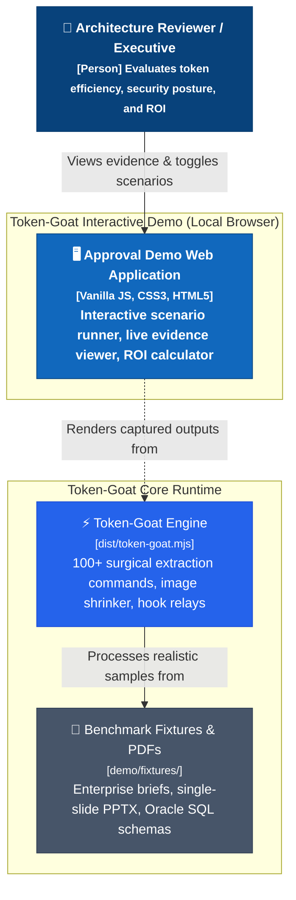
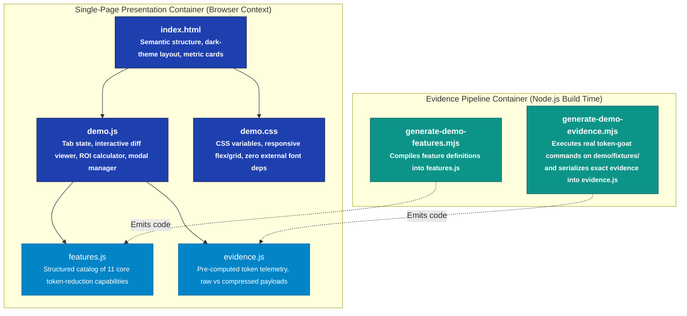
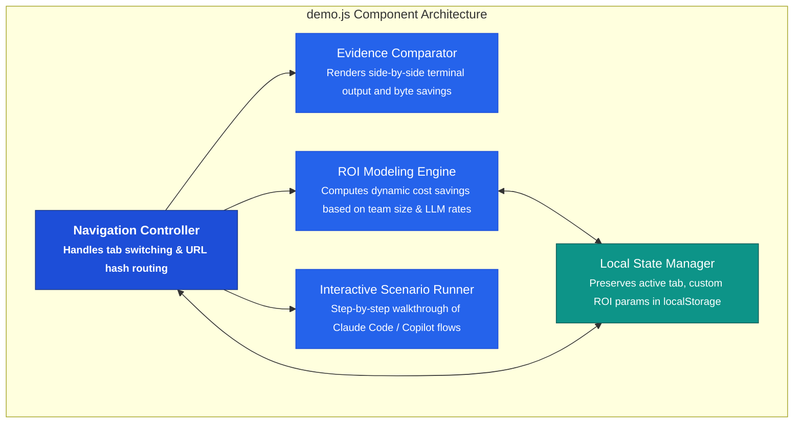
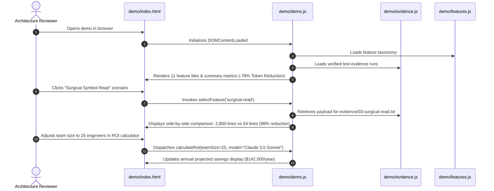

# Token-Goat Approval Demo — C4 Architecture Specification

This document details the architectural structure and data flow of the **Token-Goat Approval Demo** (`demo/`) subsystem using the C4 model.

---

## 1. System Context Diagram (Level 1)

---

## 2. Container Diagram (Level 2)

---

## 3. Component Diagram (Level 3)

---

## 4. Sequence Diagram (Level 4 Dynamic Flow)

