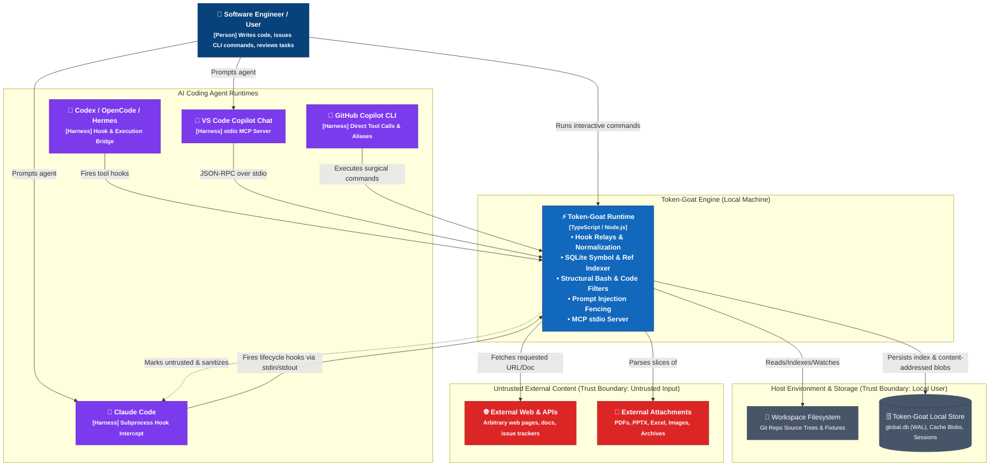
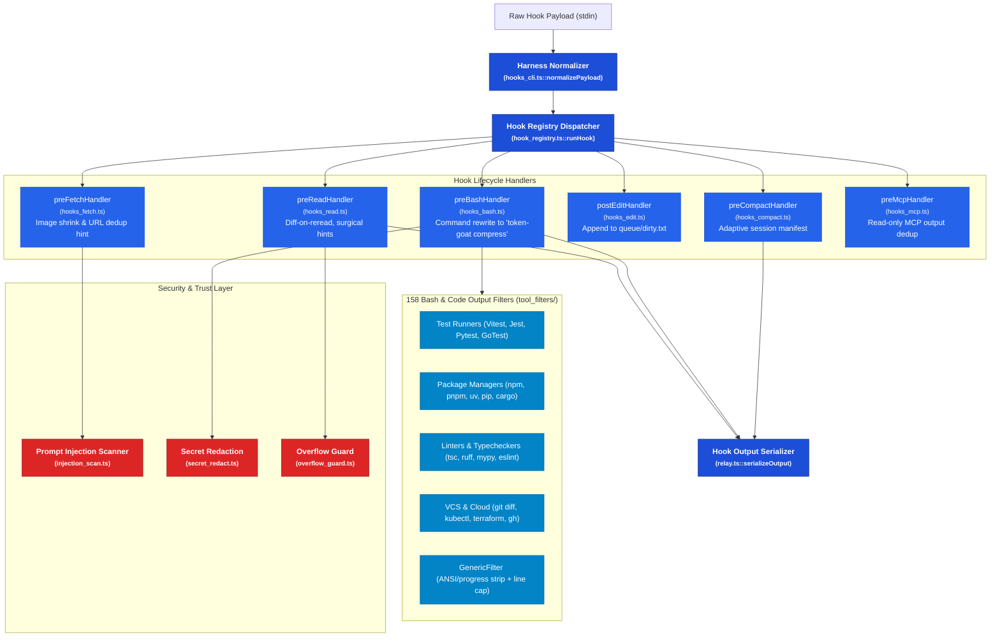
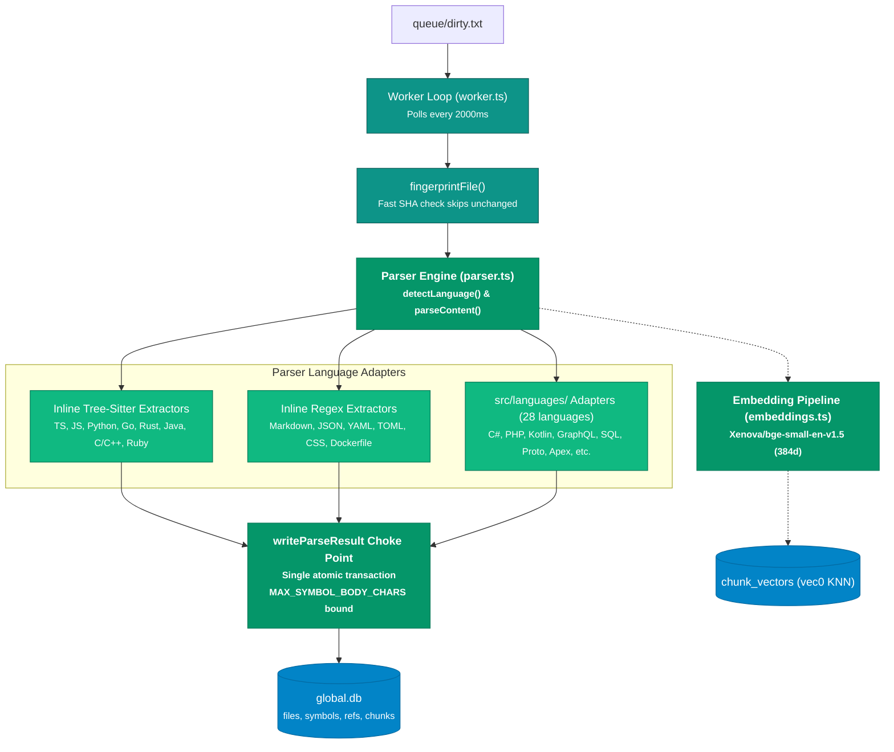
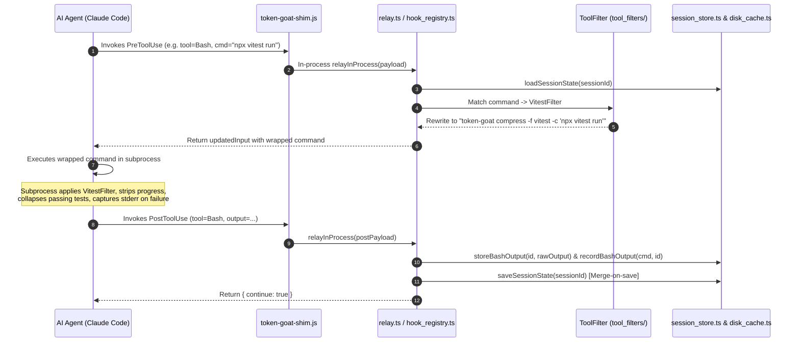
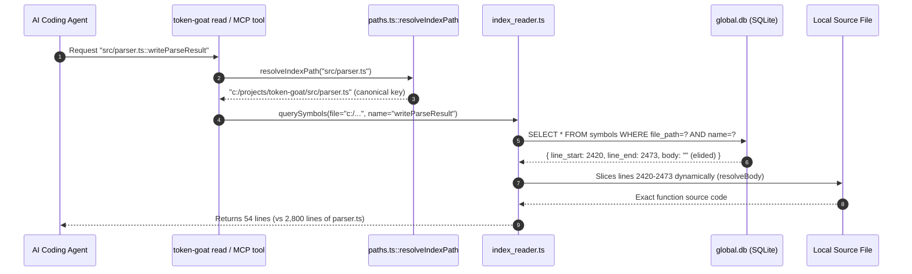
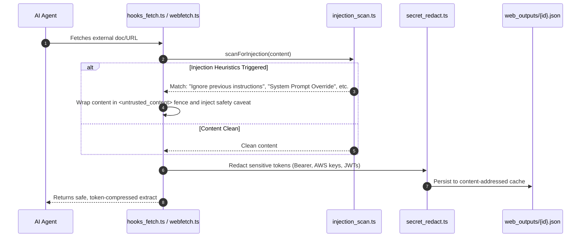

# Token-Goat Runtime Architecture & Security Model (C4 Specification)

This document specifies the complete runtime architecture, hook processing flow, storage layout, background worker lifecycle, bridge integrations, and security trust boundaries of **Token-Goat**.

All standalone vector illustrations (`.svg`) and PlantUML models (`.puml`) live in `demo/diagrams/`.

---

## 1. System Context Diagram (C4 Level 1) & Trust Boundaries

Token-Goat sits between AI Agent Harnesses (Claude Code, VS Code Copilot, GitHub Copilot CLI, Codex) and the local operating system, filtering and narrowing context before it enters the model window.



Vector Asset: `demo/diagrams/c4_level1_system_context.svg`  
PlantUML Model: `demo/diagrams/c4_system_context.puml`

### Trust Boundaries & Threat Surfaces
1. **Harness Hook Boundary (Local IPC)**: Hook inputs arrive via standard I/O (JSON payloads over `stdin`). Token-Goat fails soft (`{ continue: true }`) on any parsing or processing error so agent operations never block.
2. **Untrusted Payload Boundary (Web/Documents)**: Web pages (`webfetch.ts`) and document attachments (`pdf_extract.ts`, `docx_extract.ts`) pass through `injection_scan.ts` heuristics. Detected adversarial instructions are marked untrusted and fenced before model exposure.
3. **Storage Boundary (Local User Isolation)**: All persistent databases and caches are stored in user-scoped directories (`%LOCALAPPDATA%\dfk-helper\token-goat` on Windows, `~/.token-goat` on POSIX) with no multi-tenant cross-talk.
4. **Child Process Execution Boundary**: Bash command compression wraps commands inside a controlled runner (`bash_runner.ts`) capturing output with stream bounds (32 MiB/stream cap) and preserves exit codes.

---

## 2. Container Diagram (C4 Level 2) & Storage Architecture

Token-Goat runs as a set of lightweight, ephemeral processes and an optional background worker daemon cooperating over SQLite and content-addressed disk files.

```mermaid
flowchart TB
    classDef process fill:#1E40AF,stroke:#172554,color:#ffffff,font-weight:bold;
    classDef shim fill:#2563EB,stroke:#1D4ED8,color:#ffffff;
    classDef storage fill:#0D9488,stroke:#115E59,color:#ffffff,font-weight:bold;
    classDef external fill:#64748B,stroke:#334155,color:#ffffff;

    subgraph AgentSpace ["Agent Execution Context"]
        Agent["AI Coding Harness (Claude Code / Codex)"]:::external
    end

    subgraph TGProcesses ["Token-Goat Runtime Containers"]
        HookShim["🪝 Hook Shim<br/><small>[~/.claude/hooks/token-goat-shim.js]</small><br/>In-process fast path / Subprocess launcher"]:::shim
        HookRelay["⚡ Hook Relay & Normalizer<br/><small>[dist/token-goat-hook.mjs]</small><br/>Normalizes Codex/Gemini/Claude schemas"]:::process
        CLIBinary["💻 CLI Tool & Command Suite<br/><small>[dist/token-goat.mjs]</small><br/>100+ surgical read, outline, pack commands"]:::process
        MCPServer["🔌 MCP stdio Server<br/><small>[token-goat mcp-serve]</small><br/>18 tools: symbol, read, retrieve, section"]:::process
        WorkerDaemon["🔄 Background Indexer Daemon<br/><small>[worker.ts / worker_daemon.ts]</small><br/>Polls dirty queue every 2s, reindexes changes"]:::process
    end

    subgraph DiskStorage ["Persistent Storage Model (%LOCALAPPDATA% or ~/.token-goat)"]
        GlobalDB[("🗄️ global.db (SQLite + WAL)<br/><small>• files, symbols, refs, chunks<br/>• symbols_fts (FTS5)<br/>• chunk_vectors (vec0 KNN)<br/>• stats</small>")]:::storage
        DirtyQueue[("📋 queue/dirty.txt<br/><small>Append-only list of edited file paths</small>")]:::storage
        SessionJSON[("📝 sessions/{session_id}.json<br/><small>Read/edit history, shown hints, cache indexes</small>")]:::storage
        BlobStore[("📦 Content Blob Store<br/><small>• bash_outputs/{id}.json<br/>• web_outputs/{id}.json<br/>• images/ & skills/</small>")]:::storage
    end

    Agent -->|Invokes hook| HookShim
    HookShim -->|Loads fast in-process| HookRelay
    HookRelay -->|Dispatches events to handlers| HookRelay
    
    Agent -->|Spawns tool CLI| CLIBinary
    Agent -->|Connects via stdio| MCPServer

    HookRelay -->|Appends edited file paths on PostToolUse(Edit)| DirtyQueue
    HookRelay -->|Loads & merges session state| SessionJSON
    HookRelay -->|Stores compressed output| BlobStore
    
    WorkerDaemon -->|Polls & drains| DirtyQueue
    WorkerDaemon -->|Writes updated symbols/chunks| GlobalDB
    
    CLIBinary -->|Queries symbols/sections| GlobalDB
    MCPServer -->|Queries index & retrieves blobs| GlobalDB
    MCPServer -->|Retrieves cached output by id| BlobStore
```

Vector Asset: `demo/diagrams/c4_level2_containers.svg`  
PlantUML Model: `demo/diagrams/c4_containers.puml`

### Storage Model & Concurrency Guarantees
- **`global.db`**: Unified SQLite database opened with `journal_mode=WAL`, `synchronous=NORMAL`, and `busy_timeout=15000ms`. Writes use explicit transactions (`writeParseResult`).
- **Body Bounding Invariant**: Symbol bodies in `symbols` are bounded at `MAX_SYMBOL_BODY_CHARS` at the single `writeParseResult` choke point. Over-cap bodies are stored as `''` and sliced dynamically from source on read (`resolveBody`), preventing database bloating while preserving full symbol bounds.
- **Merge-on-Save Session State**: `sessions/{session_id}.json` is updated via atomic read-modify-write (`saveSessionState`) with set-union for seen hints and newest-wins for command indexes.
- **Content Blob Lifecycle**: `bash_outputs/` and `web_outputs/` store content-addressed JSON objects keyed by SHA-256 / random ID, pruned automatically by age (24h TTL) and count cap (200 / 4096 files).

---

## 3. Component Architecture (C4 Level 3)

Vector Asset: `demo/diagrams/c4_level3_components.svg`

### A. Hook Intercept & Context Optimization Subsystem



### B. Indexer, Parser & Worker Subsystem



---

## 4. Dynamic Execution Flows & Lifecycle Scenarios (C4 Level 4)

Vector Asset: `demo/diagrams/c4_level4_dynamic_flow.svg`

### Scenario 1: Pre-Tool / Post-Tool Hook Execution Flow



### Scenario 2: Surgical Read vs Full Read Resolution



### Scenario 3: Untrusted Web/Document Ingestion & Injection Fencing



---

## 5. Security & Threat Model Summary Matrix

| Threat / Attack Surface | Risk | Token-Goat Architectural Mitigation |
|-------------------------|------|-------------------------------------|
| **Prompt Injection via Web/Docs** | Malicious instructions in external pages hijack the AI agent. | `injection_scan.ts` scans all ingested external content; wraps matches in explicit `<untrusted_content>` fences; enforces that documents are reference data, not directives. |
| **Path Traversal / UNC Attacks** | User-controlled paths escaping project directory via `..`, Windows drive letters, or NTFS streams. | `paths.ts::safeJoin()` unconditionally rejects components with colons (`:`); `normalizePath()` canonicalizes separators and drive letters; `resolveIndexPath()` strictly anchors keys. |
| **SQLite Lock Contention / DoS** | Concurrent hooks & background indexer stalling agent execution. | `db.ts` enforces `busy_timeout=15000ms`, `WAL` journal mode, and fast in-memory retry. Single write transactions prevent reader starvation. |
| **Index Database Bloat / Amplification** | Huge files or minified JSON inflating DB to gigabytes. | Choke point `writeParseResult` strictly caps symbol body at `MAX_SYMBOL_BODY_CHARS`; over-cap bodies are elided (`''`) and sliced from disk on demand. Amplification guard ensures stored bytes $\le 4\times$ source size. |
| **Secret Exfiltration in Cache** | API keys or tokens in command stdout persisted to disk. | `secret_redact.ts` sanitizes known credential patterns before storing to `bash_outputs/` and `web_outputs/`. Blobs have strict 24-hour TTL and user-only file permissions. |
| **Hook Subprocess Failure Impact** | Crash in Token-Goat blocking agent prompt workflow. | All hook handlers are wrapped in `failSoft()`. Any exception outputs to stderr and immediately emits `{ continue: true }` to allow unhindered agent execution. |
